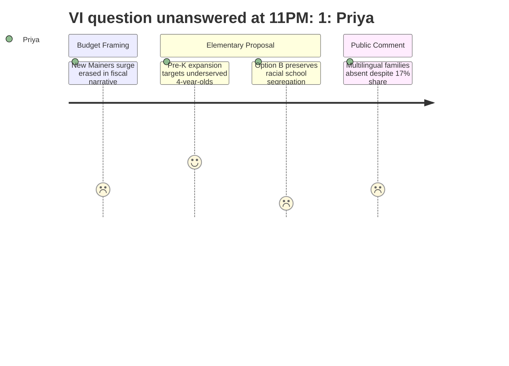

# Interpretation: Priya (PERSONA-005)
## Meeting: School Board Budget Workshop -- March 23, 2026 -- 2026-03-23

### Structured Points

#### 1. Kayler School Closure Targets the District's Most Diverse Elementary
- **Fact:** A Kayler parent, Jess Elsner, stated directly at the podium that Kayler is "approximately 45% BIPOC and 30 to 35% multilingual learners." The board had already recommended Kayler for closure in the superintendent's budget before this demographic profile was formally entered into the public record.
- **Source:** Public comment, Jess Elsner, approximately [163:01]
- **Emotional valence:** negative
- **Threat level:** 5
- **Open question:** true

#### 2. Board Could Not Answer a Title VI Question on Closure Decision
- **Fact:** Jess Elsner asked the board to explain what steps were taken to ensure the closure of Kayler -- a school 45% BIPOC and 30-35% multilingual learners -- did not violate Title VI of the Civil Rights Act. Board Chair DeAngelis responded: "I don't know if anybody is prepared to speak to that, or if we need to get a legal answer about that." No legal answer was provided before adjournment.
- **Source:** Board responses to public comment questions, approximately [299:39--300:26]
- **Emotional valence:** negative
- **Threat level:** 5
- **Open question:** true

#### 3. Option B Is Explicitly Acknowledged as Perpetuating Racial and Economic School Segregation
- **Fact:** Assistant Superintendent Prince stated that Option B "does not address our goal of having more heterogeneous schools and classrooms" and that it would continue "the model we currently have in which we have vastly different student populations demographically at the four schools." Despite this, Option B was presented to the board as a viable choice for a vote.
- **Source:** Bethany Connelly/Dr. Prince elementary presentation, approximately [46:22--47:10]
- **Emotional valence:** negative
- **Threat level:** 4
- **Open question:** true

#### 4. ESOL Staffing Cut Justified by January Enrollment Drop That the District Attributed to Student Absences
- **Fact:** Middle School Principal Stern justified reducing one ESOL teacher position partly by noting that projected student numbers depend on ACCESS test results, and acknowledged that during the January testing window "many students [were] not coming to school" -- a context she declined to name explicitly. The cut would reduce co-teaching capacity and affect students the district itself describes as requiring intensive service hours.
- **Source:** Rebecca Stern middle school presentation, approximately [70:48--72:22]
- **Emotional valence:** negative
- **Threat level:** 4
- **Open question:** true

#### 5. DEI Director Role Being Downgraded to Strategist -- Under Review, Not Decided
- **Fact:** Dr. Entwistle stated that the district is "considering a move of the DEI director into a specialist educator role, embedded with a team of other specialty content experts," describing this as still "under review." The position would shift from a director-level role with budget oversight to a mid-level embedded position, representing a structural demotion of the district's equity infrastructure at the moment of maximum need.
- **Source:** Dr. Entwistle administrative roles section, approximately [59:46--60:34] and [65:20--66:08]
- **Emotional valence:** negative
- **Threat level:** 3
- **Open question:** true

#### 6. Pre-K Expansion Adds 40 Seats Targeting the Most Underserved Four-Year-Olds -- Without Local Dollars
- **Fact:** Dr. Prince announced that despite not expanding locally funded pre-K, the district is adding 8 seats through Child Development Services (for children with IEPs), a United Way classroom partnership, and a pending Head Start expansion of 16 seats -- all externally funded. Net result: 40 new pre-K seats for income-eligible and special-needs four-year-olds at no local cost.
- **Source:** Dr. Prince elementary proposal presentation, approximately [31:14--33:00]
- **Emotional valence:** positive
- **Threat level:** 1
- **Open question:** false

#### 7. Multilingual Families Were Not in the Room Despite Making Up 17% of Enrollment
- **Fact:** Ed Tech Andrew Giggler stated plainly: "17% of students in the South Portland School Department are classified as multilingual learners" and asked directly "How is this possible if there are not efforts being made to include the families of our multilingual students in this process?" A Kayler parent, Mia Proctor, separately confirmed observing that none of the families representing the school's 30+ languages were present to speak.
- **Source:** Andrew Giggler public comment, approximately [206:35]; Mia Proctor public comment, approximately [217:32]
- **Emotional valence:** negative
- **Threat level:** 4
- **Open question:** true

#### 8. Lunch Aide Elimination Removes Food Access Specifically at Schools Like Kayler
- **Fact:** The budget eliminates all lunch aide positions and the second lunch, with the district pointing to the "Locker Project" as a substitute for food-insecure students. Support staff union president Connie DeSanto then testified that Kayler specifically qualifies for a fresh fruits and vegetable snack grant tied to its students' socioeconomic status -- and that the lunch aide is the person who delivers that snack. Eliminating the position removes both a food access mechanism and a trusted adult presence at one of the district's most economically disadvantaged schools.
- **Source:** Finance director non-personnel reductions, approximately [29:39]; Connie DeSanto public comment, approximately [244:51--246:26]
- **Emotional valence:** negative
- **Threat level:** 4
- **Open question:** true

---

### Journey Map

---

### Reactions

Okay, so I was there for five hours and here's the thing that's going to stay with me: the most diverse elementary school in the district is being closed, a parent stood up and asked point-blank whether that violates Title VI of the Civil Rights Act, and the board chair said -- at 11 o'clock at night -- "I don't know if anybody is prepared to speak to that." That's the answer. That's it. That question should have been answered by legal counsel *before* this school ever appeared in a budget proposal. The fact that it wasn't tells you everything about whose children this process was designed to protect.

And here's what made it worse to sit through: the administration's own presentation, the assistant superintendent, said it out loud -- Option B "does not address our goal of having more heterogeneous schools" and would continue "vastly different student populations demographically." They named the problem. They said it clearly. And then they left Option B on the table for a board vote anyway. Meanwhile, one ed tech in the audience had to be the person who pointed out that 17% of students are multilingual learners and their families weren't there -- not because they didn't care, but because this process didn't reach them. Transportation and translation were offered *tonight*, at what looked like the final workshop. Not at the December meeting. Not in January when they first started talking about closures. Tonight. And Mia Proctor stood up and said she could see that those families weren't in the room. I felt that.

There were moments I held onto. The Head Start seats, the CDS expansion, the United Way partnership for pre-K -- that's 40 new seats for the kids who need early intervention most, funded externally. That's not nothing. And Blair Bacon, the Skillen interventionist who's being laid off, stood up and said consolidation without reconfiguration "will only perpetuate the deep inequities in our schools." She named it and she named it precisely, from the inside. So the evidence is in the room. The equity argument is being made, loudly, by educators and Kayler parents alike. What's not in the room is a legal answer about Title VI, a plan for how to reach multilingual families before a vote, or any explanation of why the DEI director is being quietly demoted to a strategist "under review" in the same budget that's closing the school with the highest BIPOC population. I'm filing a records request for the legal analysis on Title VI this week. If there isn't one, that's the story.