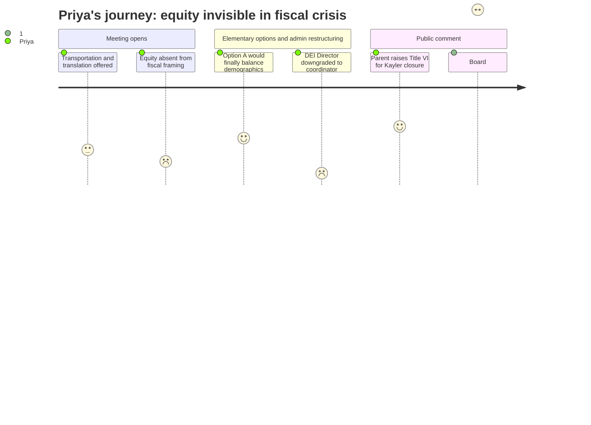

# Interpretation: Priya (PERSONA-005)
## Meeting: School Board Budget Workshop -- March 23, 2026 -- 2026-03-23

### Structured Points

#### 1. Kayler Closure Targets the District's Most Diverse School
- **Fact:** The superintendent's budget recommends closing Kayler Elementary, which a public commenter identified as approximately 45% BIPOC and 30–35% multilingual learners -- the second most diverse and second most economically disadvantaged school in the district. No demographic impact analysis was presented alongside the closure criteria.
- **Source:** Public comment, Jess Elsner [163:01–163:47]; Physical Plant Analysis criteria, Budget Presentation Slide 17
- **Emotional valence:** negative
- **Threat level:** 5
- **Open question:** true

#### 2. Title VI Compliance Question Left Unanswered at Adjournment
- **Fact:** Parent Jess Elsner asked directly what specific steps were taken to ensure the Kayler closure decision did not violate Title VI of the Civil Rights Act of 1964. At 11:15 PM, after five hours of proceedings, the board chair responded "I don't have the answer," deferred to legal counsel, and the meeting was adjourned without a response.
- **Source:** Public comment, Jess Elsner [163:01–163:47]; Board response to audience questions [299:39–300:26]
- **Emotional valence:** negative
- **Threat level:** 5
- **Open question:** true

#### 3. DEI Director Role Being Eliminated as an Independent Position
- **Fact:** The superintendent's budget proposes eliminating the Director of Diversity, Equity and Belonging and replacing it with a lower-authority "Coordinator" or "DEI Strategist" role embedded within a team -- removing independent budget oversight, direct reports, and administrator-level contract standing that the current director holds.
- **Source:** Transcript [59:46–60:34]; Budget Presentation Slides 40 and 49; Budget Book showing Director of Diversity Equity and Belonging position removed in FY27 column
- **Emotional valence:** negative
- **Threat level:** 4
- **Open question:** true

#### 4. Option B Acknowledged by District Leadership to Perpetuate Demographic Segregation
- **Fact:** District administrators stated explicitly that Option B (K–4 grade bands) "will make it more challenging to reach our district goals of creating more heterogeneous schools and classrooms" and "continues the model we currently have in which we have vastly different student populations demographically at the four schools." The board nonetheless received Option B as a viable alternative.
- **Source:** Transcript [46:22–47:10]; Budget Presentation Slide 24, Option B Analysis
- **Emotional valence:** negative
- **Threat level:** 4
- **Open question:** true

#### 5. Multilingual Families Were Largely Absent from the Process
- **Fact:** Ed tech Andrew Giggler noted that 17% of district students are multilingual learners and questioned whether efforts had been made to include those families in the budget process, observing that they were not present at this meeting. Kayler parent Mia Proctor separately stated: "I do not see any of those parents here this evening." Translation services were offered at this meeting but not consistently at prior budget forums.
- **Source:** Public comment, Andrew Giggler [206:35–209:44]; Public comment, Mia Proctor [217:12–218:17]; Board Chair opening remarks [01:36–02:21]
- **Emotional valence:** negative
- **Threat level:** 4
- **Open question:** true

#### 6. ESOL Co-Teaching Model Dropped Because It Is "Not Required"
- **Fact:** The district proposed eliminating one ESOL position at the middle school and explicitly acknowledged that the co-teaching model -- described by the presenting administrator as "best practice" with "wonderful impacts on student learning for all students in the room" -- would be discontinued for FY27 on the basis that "the state doesn't necessarily recognize that as ESOL service minutes" and it is "not required." One ESOL position is also being eliminated at the elementary level and one at the high school.
- **Source:** Transcript [70:48–73:09]; Budget Presentation Slides 57–58; SPTA reductions list, Budget Presentation Slide 37
- **Emotional valence:** negative
- **Threat level:** 3
- **Open question:** true

#### 7. Lunch Aide Elimination Removes a Food Access Layer Specific to Kayler
- **Fact:** All seven lunch aide positions across the district are being eliminated. At Kayler, the sole lunch aide also delivered a fresh fruits and vegetables grant snack twice weekly -- a grant the school qualifies for due to its students' socioeconomic status. The district cited "the Locker Project" as an alternative to a second meal but identified no replacement for the Kayler-specific grant delivery function.
- **Source:** Public comment, Connie DeSanto [244:51–247:15]; Budget Presentation Slide 34; non-personnel reductions, Budget Presentation Slide 12; Transcript [29:39–30:27]
- **Emotional valence:** negative
- **Threat level:** 3
- **Open question:** true

---

### Journey Map

---

### Reactions

So here's what I'd lead with: they are closing Kayler -- 45% BIPOC, 30–35% multilingual learners, the second most diverse school in the district -- and when a Kayler parent stood up and asked the board flat-out whether they had checked for Title VI violations, the board chair said, at 11:15 at night, "I don't have the answer." Then they adjourned. That's the whole meeting in two sentences. Five hours, over thirty public speakers, and the single most legally and morally urgent question of the evening got deferred to legal counsel and a future date that hasn't been scheduled yet. Whether that's negligence or something else, it is not acceptable. You do not propose closing the most diverse school in a district serving over 17% multilingual learners without a civil rights analysis in hand before the vote.

What made it land even harder is that the administration put Option B on the board's plate as a live choice, knowing -- they said it themselves, it's in the slide deck -- that Option B "continues the model we currently have in which we have vastly different student populations demographically at the four schools." They presented a segregation-perpetuating option as equally worthy of serious consideration while simultaneously claiming equity is a core district value. And then look at what else is happening structurally: the DEI Director is being eliminated as an independent role with budget authority and replaced by a "coordinator" embedded in a team. The ESOL co-teaching model -- described by their own administrator as "best practice" -- is being cut because it's "not required" by the state. Every lunch aide is gone, including the one at Kayler who was delivering a fresh fruits and vegetables grant snack that only Kayler qualifies for due to its students' socioeconomic status. The McKinney-Vento social worker position is being reduced. You eliminate the interventionist at Skillen, you cut the equity infrastructure at the administrative level, you drop the co-teaching for multilingual learners, and you close the school that serves the most vulnerable kids -- and you call it fiscal sustainability. There's a pattern there that isn't accidental, even if no one intended it.

What I keep thinking about is who was not in that room. Multiple people raised it: Kayler has upward of 30 languages spoken, 17% of district students are multilingual learners, and the most affected families were largely absent from a five-hour Monday night meeting. The district offered translation services at this meeting -- a parent had to publicly ask for that at a prior meeting to make it happen -- but the families who most needed to shape this decision needed a seat at the table in December and February, not in March at 10 PM when the budget is essentially finalized. One speaker noted that as of meeting night, 10 out of 127 community questions submitted to the district's own budget platform had been answered. There was a nationally board-certified literacy specialist with a multilingual endorsement -- Blair Bacon, who named herself -- who lost her job because her hire date was July 10, 2023, and seniority is the only thing that counts in the contract. The equity work she was doing at Skillen was described, by her, as a band-aid on a wound too large. And now the band-aid is gone too. That's where we are.