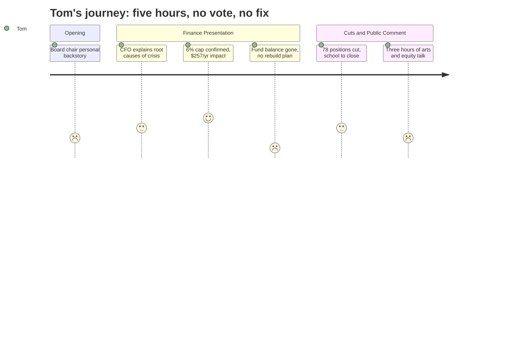

# Interpretation: Tom (PERSONA-006)
## Meeting: School Board Budget Workshop -- March 23, 2026 -- 2026-03-23

### Structured Points

#### 1. The 6% Cap Was Held — $257/Year on Your Tax Bill
- **Fact:** The finance director confirmed the proposed FY27 budget meets the city council's 6% local tax increase cap, which she translated to approximately $257 in additional annual cost for a typical homeowner.
- **Source:** [25:47]
- **Emotional valence:** positive
- **Threat level:** 2
- **Open question:** true

#### 2. Enrollment Fell 300 Kids, Staffing Rose 82 Positions
- **Fact:** The finance director identified the root cause of the crisis as a structural mismatch: district enrollment dropped by roughly 300 students while staffing grew by 82 positions, with COVID relief funds masking the unsustainable gap until the savings ran dry.
- **Source:** [15:36--16:25]
- **Emotional valence:** negative
- **Threat level:** 4
- **Open question:** false

#### 3. Seven Finance Directors in Six Years
- **Fact:** The current finance director disclosed that she is the seventh person to hold the position in the past six years, and directly cited this revolving door as a cause of financial disarray, audit findings, and the district's inability to plan ahead.
- **Source:** [16:25--17:10]
- **Emotional valence:** negative
- **Threat level:** 4
- **Open question:** true

#### 4. The Baseline Without Cuts Was an 18--19% Tax Increase
- **Fact:** A straight roll-forward budget -- no changes, just moving current costs forward one year -- would have required an 18--19% property tax increase. The $7.2M in cuts, including 78 positions and a school closure, were required to reach the 6% ceiling.
- **Source:** Fiscal Context; [25:47--26:35]
- **Emotional valence:** negative
- **Threat level:** 4
- **Open question:** false

#### 5. The Fund Balance Is Gone — No Cushion, No Rebuild Plan
- **Fact:** The district's reserve fund is essentially exhausted. When asked how unplanned costs (storms, litigation) would be covered next year, the finance director said the district would draw on the city's fund balance and repay it by raising taxes in the subsequent year. Asked about rebuilding the reserve, she confirmed there is no plan for FY27 — it is "too dire."
- **Source:** [98:24--99:09], [103:01--103:48]
- **Emotional valence:** negative
- **Threat level:** 5
- **Open question:** true

#### 6. FY27 Doesn't Fix the Structural Problem
- **Fact:** The finance director explicitly warned that FY27 is like wiping out a credit card balance without changing spending habits. Labor costs automatically increase faster than 6% annually, utilities are rising 13--14% per year, and new debt service obligations are coming in FY28 -- including principal and interest on the athletic field bond. Without structural changes, the district could face another crisis.
- **Source:** [19:29--22:36]
- **Emotional valence:** negative
- **Threat level:** 4
- **Open question:** true

#### 7. Per-Pupil Cost Is the Highest Among Comparable Districts
- **Fact:** South Portland's per-pupil expenditure of $26,651 is the highest among comparable-size districts in Maine. State funding covers only roughly 20% of actual costs, far below the 55% it is supposed to cover. A community member at the public comment explicitly named this as the context for the severity of the cuts.
- **Source:** Fiscal Context; [255:04]
- **Emotional valence:** negative
- **Threat level:** 3
- **Open question:** true

#### 8. Admin Costs Largely Shielded While Classroom and Low-Wage Staff Absorb the Cuts
- **Fact:** The union president for support staff stated publicly that the proposal eliminates lunch aide positions (part-time workers earning near minimum wage) and dozens of teachers while making minimal reductions to central office administrators and directors who earn significantly higher salaries and do not provide direct instruction to students.
- **Source:** [246:26--247:15]
- **Emotional valence:** negative
- **Threat level:** 3
- **Open question:** true

---

### Journey Map

---

### Reactions

Sat through five hours of that last night. Here's what actually matters. The finance director basically stood up and confirmed everything I've been saying for years. They grew staff by 82 people while losing 300 kids from the rolls. They burned through every dollar in savings to cover the gap -- used it as operating money, not emergency money -- and nobody caught it because they went through seven finance directors in six years. Seven. The woman who said that was the seventh one. In six years. You wonder why the books were a mess?

The number they want you to focus on is $257 a year -- that's the 6% increase on your tax bill. Fine. I can live with $257 if they've actually fixed something. But the same finance director who told you that also told you that FY27 doesn't solve the structural problem. Labor costs go up more than 6% automatically every year just from step increases and raises. Utilities are going up 13-14%. They've got new bond payments coming next year on that athletic field. She used an analogy herself -- wiping out your credit card balance doesn't help if you're still overspending every month. And their fund balance is completely empty, zero cushion. One board member asked what happens if we get seven snowstorms or a lawsuit next year and the answer was: we draw on the city and pay it back by raising your taxes the year after that. That's the whole plan.

Oh, and we apparently have the highest per-pupil cost of any comparable district in Maine at $26,651. The state is supposed to cover 55% of school costs and is actually covering about 20%. I don't love that, but that doesn't explain how you hire 82 people during a temporary enrollment surge and never bring the numbers back down. And at the end, when somebody in the union got up and pointed out that they're cutting part-time lunch aides making minimum wage while barely touching the central office and director salaries -- that got my attention. I'm not saying teachers are the problem. But when you've got the highest per-pupil spend in comparable districts and zero savings and you're asking me for more money next year too, I want to see every line of the admin budget before we have this conversation again.