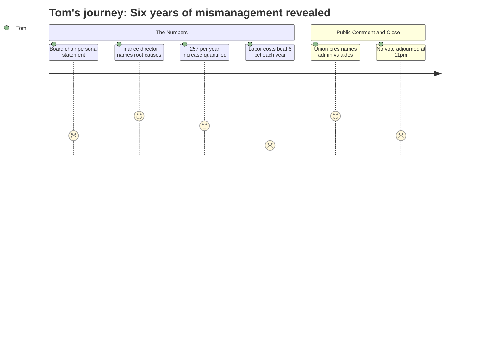

# Interpretation: Tom (PERSONA-006)
## Meeting: School Board Budget Workshop -- March 23, 2026 -- 2026-03-23

### Structured Points

#### 1. The tax hit: $257 a year on the average home
- **Fact:** The finance director stated the 6% local tax levy increase translates to approximately $257 in additional annual property taxes on a home assessed at the South Portland average of $514,000 — a concrete per-household figure presented from the dais.
- **Source:** Transcript [24:58–25:47]; Budget Presentation Slide 8 (Tax Impact table)
- **Emotional valence:** neutral
- **Threat level:** 2
- **Open question:** true

#### 2. Staff grew 82 positions while 300 students left — for years, with no policy guardrail
- **Fact:** The finance director explained that when COVID-era enrollment surged, the district hired significantly; when enrollment fell and federal relief funding ended, staffing was never reduced. She noted the district also lacked a minimum fund balance threshold policy, which would have forced an earlier reckoning: "If we had, staffing levels could have dropped more naturally, and that would've been far less painful than where we are today."
- **Source:** Transcript [14:49–16:25]; Budget Presentation Slide 29 (Staffing Projections table)
- **Emotional valence:** negative
- **Threat level:** 4
- **Open question:** true

#### 3. The savings account is empty — and there is no plan to refill it this year
- **Fact:** The fund balance has been drawn to zero after being used as operating revenue for multiple years. When a board member asked directly whether seeding the fund balance was included in the FY27 budget, the finance director responded: "No. This year is too dire." A second board member asked what happens in the absence of reserves if there are "seven snowstorms" or litigation; the finance director replied that the district would draw on the city's fund balance and pay it back by raising taxes the following year.
- **Source:** Transcript [98:24–99:09]; Transcript [103:48–104:36]; Budget Presentation Slide 5
- **Emotional valence:** negative
- **Threat level:** 5
- **Open question:** true

#### 4. Seventh finance director in six years — and the books show it
- **Fact:** The new finance director identified herself as the seventh person in the role over six years. She stated directly: "anywhere you find that kind of revolving door of financial leadership, there's a degree of disarray... there's no way our books could have been in order. There's no way we wouldn't have been able to better plan if there had been that stability."
- **Source:** Transcript [16:25–17:10]
- **Emotional valence:** negative
- **Threat level:** 3
- **Open question:** false

#### 5. Labor costs structurally outpace the 6% ceiling — every year, by contract
- **Fact:** The finance director warned that if all employees remain in their current positions, labor costs increase by more than 6% annually through contractual step and lane adjustments alone. Since personnel is the dominant share of the budget, she stated it is "mathematically impossible not to have a problem" year after year — and added plainly: "I can't calculate our way out of that."
- **Source:** Transcript [21:01–21:49]; Budget Presentation Slide 6
- **Emotional valence:** negative
- **Threat level:** 5
- **Open question:** true

#### 6. FY27 pays down the debt — but the spending habits aren't fixed yet
- **Fact:** The finance director explicitly compared FY27 to "wiping out the balance" on a credit card — it resets the path but does not solve the structural problem. She named specific FY28 pressures: at least $300,000 in additional debt service on the athletic field bond, a potential Skillen boiler debt, utilities increasing 13–14% annually, and declining enrollment continuing to erode state aid.
- **Source:** Transcript [19:29–22:36]; Budget Presentation Slide 6
- **Emotional valence:** negative
- **Threat level:** 4
- **Open question:** true

#### 7. The union president asked the question Tom came to ask
- **Fact:** The support staff union president stated during public comment: "It's awfully hard for a parent like me to square how cutting all of the lunch aides who work 10 hours per week making the state minimum rate was a more prudent budgetary decision than further reductions in central office, administration, or director positions." She added, as union president: "I can say with confidence that our schools can function with fewer administrators."
- **Source:** Transcript [247:15–248:01]
- **Emotional valence:** negative
- **Threat level:** 3
- **Open question:** true

#### 8. The one number that actually looks good: smallest budget increase in five years
- **Fact:** Despite the scale of cuts and structural difficulty, the finance director confirmed that the 3.3% total budget increase is "the lowest that we've actually had in many years." The superintendent reiterated in the closing summary that this represents "the smallest year-to-year operating increase in the last five years."
- **Source:** Transcript [24:11–24:58]; Budget Presentation Slide 69
- **Emotional valence:** positive
- **Threat level:** 1
- **Open question:** false

---

### Journey Map

---

### Reactions

So I sat through five hours of that thing Monday night. You want to know what actually stuck with me? The new finance director — seventh one in six years, she said that herself — got up and just laid out exactly how this happened. Enrollment dropped by 300 kids over the last few years while they were adding staff. COVID money came in and they hired more people. Money ran out, they didn't cut back. Then instead of saying "we have a problem," they started raiding the savings account to cover day-to-day operating costs. For years. Until there's nothing left. She compared it to paying off your credit card without fixing the habits that ran it up. And I'm sitting there thinking: that's exactly what happened, and this is the first time somebody up front has just said it.

The number they gave us is $257 more a year on your property tax bill, based on the average South Portland home. I'll admit — I was braced for worse. But here's the part nobody's talking about loudly enough: she also told the board that by contract, labor costs go up more than 6% per year automatically, every year, for existing staff. The city council set a 6% ceiling on the tax increase. Labor is most of the budget. She actually said the words "mathematically impossible not to have a problem." So I'm asking: what exactly did we fix? Next year they've got at least $300,000 in new bond payments coming due on the athletic field. The Skillen boiler might need emergency debt. And there's no cushion. A board member asked what happens if there are seven snowstorms or a lawsuit next year. The answer was: we borrow from the city and pay it back by raising your taxes the year after.

The other thing that got me — this was nearly midnight — the support staff union president got up and said what I've been thinking at every one of these meetings for years. They cut all the lunch aides, minimum wage, ten hours a week, no hesitation. But they closed a whole school and somehow the administrator count barely moved. She said it flat out: our schools can function with fewer administrators. I thought, finally. Somebody from inside the district is saying it. The board nodded and moved on, no vote, "see you Monday." Five hours of that meeting and they couldn't make a single decision. I don't know what they're waiting for, but I can tell you the clock is running and the savings account is empty.