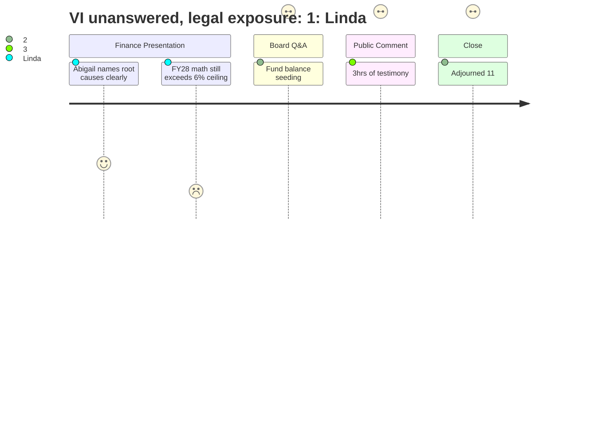

# Interpretation: Linda (PERSONA-007)
## Meeting: School Board Budget Workshop -- March 23, 2026 -- 2026-03-23

### Structured Points

#### 1. Finance director finally names the structural causes — on the record
- **Fact:** Finance Director Ketchem identified three root causes of the fiscal crisis on the record: enrollment-staffing misalignment worsened by COVID funding that propped up positions, the absence of a minimum fund balance threshold policy as a fiscal guardrail, and chronic leadership instability — she is the seventh finance director in six years. She framed these explicitly as cause and effect, not blame, and connected them directly to audit findings and operational disarray.
- **Source:** Transcript [14:49–17:55]
- **Emotional valence:** positive
- **Threat level:** 1
- **Open question:** false

#### 2. FY28 math is structurally broken before the ink dries on FY27
- **Fact:** Ketchem warned that even after FY27 resets the path, the district faces compounding structural problems the following year: labor costs grow faster than 6% annually if all staff stay in place, electricity is increasing 13–14% per year, debt service will increase by at least $300,000 with the athletic field bond principal payment, and the Skillen boiler represents additional potential debt. She stated flatly: "It's mathematically impossible not to have a problem."
- **Source:** Transcript [19:29–22:36]
- **Emotional valence:** negative
- **Threat level:** 4
- **Open question:** true

#### 3. No plan exists to seed the fund balance
- **Fact:** When Member Feller asked about the plan to rebuild the fund balance, Ketchem confirmed there is no seeding plan in the FY27 budget — the year is "too dire." Member Richardson followed by asking how unanticipated costs (snowstorms, litigation, emergency labor) would be covered in the absence of reserves; Ketchem confirmed the district would draw on the city's fund balance by default and repay through a future tax increase.
- **Source:** Transcript [98:24–103:48]
- **Emotional valence:** negative
- **Threat level:** 4
- **Open question:** true

#### 4. Title VI legal exposure on Kayler closure — no prepared answer
- **Fact:** A Kayler parent raised specifically whether the proposed closure of Kayler — a school that is approximately 45% BIPOC and 30–35% multilingual learners — violates Title VI of the Civil Rights Act. During the post-comment Q&A, Chair DeAngelis acknowledged no prepared legal answer was available and stated she wanted a formal legal opinion, not a quick search. No attorney brief had been prepared despite Kayler having been the administration's recommendation for weeks.
- **Source:** Transcript [163:01–163:47]; [299:39–300:26]
- **Emotional valence:** negative
- **Threat level:** 5
- **Open question:** true

#### 5. Meet-and-consult obligations span all four bargaining units and are already overdue on some fronts
- **Fact:** Member Richardson pressed on how many working condition changes would trigger meet-and-consult obligations under state law and existing contracts. Dr. Prince confirmed all four bargaining units have been or will be invited to meet and consult, and those conversations must conclude before changes take effect in the fall. Director Nally's section on reassigning CDL bus drivers to cafeteria duty during lunch hours made clear at least one additional meet-and-consult is not yet formally initiated.
- **Source:** Transcript [134:54–137:14]; [80:18–81:51]
- **Emotional valence:** neutral
- **Threat level:** 3
- **Open question:** true

#### 6. Administration is ready to deliver either option — the choice of pace belongs to the board
- **Fact:** Dr. Prince and Principal Connolly clarified that both Option A (primary/intermediate grade band reconfiguration) and Option B (full K–4 grade bands) are achievable for fall 2026. Option A is the faster path to equity and resource efficiency; Option B can serve as a bridge year while the board conducts a structured community engagement study aimed at full reconfiguration in 2027–28. The board cannot bind a future board's fiscal commitments, but can recommend a study timeline.
- **Source:** Transcript [48:45–50:18]; [114:42–116:13]
- **Emotional valence:** positive
- **Threat level:** 2
- **Open question:** false

#### 7. Board adjourned at 11:15 PM with no vote taken; April 7 City Council presentation is unchanged
- **Fact:** After more than three hours of public comment and with Title VI and other questions still unresolved, Member Smith moved to adjourn and Member Feller seconded. No action was taken on school closure authorization, grade configuration, or budget adoption. Chair DeAngelis confirmed the next scheduled meeting is March 30 and the City Council budget presentation remains April 7 — with a projected council vote on April 14.
- **Source:** Transcript [299:39–307:24]; [25:47]
- **Emotional valence:** negative
- **Threat level:** 4
- **Open question:** true

---

### Journey Map

---

### Reactions

The best thing that happened tonight was Abigail. She stood up at that lectern and said, in a public meeting, that we got here because we had no minimum fund balance threshold and seven finance directors in six years. That is the clearest accounting of root causes I have heard in a public forum. She framed it as cause and effect, not blame, and she's right — and it gives those of us at the table something to actually point to. What I can't stop thinking about, though, is what she said next: FY27 resets the path but it doesn't fix the core problem. And then she laid out the FY28 math. Labor costs alone, if nobody moves, grow faster than 6%. That sentence landed differently for me sitting on the dais than it did in the finance committee briefings. We are not done. We are just done with this year.

What I keep coming back to is that we have no fund balance seeding plan, and Daniel had to ask about it directly to get that on the record. Abigail's answer — this year is too dire — is accurate, but it means we are one hard winter or one expensive out-of-district placement away from drawing on the city and paying it back through the following year's tax increase. Eleni asked exactly the right follow-up: what happens when the unexpected happens? The answer is: we hope it doesn't. I have been pushing for a minimum fund balance threshold policy for two budget cycles. We still don't have one. That has to be the first thing we codify after this budget is adopted, not a goal we put in a report and revisit in eighteen months.

The Title VI question is what has me reaching for the phone first thing tomorrow. Jess Elsner asked exactly the right question — Kayler is 45% BIPOC and 30-35% multilingual learners, and we are proposing to close it. What's our standing under the Civil Rights Act? Rosemarie said she had done some quick research, and I said out loud that I want a legal brief, not a search. We have known Kayler was the administration's recommendation for weeks. That answer should have been sitting at the table tonight. And then we adjourned at 11:15 without voting on anything — not the closure, not Option A or B, not budget adoption. I understand everyone was exhausted. I was exhausted. But we have March 30th and April 7th is the City Council presentation. I do not know how we build a board position in one week with a legal question still open, but that is what the calendar requires, and the calendar does not care how tired we are.