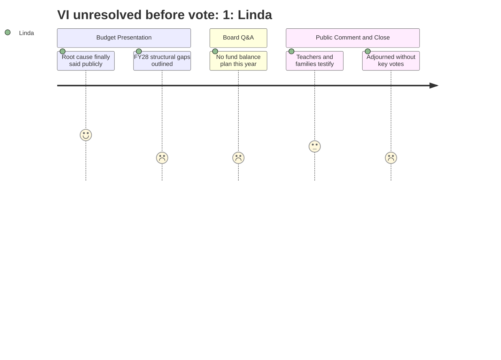

# Interpretation: Linda (PERSONA-007)
## Meeting: School Board Budget Workshop -- March 23, 2026 -- 2026-03-23

### Structured Points

#### 1. Finance Director Puts Root Causes on the Public Record
- **Fact:** Finance Director Ketchem identified three structural causes of the fiscal crisis in public testimony: enrollment-staffing-funding misalignment (staffing levels did not decrease after COVID relief funds ended); the absence of a formal fund balance threshold policy that masked the operating deficit; and leadership instability characterized as the "seventh finance director in six years." She stated these causes compounded into audit findings, planning failures, and gradual depletion of reserves.
- **Source:** [14:49–17:55]; Slide 4, "FY21–FY25: Some Factors Leading to Today"
- **Emotional valence:** positive
- **Threat level:** 2
- **Open question:** true

#### 2. FY27 Budget Delivers on the 6% Tax Cap
- **Fact:** The proposed FY27 budget totals $75.85M, with a 3.3% overall spending increase and a 6.0% increase in local tax revenue -- meeting the City Council's ceiling. Finance Director Ketchem confirmed it represents "the smallest year-to-year operating increase in the last five years." The per-household impact calculates to approximately $257 annually for an average South Portland home assessed at $514,000.
- **Source:** [24:58–26:35]; Slide 8, "Tax Impact"; Slide 69, "The Superintendent's Budget"
- **Emotional valence:** positive
- **Threat level:** 1
- **Open question:** false

#### 3. FY28 Structural Problems Remain Unsolved After This Budget
- **Fact:** Finance Director Ketchem stated explicitly that FY27 "resets our financial path but does not solve our core problems," citing: labor costs that increase more than 6% per year by contract even with no new hires; utility inflation at 13–14% actual rates; at least $300K in additional FY28 debt service from the athletic field bond; Skillen boiler uncertainty that may require new borrowing; and enrollment decline reducing non-local state tax revenue. On LD 2666, the proposed state funding formula revision, Dr. Prince noted only two of nine provisions have been modeled and the outcome for South Portland could go either direction.
- **Source:** [19:29–23:23]; Slide 6, "Preparing for FY28 and Beyond"; [122:24–123:09]
- **Emotional valence:** negative
- **Threat level:** 4
- **Open question:** true

#### 4. Fund Balance Rebuild: No Plan Exists for FY27
- **Fact:** Member Feller asked directly: "What is the plan for seeding the fund balance?" Finance Director Ketchem answered: "We need to develop a plan to seed the fund balance... This year is too dire." The FY27 budget contains no allocation toward rebuilding reserves. Member Richardson noted that in the absence of a fund balance, unexpected costs -- severe weather, litigation, emergency bargaining -- would require drawing on the city's fund balance with repayment through a future tax increase.
- **Source:** [98:24–99:09]; [103:24–104:15]
- **Emotional valence:** negative
- **Threat level:** 3
- **Open question:** true

#### 5. Title VI Legal Exposure Unresolved Before the March 30 Vote
- **Fact:** Community member Jess Elsner raised a Title VI (Civil Rights Act of 1964) challenge at public comment, noting Kayler's student body is approximately 45% BIPOC and 30–35% multilingual learners, and asking what steps verified the closure decision does not constitute a civil rights violation. At the end-of-meeting Q&A, Board Chair DeAngelis acknowledged the question and stated on the record: "I don't have the answer" -- and that she wanted "some legal answer," not quick research. No legal opinion was provided before adjournment.
- **Source:** [163:01–163:47]; [299:39–300:26]
- **Emotional valence:** negative
- **Threat level:** 5
- **Open question:** true

#### 6. Special Education Mandates Are Expanding While Provider Positions Are Eliminated
- **Fact:** Speech-language pathologist Rachel Gibbs testified that the two OT positions proposed for elimination are filling a staffing gap that has existed for at least five years -- the district has been unable to hire sufficient special ed ed-techs despite positions posted and unfilled throughout that period. She further noted the state mandate is expanding: by FY27 the district serves IEP students from age 4, by FY28 from age 3, and through age 22 continuously. Cutting in-house providers forces contracted services at significantly higher cost. Budget documents show Cost Center 2 (Special Education) already increased from $15.05M to $16.31M despite system-wide cuts.
- **Source:** [233:06–238:01]; FY27 Budget Book, Cost Center 2 row totals; Slides 42–44, regional comparison
- **Emotional valence:** negative
- **Threat level:** 4
- **Open question:** true

#### 7. Meet-and-Consult Obligations Span All Four Bargaining Units With No Mapped Timeline
- **Fact:** Member Richardson asked how many positions would require meet-and-consult under collective bargaining agreements. Dr. Prince confirmed all four units (SEA, SPESPA, SPTA, principals) have obligations triggered by working condition changes. Meetings have been set with three associations; the principals' association has not yet been scheduled. Director of Operations Nally separately acknowledged SEA meet-and-consult is required before the proposed mid-day custodial scheduling change takes effect.
- **Source:** [134:54–137:14]; [80:18–81:51]
- **Emotional valence:** negative
- **Threat level:** 3
- **Open question:** true

#### 8. Board Adjourns at 11:15 PM Without Taking Any of the Three Agenda Votes
- **Fact:** The Special Meeting agenda listed three binding action items: authorize the superintendent to file a school closing report with the Commissioner of Education (2.1); select Option A or B for elementary grade configuration (2.2); and adopt the FY27 budget as the board's City Council proposal (2.3). None of the three votes was called. Member Smith moved to adjourn, seconded by Member Feller. The April 7 City Council presentation date remains on the calendar.
- **Source:** [307:04–307:24]; Special Meeting Agenda, items 2.1–2.3; Slide 9, "Timeline"
- **Emotional valence:** neutral
- **Threat level:** 2
- **Open question:** true

---

### Journey Map

---

### Reactions

The thing that actually gave me some relief tonight -- and I know that sounds strange given what we sat through -- was Abigail saying out loud, in a public meeting, that we didn't have a fund balance threshold policy and that's part of why we're here. Seven finance directors in six years. She said it. That's the honest version of the story, and I've been waiting for someone to own it in this room without hedging. But then she said something I need the whole community to actually hear: FY27 resets the path and does not solve the core problems. Labor costs go up more than six percent by contract even if we don't hire a single new person. Utilities are up thirteen, fourteen percent actual. We have three hundred thousand more in debt service coming in FY28 just from the athletic field bond, and nobody knows yet what the Skillen boiler is going to cost. I need board members -- and taxpayers -- to understand that voting yes on this budget next week doesn't mean we're done. It means we've stopped the bleeding for one year.

The question I can't let go of is Jess Elsner's Title VI challenge. Kayler is forty-five percent BIPOC, thirty to thirty-five percent multilingual learners. She asked, on the record, how closing that school doesn't run afoul of the 1964 Civil Rights Act. Rosemarie's answer -- honestly -- was "I don't have the answer" and we need legal counsel. That is the correct answer. But we need that legal opinion in writing before any vote on March thirtieth, not after we've acted. The other thing I'm watching closely is the special education picture. Rachel Gibbs laid out exactly what happens when you eliminate those two OT positions: you don't close the gap, you widen it, because those roles have been posted and unfilled for five years. And by FY28 we're mandated to serve students with IEPs from age three through twenty-two. You cannot cut in-house providers now and then contract out at premium rates when you've already demonstrated you can't fill those roles competitively. The math doesn't work in our favor, and that exposure compounds every year we wait.

At eleven-fifteen we adjourned without taking any of the three Special Meeting votes. I think that was the right call -- not because the room was incapable, but because we are still missing what we need. The legal answer on Title VI. A real decision framework for Option A versus B -- when Jo was asked directly what framework would guide that choice, the answer was "it's essentially a board decision," which is accurate but not sufficient going into Monday. And Daniel's fund balance question hung in the air: there's no rebuild plan, and that conversation can't stay deferred indefinitely. April seventh does not move. I'd rather we come to March thirtieth with the legal memo in hand, at least the beginning of a framework for the Option A-B decision, and a commitment to put FY28 multi-year planning on a calendar -- even if the public comment goes until midnight again.