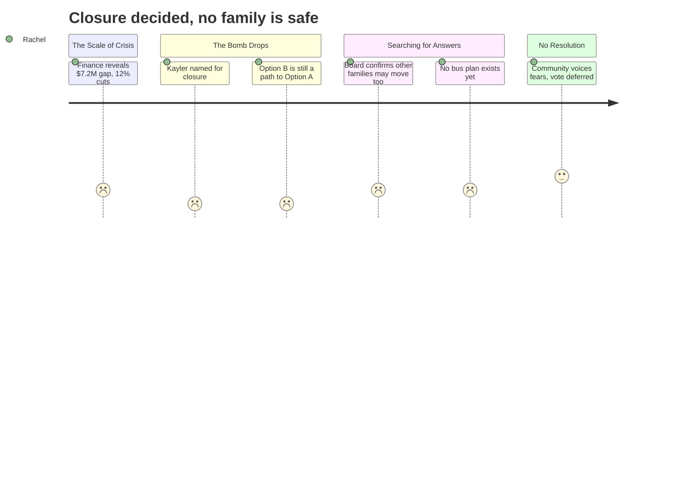

# Interpretation: Rachel (PERSONA-008)
## Meeting: School Board Budget Workshop -- March 23, 2026 -- 2026-03-23

### Structured Points

#### 1. Kayler Officially Named for Closure
- **Fact:** The administration formally recommended closing Kayler Elementary School for the 2026-27 school year. All five buildings were analyzed; Kayler was selected over Dyer following a six-domain evaluation conducted twice by building administrators and directors, with both rounds producing the same result.
- **Source:** Transcript [34:23--35:12]; Presentation Slide 16
- **Emotional valence:** negative
- **Threat level:** 5
- **Open question:** true

#### 2. Option A Would Move Every Elementary Student -- Not Just Kayler Families
- **Fact:** Under Option A (the administration's stated preference), all students currently in K--1 would be reassigned to one of two "primary schools" (Dyer or Small), and all students in grades 2--4 would move to one of two "intermediate schools" (Brown or Skillin) -- meaning every elementary family in the district faces reassignment, regardless of their current school.
- **Source:** Transcript [36:45--37:33]; Presentation Slides 18, 21
- **Emotional valence:** negative
- **Threat level:** 4
- **Open question:** true

#### 3. Choosing Option B Does Not Prevent Reconfiguration -- It Delays It By One Year
- **Fact:** Dr. Prince explicitly told the board that Option B "could be the plan for the fall of '26, while the board and the community engages with implementation for fall of '27," and later confirmed that choosing Option B still puts the board "on a path to Option A in the following fall."
- **Source:** Transcript [48:45--49:33]; [114:42--115:27]
- **Emotional valence:** negative
- **Threat level:** 4
- **Open question:** true

#### 4. Redistricting Under Option B Would Affect Families Beyond Kayler
- **Fact:** When a board member asked whether only Kayler families would move under Option B, Dr. Prince confirmed that "on the margins of our school zones, there are other families" at Brown and other schools who might also need to redistrict in order to maximize use of remaining buildings -- meaning no family outside Kayler is guaranteed to stay put.
- **Source:** Transcript [112:22--113:10]
- **Emotional valence:** negative
- **Threat level:** 3
- **Open question:** true

#### 5. No Transportation Plan Exists Yet
- **Fact:** The Director of Operations stated that the district "is waiting for the board to make a decision on Option A or Option B before we complete" transportation modeling -- meaning no routing, bus timing, or logistics plan exists for families to evaluate, despite a five-month implementation window.
- **Source:** Transcript [123:55--124:10]; Presentation Slide 67
- **Emotional valence:** negative
- **Threat level:** 3
- **Open question:** true

#### 6. Class Sizes Will Increase at All Remaining Schools Under Both Options
- **Fact:** Presenting the reconfiguration slides, Principal Connolly stated plainly that "in both options, class sizes increase," moving current averages toward district policy caps of 20 for K--2 and 24 for grades 3--4. This affects all four remaining elementary schools regardless of which option is chosen.
- **Source:** Transcript [38:20--39:55]; Presentation Slide 20
- **Emotional valence:** negative
- **Threat level:** 2
- **Open question:** false

#### 7. No Vote Taken -- Decision Deferred to March 30
- **Fact:** After more than five hours, the board chair declined to hold votes on school closure, grade configuration, or budget adoption, stating "I'm not going to have us go back to going through debate and going into regular session and voting at 11:15." The next scheduled meeting is Monday, March 30.
- **Source:** Transcript [299:39--300:26]; [306:37--307:24]
- **Emotional valence:** neutral
- **Threat level:** 2
- **Open question:** true

#### 8. Keeping All Five Schools Open Would Require 12--16 Additional Staff Cuts
- **Fact:** The assistant superintendent stated that if the board does not approve the school closure, "an additional 12 to 16 positions from across the district would need to be eliminated to create a balanced budget" -- framing closure as the only path that stops further layoffs.
- **Source:** Transcript [33:37--34:23]; Presentation Slide 15
- **Emotional valence:** negative
- **Threat level:** 3
- **Open question:** false

---

### Journey Map

---

### Reactions

So they officially put Kayler on the chopping block tonight. The administration gave their full recommendation -- they ran this analysis across six categories, did it twice, and came up with Kayler both times. Dead-end street, no secondary evacuation route, building layout. They'd been looking at all five schools since December but it kept coming back to Kayler versus Dyer, and Kayler lost. A lot of Kayler families were in that room, and some of them just found out their school was even being considered from the *news* -- not from the district. The former PTA president said that directly into the microphone. The family who lets their kids ride bikes to school, who volunteers at every fundraiser, who's been in the community fifteen years -- they were there. And their school is closing. That part feels basically decided. It's awful.

But here's what I couldn't stop thinking about the whole drive home. Closing Kayler is just the first piece. Then there are two options for what happens to *all* the elementary schools after that, and one of them -- Option A, which is the one the administration keeps pushing -- would move every single elementary kid at some point. They would split all the schools into "primary schools" for pre-K through first grade, and "intermediate schools" for grades 2 through 4. So your kid finishes first grade and then switches to a completely different building for second grade. Every family in every school gets disrupted, not just Kayler. The administration made it clear they want this -- they said it probably five different times in different ways. And here's the part that really got me: a board member asked what happens if we just go with Option B this year, which is the less disruptive version where you close Kayler and keep the other four schools as K--4. Dr. Prince basically said you can do that, but she also said right out loud that Option B is still "a path to Option A in the following fall." So there is no version of this where reconfiguration doesn't eventually happen. The only question is whether it's your kid this year or next year.

And nobody could give any actual specifics about what this looks like on the ground. Where would the kids go? What do the bus routes look like? How long is the ride for a five-year-old? The transportation director literally said they're not going to start modeling routes until after the board picks an option. So we're being asked to decide if this is acceptable without knowing what it actually means for our morning. There was no vote tonight -- the meeting ran until 11:15 and the chair just adjourned. Next meeting is March 30th. I'll be there. But I left feeling like the decision is already basically made in that room, and the public comment is the part where we watch it happen. I don't know what it takes to actually change the outcome at this point.