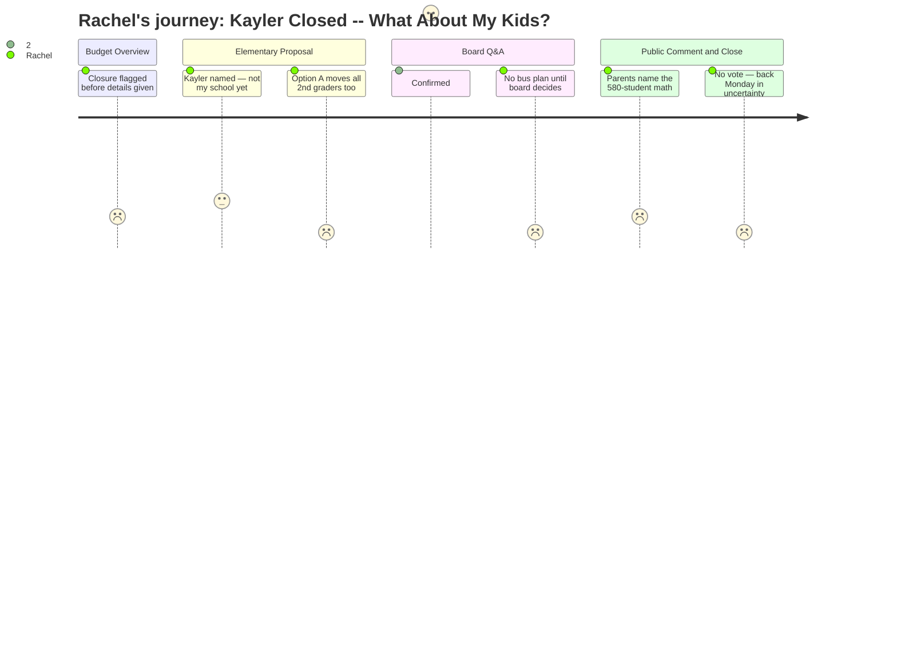

# Interpretation: Rachel (PERSONA-008)
## Meeting: School Board Budget Workshop -- March 23, 2026 -- 2026-03-23

---

### Structured Points

#### 1. Kayler named for closure — but zone boundaries put other families at risk too
- **Fact:** After analysis of Kayler and Dyer across six domains, the district recommended Kayler for closure. However, when a board member pressed whether redistricting under Option B would affect only Kayler families, the assistant superintendent confirmed: "it would not just be Caylor families" — families near the margins of adjacent zones (Brown, Dyer) could also be reassigned to maximize building capacity.
- **Source:** [34:23]–[35:12] (Kayler named); [112:22]–[113:10] (scope of redistricting confirmed in board Q&A)
- **Emotional valence:** negative
- **Threat level:** 4
- **Open question:** true

#### 2. Option A would uproot at least 580 students across the entire district
- **Fact:** A speaker during public comment calculated that closing Kayler alone would displace 160 students, but Option A reconfiguration — moving all second graders out of their current schools to new intermediate buildings — would require at least 424 additional students to change schools, for a total of 580-plus children district-wide. Another speaker confirmed that under Option A every incoming second grader at Dyer, Small, and Kayler would be moved.
- **Source:** Public comment, ~[251:55] (Hailey Runback); ~[210:30] (Brian Green)
- **Emotional valence:** negative
- **Threat level:** 5
- **Open question:** true

#### 3. No transportation plan exists — district is waiting for the board to decide first
- **Fact:** When asked whether the transportation reduction estimate accounted for Option A or B, the assistant superintendent confirmed the district had engaged a consultant but stated: "We are waiting for the board to make a decision on Option A or Option B before we complete that modeling."
- **Source:** [123:55]–[124:00]
- **Emotional valence:** negative
- **Threat level:** 4
- **Open question:** true

#### 4. Class sizes increase in both options — district policy caps will be stretched
- **Fact:** The presentation showed that current average class sizes already run below district-set caps, and "in both options, class sizes increase." The presenter acknowledged that using averages conceals real variability and flagged this as something that would "need to dig a little further into."
- **Source:** [38:20]–[39:55]
- **Emotional valence:** negative
- **Threat level:** 3
- **Open question:** true

#### 5. Option B described as affecting fewer families and causing fewer transitions
- **Fact:** The district's own presentation noted Option B (full K–4 grade bands) "presents less change for families, but not all families" and "minimizes" transitions compared to Option A, which would add a second school transition within elementary years. The district acknowledged this model "allows for a broader age range of students to stay together."
- **Source:** [44:46]–[45:35]
- **Emotional valence:** neutral
- **Threat level:** 2
- **Open question:** true

#### 6. School year starts in August — the district has five months, not six
- **Fact:** A public commenter pointed out mid-meeting that children return to school in August, not September, meaning the actual implementation window is roughly five months — not the six months frequently cited in discussion. The board has not yet voted, and the next meeting is March 30.
- **Source:** ~[189:00]–[189:29] (Debbie McNeany, public comment)
- **Emotional valence:** negative
- **Threat level:** 4
- **Open question:** true

#### 7. Keeping all five schools open requires cutting 12–16 more positions
- **Fact:** The assistant superintendent stated explicitly: "If we do not move forward with school closure, then we would estimate that an additional 12 to 16 positions from across the district would need to be eliminated to create a balanced budget." This framing directly linked the closure decision to job preservation.
- **Source:** [33:37]–[34:00]
- **Emotional valence:** negative
- **Threat level:** 3
- **Open question:** true

#### 8. No vote tonight — board adjourned at 11:15 PM, next meeting March 30
- **Fact:** After more than five hours, the board chair declined to hold a vote, stating "nobody can think straight at this point." A board member asked whether additional meetings could be scheduled before March 30 and received no commitment. Families will wait at least another week with no decision on which option — or whether Kayler closes at all.
- **Source:** [299:39]–[307:24]
- **Emotional valence:** negative
- **Threat level:** 3
- **Open question:** true

---

### Journey Map

---

### Reactions

So Kayler is closing. That was the headline. I genuinely felt for those parents in the room — some of them said they found out through the news, not from the district, and you could feel how raw that was. I sat there for like two minutes thinking, okay, it's not our school, we're okay. And then they started explaining the options and I realized I was nowhere near okay.

Option A — which is what the administration has been pushing for — means every incoming second grader in the whole district switches schools. Every single one. Not just the Kayler kids. A woman in the audience did the math: 160 Kayler students forced to move regardless, but Option A adds 424 more on top of that. Over 580 kids total. When a board member asked the assistant superintendent point-blank, "Is this just Kayler families or more people?" the answer was basically: "Mostly Kayler, but also families near zone boundaries at Brown and other schools." Nobody can tell me yet whether we're one of those families. And there is no transportation plan. They said it directly — they can't model the bus routes until the board picks an option. The school year starts in August. A parent at the microphone literally had to tell the board it's August, not September — we have five months, not six. Five months with no routes, no before-care plan, no answers on which kids go where.

I left that meeting needing to know two things: where exactly our zone boundary is, and whether Option B — which they admitted "presents less change for families" — is actually still on the table or whether the board is being herded toward Option A. Because if Option A is where this is going, my kids are changing schools. I'm texting the other parents in our school tonight because I don't think half of them know that reconfiguration isn't just a Kayler problem. No vote happened, by the way. Five hours, midnight almost, and we come back Monday. I cannot keep doing this.