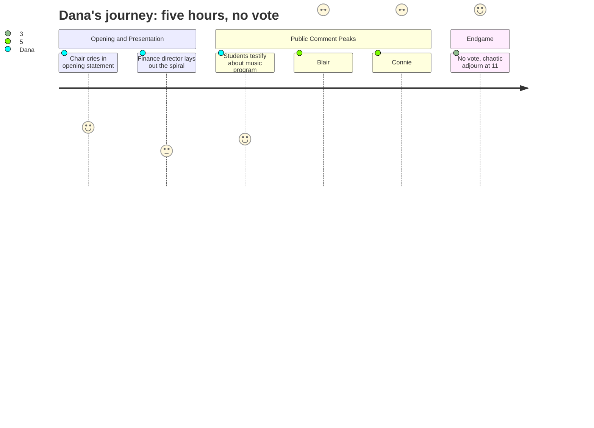

# Interpretation: Dana (PERSONA-009)
## Meeting: School Board Budget Workshop -- March 23, 2026 -- 2026-03-23

---

### Structured Points

#### 1. Board Chair Opens With Personal Breakdown
- **Fact:** Before discussing a single budget line, Board Chair DeAngelis delivered a lengthy personal statement describing bursting into tears at dinner with friends, disclosing her partner's death from mesothelioma in 2019, and publicly apologizing to a fellow board member. She framed her entire biography -- immigrant parents, union presidency, cancer diagnosis -- as context for why she belongs in the room.
- **Source:** `[00:01--08:34]`
- **Emotional valence:** positive
- **Threat level:** 2
- **Open question:** false

#### 2. Finance Director Identifies Herself as the Seventh in Six Years
- **Fact:** Finance Director Ketchem, walking through root causes of the $7.2M gap, disclosed mid-presentation that she is the seventh finance director in six years, and stated directly: "There's no way our books could have been in order." She also described a "revolving door" of financial leadership as a structural cause of the crisis, distinct from any single decision.
- **Source:** `[14:49--17:55]`
- **Emotional valence:** negative
- **Threat level:** 4
- **Open question:** true

#### 3. School Proposed for Closure Is 45% BIPOC -- Title VI Question Raised From the Floor
- **Fact:** A Kayler parent identifying herself as a former PTA president stated from the public microphone that Kayler is approximately 45% BIPOC and 30--35% multilingual learners, then asked directly whether the district had taken steps to ensure closing Kayler does not violate Title VI of the Civil Rights Act. The board chair acknowledged the question and said they would need a legal answer, which was not provided that night.
- **Source:** `[163:01--164:32]` and `[299:39--300:26]`
- **Emotional valence:** negative
- **Threat level:** 5
- **Open question:** true

#### 4. Laid-Off Interventionist: "My Number Is July 10th, 2023"
- **Fact:** Blair Bacon, identified as a 2026 RIF member and a 25-year educator, told the board she holds a master's degree in literacy, a multilingual endorsement, and national board certification twice -- then stated that none of it matters, because under the contract the only thing that determines who is laid off is a hire date. Her hire date: July 10, 2023. She explicitly endorsed consolidation and reconfiguration and called on the board to vote to move forward.
- **Source:** `[156:51--160:00]`
- **Emotional valence:** negative
- **Threat level:** 4
- **Open question:** false

#### 5. Eighth-Grade Students Testify About Music Program Cuts
- **Fact:** Two eighth-grade students -- Lucy and Samantha -- came to the podium to speak in defense of the percussion ed tech position, describing the role in specific terms: the ability to run separate percussion sectionals while band directors work with wind players, the ed tech's special education certification enabling inclusion access, and the personal meaning of the music program. Both were composed and specific. The board chair had to ask the audience three times to stop applauding after each student spoke.
- **Source:** `[151:22--155:19]`
- **Emotional valence:** positive
- **Threat level:** 2
- **Open question:** false

#### 6. Union President Reads Lunch Aide Wages Alongside Superintendent Salary on the Record
- **Fact:** Connie DeSanto, identified as president of the support staff union, stated that an ed tech one at the lowest pay step earns approximately $20,800 for a school year. She then cited the 2024--25 salary of former Superintendent Timothy Metheny at approximately $158,000 -- a ratio she called 7.6 to one. She called the elimination of lunch aides while maintaining administrative positions "not the look we want for South Portland."
- **Source:** `[206:35--208:10]` and `[242:29--248:01]`
- **Emotional valence:** negative
- **Threat level:** 4
- **Open question:** false

#### 7. Board Adjourns at 11:15 PM With No Vote Taken
- **Fact:** After more than five hours and approximately 40 public comments, the board adjourned without voting on the school closure, the grade configuration option, or the FY27 budget. One board member moved for an earlier supplemental meeting, the chair said only that the next scheduled meeting is March 30, and the meeting ended on a motion to adjourn with no consensus on timeline. The April 7 City Council presentation date was not moved.
- **Source:** `[299:39--307:24]`
- **Emotional valence:** negative
- **Threat level:** 3
- **Open question:** true

---

### Journey Map

---

### Reactions

Okay, so I need you to know that I almost didn't send a crew to this one. The agenda said "budget workshop" and I assumed we'd get two hours of slides and one usable soundbyte about property taxes. Wrong. The board chair opened the meeting by describing how she burst into tears at dinner Friday night and then talked about her partner dying of cancer. Before a single number had been mentioned. That's your cold open right there -- *before* we even get to 78 people losing their jobs. If our shooter got clean audio on that, we have a piece.

The real story -- the one I think nobody else is going to run -- is this: they want to close Kayler school, which is 45% BIPOC and 30-something percent multilingual learners, and a woman got up to the microphone and asked point-blank whether that violates the Civil Rights Act. The board chair said they'd need a legal answer. They don't have one. Meanwhile, a laid-off teacher -- national board certified, twice, 25 years in the classroom -- stood up and said the only thing that matters about whether she keeps her job is a date: July 10, 2023. That's when she was hired, and that's her number under the contract. She said it herself. That's your B-block right there -- credential versus seniority, and what it costs the kids.

And here's the kicker: after five hours and forty-something public speakers, they adjourned without voting on anything. The next meeting is Monday. That's the one we actually need to be at, because that's when they vote on which school closes, which configuration they pick, and whether this budget goes to the City Council on April 7. I'd send a crew Monday. The vote, the Kayler civil rights angle, the board chair who's clearly running on no sleep -- that's a segment. Maybe two if the vote goes sideways.