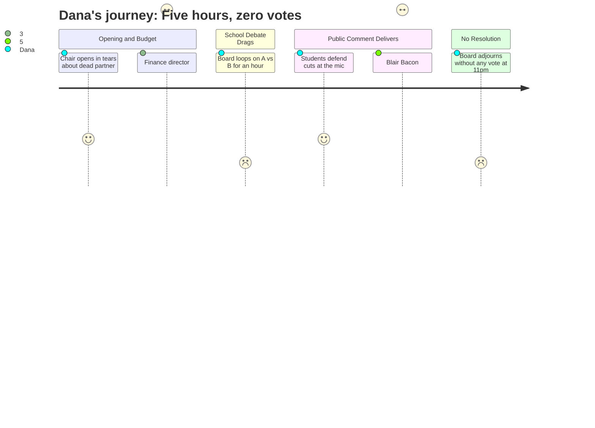

# Interpretation: Dana (PERSONA-009)
## Meeting: School Board Budget Workshop -- March 23, 2026 -- 2026-03-23

### Structured Points

#### 1. Board Chair Opens With Grief, Not Governance
- **Fact:** Board Chair DeAngelis began the meeting with an 8-minute personal statement disclosing that she burst into tears at dinner the Friday before because of the stress she'd been carrying. She described her late partner dying of mesothelioma in 2019, her own breast cancer diagnosis in 1992, and defended herself against community accusations that she called parents "racist" — while also apologizing to Member Holman for unkind remarks.
- **Source:** [00:01]–[08:34]
- **Emotional valence:** positive
- **Threat level:** 2
- **Open question:** true

#### 2. Finance Director: "I'm the Seventh in Six Years"
- **Fact:** Finance Director Abigail Ketchem, nine months into the job, attributed part of the fiscal collapse to leadership instability — explicitly stating, "I am the seventh finance director in six years, and anywhere you find that kind of revolving door of financial leadership, there's a degree of disarray." She said there was "no way our books could have been in order" and described the district as having driven off a cliff it didn't see coming.
- **Source:** [14:49]–[17:55]
- **Emotional valence:** negative
- **Threat level:** 3
- **Open question:** true

#### 3. Laid-Off Teacher: "The Only Thing That Matters Is a Date"
- **Fact:** Blair Bacon, identified as a member of the "2026 RIF," addressed the board as a teacher losing her job despite holding national board certification — the highest credential in the profession — earned twice, plus a master's in literacy and a multilingual endorsement. She stated the union contract protects employees by hire date alone: "I thought my union would fight for me, only to find that in this contract, education and professional credentials matter second. The only thing that matters is a date. In my case, this date was July 10th, 2023."
- **Source:** [156:05]–[159:55]
- **Emotional valence:** negative
- **Threat level:** 4
- **Open question:** true

#### 4. Eighth Graders Take the Mic to Save a Staff Member
- **Fact:** Two eighth-grade students, Lucy and Samantha, spoke during public comment in defense of the percussion ed tech position being cut. Lucy described him as a certified special education teacher who makes music accessible to students with IEPs. Samantha said: "Even when a small grain of sand is moved, the entire beach feels its impact, especially the surrounding sand near it."
- **Source:** [151:22]–[154:33]
- **Emotional valence:** positive
- **Threat level:** 1
- **Open question:** false

#### 5. Kayler Parent Raises Civil Rights Violation — Board Has No Answer
- **Fact:** Kayler parent Jess Elsner noted that Kayler is "approximately 45% BIPOC and 30 to 35% multilingual learners," then asked the board to "explain the exact steps that were taken to ensure that when we were deciding to close Kayler, that Title VI wasn't being violated." Board Chair DeAngelis responded at the end of the meeting: "I get the question. I don't have the answer."
- **Source:** [163:01]–[163:47]; [299:39]–[300:26]
- **Emotional valence:** negative
- **Threat level:** 5
- **Open question:** true

#### 6. Union President and Kayler Parent Breaks on Senior Walk-Through Question
- **Fact:** Connie DeSanto, identified as union president for support staff and a Kayler community member since 2014, described telling her high school sophomore son that Kayler might close. He eventually asked: "Where would he be able to do his senior walk-through?" She said, "That question I didn't have an answer for, and that was hard, really, really hard." She also argued that cutting all-minimum-wage lunch aides while preserving administrative salaries was "not the look we want for South Portland."
- **Source:** [242:29]–[247:15]
- **Emotional valence:** negative
- **Threat level:** 3
- **Open question:** false

#### 7. Board Adjourns at 11:15 PM Without Voting on Anything
- **Fact:** After more than five hours of presentations and public comment, a board member moved to adjourn before any vote was taken on school closure, grade configuration, or budget adoption. Board Chair DeAngelis said no one could "think straight at this point." A board member was cut off mid-sentence asking to explore additional meetings this week. The next scheduled meeting is Monday, March 30th — the apparent date when votes may actually occur.
- **Source:** [299:39]–[307:24]
- **Emotional valence:** negative
- **Threat level:** 4
- **Open question:** true

---

### Journey Map

---

### Reactions

The board chair cried at dinner last Friday. That's your soft open if your news director wants the sympathetic angle — 70-something woman, lost her partner to mesothelioma, beat breast cancer, opened a five-hour budget meeting by telling a packed auditorium about the moment it all cracked. You've got maybe 20 seconds of setup there. Whether that earns sympathy or reads as deflection before she votes to close a school serving mostly BIPOC kids — that's the editorial call you need to make fast, because March 30th is six days away and that's when they actually vote.

The real story is Blair Bacon. She's a Skillen interventionist who just got her pink slip. Twenty-five years in education, master's in literacy, national board certification — twice — and she's out because her hire date is July 10, 2023. That's it. That's the contract. Seniority wins, credentials lose. She said, "I thought my union would fight for me." That's your soundbyte. She's already written the segment for you. Call her before she leaves the area, get her on camera in front of whatever classroom she's about to stop teaching in, and you've got segment one.

Segment two is the Title VI angle, and you cannot sleep on this. A Kayler parent stood at that mic and asked — on the record — whether closing a school that is 45% BIPOC and 35% multilingual learners violates the Civil Rights Act. The board chair said, at eleven o'clock at night, that she didn't have a legal answer. That's the follow-up story into the city council budget presentation April 7th. And for B-roll: there's a family in that neighborhood who bikes their kids to Kayler in a battery-powered pink toy Jeep. Sam Elsner described it. That's your establishing shot — two minutes of footage before you ever show a spreadsheet.