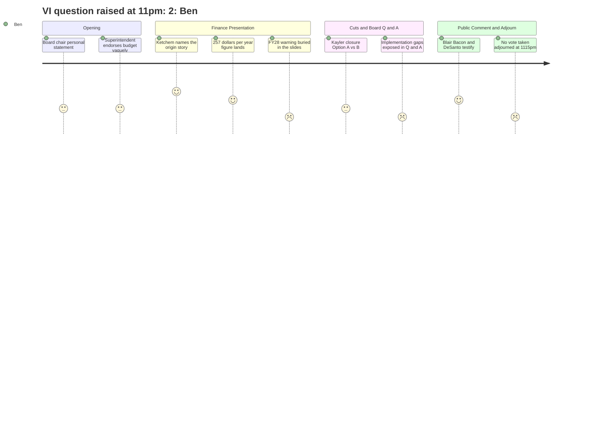

# Interpretation: Ben (PERSONA-010)
## Meeting: School Board Budget Workshop -- March 23, 2026 -- 2026-03-23

### Structured Points

#### 1. The $257/Year Figure — The Lede He Needed
- **Fact:** Finance Director Abigail Ketchem translated the 6% tax increase into a household number: "about $257 additional per year." This is the first time in the budget season a dollar figure has been attached to the increase in plain-English terms.
- **Source:** [25:47] transcript
- **Emotional valence:** positive
- **Threat level:** 2
- **Open question:** true — How does $257 vary across different property assessments in the city? Ketchem's figure appears to be an average. The number needs a qualifier before it goes to print.

#### 2. The Origin Story — "Seventh Finance Director in Six Years"
- **Fact:** Ketchem delivered the most coherent public accounting yet of how the district reached crisis: enrollment dropped while staffing grew (inflated by COVID money that then expired), no minimum fund balance policy acted as a circuit breaker, and leadership churn — she explicitly said "I am the seventh finance director in six years" — prevented any early intervention. She said directly: "There's no way our books could have been in order."
- **Source:** [14:49]–[17:55] transcript
- **Emotional valence:** positive — for Ben, this is the narrative thread he's been trying to piece together across the season
- **Threat level:** 3
- **Open question:** true — Board member Meredith Diamond's public comment referenced "unauthorized overspending and financial mismanagement reported in recent audits." What specifically did those audits flag? That documentation hasn't surfaced in any meeting Ben has followed.

#### 3. FY27 Fixes the Symptom, Not the Disease
- **Fact:** Ketchem warned explicitly that this year's budget "does not solve our core problems" — it functions like paying off a credit card, but if spending patterns don't change, "we could certainly find ourselves in this place again." She also noted that labor costs alone grow faster than 6% annually, meaning the structural math is broken going into FY28, which also carries new debt service and the Skillen boiler question.
- **Source:** [19:29]–[21:49] transcript
- **Emotional valence:** negative
- **Threat level:** 4
- **Open question:** true — No FY28 gap number was given. Ketchem gestured at it but the board didn't press for a figure. That number is the story the district has not yet told publicly.

#### 4. Kayler Is 45% BIPOC — and the Title VI Question Was Not Answered
- **Fact:** Kayler parent Jess Elsner noted that Kayler is approximately 45% BIPOC and 30–35% multilingual learners, and asked the board to explain what specific steps were taken to ensure the closure did not violate Title VI of the Civil Rights Act. At 11:15 PM, the board chair acknowledged the question and said it required legal counsel — which was not present — and did not provide an answer.
- **Source:** [163:01]–[163:47] public comment; [299:39]–[300:26] board response
- **Emotional valence:** negative
- **Threat level:** 4
- **Open question:** true — This is the question that the district left officially unanswered at the close of the meeting. No legal review of the closure criteria against Title VI has been made public.

#### 5. Blair Bacon — The Human Cost of a Date
- **Fact:** Blair Bacon, a RIF'd interventionist at Skillen, told the board she holds a master's in literacy, a multilingual endorsement, and two National Board Certifications — the highest mark in the profession — and that she loses her job because of a single date: "July 10th, 2023. That was the day the board approved my employment. That is my number, and because of it, my time is up." She said she expected her union to fight for credentials, not just dates.
- **Source:** [156:05]–[159:55] public comment
- **Emotional valence:** negative
- **Threat level:** 4
- **Open question:** true — How many of the 32 teachers on the recall list have a similar credential profile? The seniority system is structurally eliminating some of the district's highest-credentialed staff, and no board member asked that question.

#### 6. The Reconfiguration Trust Gap — Five Months, No Transportation Plan
- **Fact:** The administration said it was "prepared to deliver on either option" for the fall, but board member Richardson noted the district is simultaneously absorbing 78 position cuts, closing a school, and potentially reconfiguring grade bands — all by September. The district explicitly said it was waiting for a board decision before modeling transportation routes, and acknowledged that a compressed timeline means other priorities (like a cell phone policy) would be set aside.
- **Source:** [131:45]–[134:08]; [123:55]–[124:10] board Q&A
- **Emotional valence:** negative
- **Threat level:** 3
- **Open question:** true — Dr. Prince mentioned Saco and Scarborough as neighboring districts already running the primary/intermediate model. Has the district formally consulted them? That information was not provided in this meeting.

#### 7. No Vote — Story Has No Ending (Yet)
- **Fact:** After more than five hours, including approximately two hours of public comment, the board adjourned at 11:15 PM without taking any action on school closure, grade configuration, or budget adoption. A board member explicitly asked to explore holding an additional meeting earlier in the week; another member moved to adjourn immediately. The next scheduled meeting is March 30. The April 7 City Council presentation is a hard deadline.
- **Source:** [299:00]–[307:24] transcript
- **Emotional valence:** negative
- **Threat level:** 3
- **Open question:** true — Will the board convene before March 30? No commitment was made on the record.

---

### Journey Map

---

### Reactions

So I'm telling the editor we've got at least two pieces here, maybe three. The first one basically writes itself: South Portland is proposing a 6% tax increase — that's $257 more a year on an average property — and it still cuts 78 positions and closes an elementary school. That's the nut, and readers who haven't been following any of this need it before they can make sense of anything else. The finance director gave me a credit card analogy I can actually use: FY27 wipes out the balance, but if you don't change your spending habits, you end up right back in debt. She said flat out that this year's budget "does not solve our core problems." I want to quote that in contrast to how the district's public communications have framed hitting the 6% target as a kind of achievement. There's a story in that gap.

The piece I actually want to write is the origin story. Abigail Ketchem — nine months on the job, seventh finance director in six years — got up and explained how the district got here. Enrollment dropped 23 percent in four years while staffing didn't come down, COVID money masked the shortfall, and there was no minimum fund balance policy to force anyone's hand until the savings were gone. She said "there's no way our books could have been in order" with that kind of leadership churn. That's a remarkable thing for a public official to say at a public meeting. I'm calling her this week to see how much more she'll put on record, because that backstory is the thing that makes $257 make sense to someone who's been scratching their head about how we got here.

The piece I can't write yet — because the board didn't vote and it's not over — is the Kayler piece. A parent named Jess Elsner stood up at 11 o'clock at night and asked whether closing a school that's 45 percent BIPOC and over 30 percent multilingual learners violates Title VI of the Civil Rights Act. The board said: good question, we need our lawyer. Nobody answered it. And separately, a woman named Blair Bacon, who has two National Board Certifications and 25 years in the profession, stood up and said she lost her job because of the date the board approved her employment — July 10th, 2023. Not her credentials, not her performance. A date. That's the human story that makes the structural one land. I just need the board to actually take a vote first. Next meeting is March 30. I'll watch it on SPC-TV.