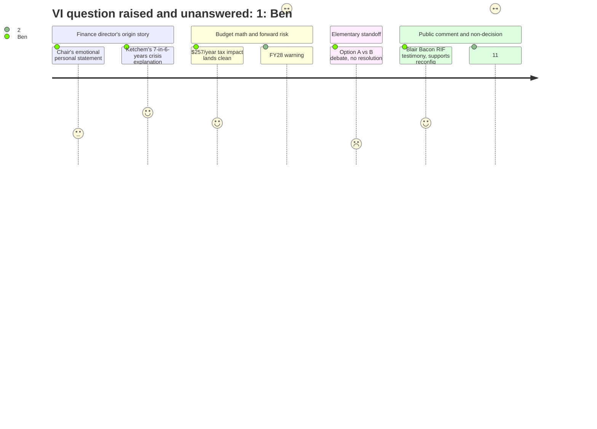

# Interpretation: Ben (PERSONA-010)
## Meeting: School Board Budget Workshop -- March 23, 2026 -- 2026-03-23

### Structured Points

#### 1. Finance Director Delivers the Historical Context Ben Has Been Hunting All Season
- **Fact:** Finance Director Abigail Ketchem — identifying herself as the seventh finance director in six years — gave the clearest public explanation yet of how the district reached this crisis: COVID relief funds inflated staffing levels that were never reduced when the money ended, the absence of a minimum fund balance policy masked the problem year over year, and leadership turnover meant the books were never consistently maintained.
- **Source:** Transcript [14:49–17:55]; FY27 Budget Presentation, Slide 4 ("FY21–FY25: Some Factors Leading to Today")
- **Emotional valence:** positive
- **Threat level:** 2
- **Open question:** false

#### 2. The Tax Impact for the Average Homeowner Is Finally a Single, Usable Number
- **Fact:** Ketchem stated that the proposed 6% local tax increase works out to approximately $257 per year for the owner of a median South Portland home valued at $514,000 — the first concrete plain-English figure offered to a general audience across this entire meeting.
- **Source:** Transcript [25:47]; FY27 Budget Presentation, Slide 8 ("Tax Impact")
- **Emotional valence:** neutral
- **Threat level:** 1
- **Open question:** false

#### 3. FY27 Wipes the Balance But Ketchem Warns the Structural Problems Remain
- **Fact:** Ketchem used a credit card debt analogy to explain that FY27 resets the district's finances but does not fix underlying problems: labor costs that increase by more than 6% per year under existing contracts, rising utility costs, at least $300,000 in additional debt service coming in FY28, and declining enrollment continuing to reduce state revenue.
- **Source:** Transcript [19:29–23:23]; FY27 Budget Presentation, Slide 6 ("Preparing for FY28 and Beyond")
- **Emotional valence:** negative
- **Threat level:** 4
- **Open question:** true

#### 4. Board Adjourns at 11:15 PM Without Taking a Single Vote
- **Fact:** Despite an agenda calling for three binding votes — authorizing a school closure report to the Commissioner, selecting Option A or B for elementary reconfiguration, and adopting the FY27 budget — Chair DeAngelis announced "I'm not going to have us go back to going through debate and going into regular session and voting at 11:15," and the meeting was adjourned on a motion by Member Smith, with no decisions made.
- **Source:** Transcript [299:39–307:24]
- **Emotional valence:** negative
- **Threat level:** 3
- **Open question:** true

#### 5. Title VI Question About Kayler's Demographics Goes Unanswered at the End of the Night
- **Fact:** Parent Jess Elsner noted in public comment that Kayler is approximately 45% BIPOC and 30–35% multilingual learners, then asked the board what specific steps were taken to ensure the closure recommendation doesn't violate Title VI of the Civil Rights Act of 1964. When questions were answered at 11:15 PM, Chair DeAngelis acknowledged it and said: "I don't have the answer."
- **Source:** Transcript [163:01–164:00; 299:39–300:26]
- **Emotional valence:** negative
- **Threat level:** 5
- **Open question:** true

#### 6. A Laid-Off National Board-Certified Teacher Endorses Reconfiguration — From the RIF List
- **Fact:** Blair Bacon, a literacy interventionist at Skillen who identified herself as a member of the "2026 RIF" class, gave public testimony endorsing consolidation and reconfiguration, arguing that "consolidation without reconfiguring will only perpetuate the deep inequities in our schools." She also criticized union seniority rules for protecting hire date over professional credentials.
- **Source:** Transcript [156:05–159:55]
- **Emotional valence:** positive
- **Threat level:** 2
- **Open question:** true

#### 7. State Funding Is Covering About 20% of Costs When the Formula Was Supposed to Deliver 55%
- **Fact:** The pre-meeting fiscal context establishes that state funding covers only roughly 20% of actual per-pupil costs against an intended formula share of approximately 55% — a gap never explained to the public during the meeting itself. The issue surfaced briefly only when Member Holman asked about LD 2666, the pending legislation that might adjust the formula, with no certainty about whether South Portland would gain or lose under it.
- **Source:** Fiscal Context; Transcript [122:24–123:09]
- **Emotional valence:** negative
- **Threat level:** 4
- **Open question:** true

#### 8. The District Is Projecting a Deficit for the Current Year — Not Just FY27
- **Fact:** Ketchem stated the district is "projecting a deficit for this fiscal year" — meaning FY26, the year currently in progress — and that because no fund balance exists, any FY26 overage would require drawing from city reserves and repaying in a future year, likely passed to taxpayers.
- **Source:** Transcript [17:55–18:43]; board Q&A exchange with Member Richardson at [103:01–103:48]
- **Emotional valence:** negative
- **Threat level:** 4
- **Open question:** true

---

### Journey Map

---

### Reactions

Hey — here's what I've got from Monday. Five hours, zero votes. That's the kicker, but the real story is what Abigail Ketchem said before the room fell apart.

She's the seventh finance director in six years — said so herself — and she got up and gave the most honest public accounting of how this district got here that I've heard all season. COVID money inflated staffing that never came back down. They had no savings floor policy, so nobody ever pulled the emergency brake. And the revolving door of financial leadership meant the books were never consistently maintained and nobody could plan. She used a credit card analogy: FY27 wipes the balance, but if the underlying habits don't change, you're right back at the cliff. Every word of that goes in print. But the thing that's keeping me up is something she almost buried: labor costs under existing contracts increase faster than 6% per year just by staying in place. That means the math is structurally broken before they've even opened a school. I need to get her on the phone and ask whether 78 positions cuts actually changes that equation, or whether we're back at this table in FY28.

The tax number I needed is $257 a year on a median home. That's my nut graf. But the story I couldn't see coming was that the board couldn't agree on what *kind* of school closure this is — close Kayler and drop those kids into existing K-4 schools, or close Kayler and reorganize the whole district by grade band. They talked about it until 11:15 and went home without voting. The City Council presentation is April 7th. That timeline is already broken.

The thing I cannot drop: a parent named Jess Elsner asked the board to explain how closing a school that's 45% BIPOC and 30–35% multilingual learners clears Title VI. At 11:15 PM, the chair said she didn't have a legal answer. That question is sitting in the air and nobody in this community's press corps seems to have picked it up. I'm going to make some calls. The other gap I need for the next piece is the state funding number — the formula is supposed to deliver roughly 55% of per-pupil costs and South Portland is getting around 20%. That figure never made it into any slide the public saw Monday night. If readers understood that, the whole conversation about property taxes would land differently. That's probably the piece after the vote.