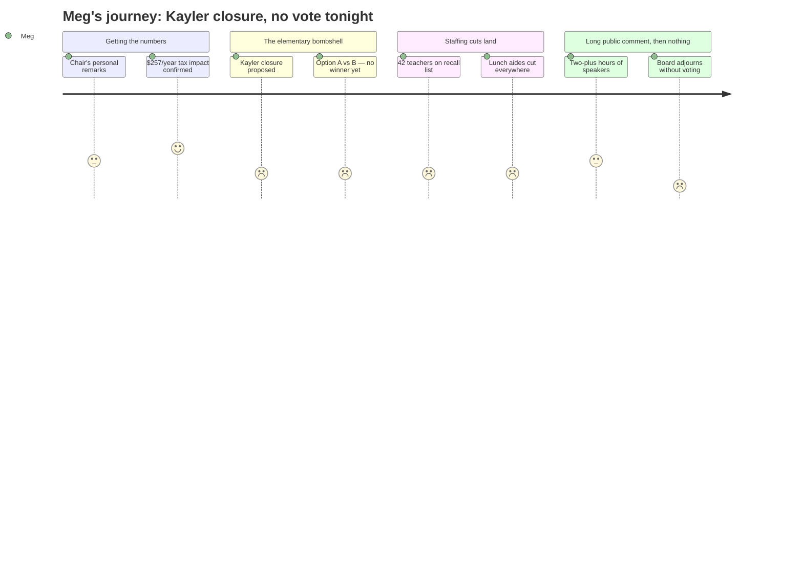

# Interpretation: Meg (PERSONA-011)
## Meeting: School Board Budget Workshop -- March 23, 2026 -- 2026-03-23

### Structured Points

#### 1. No vote was taken — next meeting is Monday March 30
- **Fact:** Despite three action items on the agenda (school closure authorization, Option A or B selection, and budget adoption), the board adjourned at approximately 11:15 PM without voting on any of them. The next scheduled meeting is March 30 at 6:00 PM.
- **Source:** Agenda, Special Meeting items 2.1–2.3; transcript [299:00–307:30] — Chair DeAngelis states "I'm not going to have us go back to going through debate and going into regular session and voting at 11:15."
- **Emotional valence:** negative
- **Threat level:** 4
- **Open question:** true

#### 2. Kayler School is the proposed closure — not Dyer
- **Fact:** After a two-round analysis of all five elementary buildings, district leadership is recommending closure of Kayler School for the 2026–27 school year. The recommendation changed in recent weeks — slides were not posted until the Friday before the meeting. Kayler's entire FY27 budget line is zeroed out in the budget book.
- **Source:** Transcript [33:37–35:12]; presentation slide 16; budget book rows 116–161 (Kaler Elementary, FY27 Budget = $0 across all line items)
- **Emotional valence:** negative
- **Threat level:** 5
- **Open question:** true

#### 3. The tax hit: $257 more per year for an average South Portland home
- **Fact:** The proposed budget delivers a 6% increase in local tax revenue, which works out to approximately $257 in additional annual school taxes for a home assessed at the South Portland average of $514,000. The total budget is $75.85 million, a 3.3% overall increase — the smallest year-over-year operating increase in five years.
- **Source:** Transcript [25:47]; presentation slide 8
- **Emotional valence:** neutral
- **Threat level:** 2
- **Open question:** false

#### 4. 78 positions cut — 42 of them are teachers
- **Fact:** The superintendent's budget eliminates 78 positions, representing 12% of district staff. This includes 42 teachers (32 of whom are on a recall list with no guaranteed position), 18 support professionals (ed techs and clerks), and 13 service association positions. Staff were notified on March 18; association representatives were not initially cc'd on those emails, which the assistant superintendent acknowledged as a miscommunication.
- **Source:** Transcript [11:43–13:17], [51:53–57:25]; presentation slides 29–36
- **Emotional valence:** negative
- **Threat level:** 5
- **Open question:** false

#### 5. Two options for what happens to elementary schools — and the district leadership prefers Option A
- **Fact:** Option A creates two "primary" schools (pre-K–1 at Dyer and Small) and two "intermediate" schools (grades 2–4 at Brown and Skillen). Option B keeps all four remaining schools as K–4. The administration explicitly recommends reconfiguration (Option A) as the better long-term outcome for equity and resource efficiency, but said both can work — Option A is faster, Option B could be a bridge to Option A in fall 2027. Class sizes increase under both options.
- **Source:** Transcript [35:59–49:33]; presentation slides 18–25
- **Emotional valence:** neutral
- **Threat level:** 3
- **Open question:** true

#### 6. All lunch aide positions are eliminated — at every school
- **Fact:** The budget eliminates all seven lunch aide positions district-wide. These are non-union, two-hour-per-day positions. Skillen and Small already had both positions vacant; Dyer had zero. The district cited a 50% vacancy rate over four years and the need to focus resources on instructional outcomes. The second lunch is also being cut; the district cited the Locker Project as an alternative food source.
- **Source:** Transcript [29:39–30:27]; presentation slide 34
- **Emotional valence:** negative
- **Threat level:** 3
- **Open question:** false

#### 7. The finance director warned that FY27 does not fix the underlying problem
- **Fact:** Finance Director Abigail Ketchem (the seventh finance director in six years) explicitly told the board that FY27 "resets our financial path but does not solve our core problems." She warned that labor costs alone increase faster than 6% annually if all staff remain in place, utilities are rising 13–14% per year, and FY28 will add at least $300,000 in new debt service from the athletic field bond. She used the analogy of wiping out credit card debt without changing the spending habits that created it.
- **Source:** Transcript [19:29–23:23]; presentation slide 6
- **Emotional valence:** negative
- **Threat level:** 4
- **Open question:** true

#### 8. Pre-K is actually expanding — just not with local dollars
- **Fact:** Despite the budget cuts, the district is adding approximately 40 pre-K seats for four-year-olds through partnerships — 8 seats funded by Child Development Services for students with special education needs, 16 through a United Way off-site classroom, and 16 through a Head Start on-site partnership. The locally funded 64 pre-K seats remain unchanged.
- **Source:** Transcript [31:14–32:49]; presentation slide 14
- **Emotional valence:** positive
- **Threat level:** 1
- **Open question:** false

---

### Journey Map

---

### Reactions

OK so I watched the whole thing, all five hours. Here's what you need to know right now: **they didn't vote on anything.** I know. I know. The meeting went until 11:15 at night and they adjourned without taking action on the school closure, without picking Option A or Option B, without formally adopting the budget. Next meeting is **Monday March 30 at 6pm**. That's when the actual decisions will happen. Mark it.

Here's the actual news from tonight. Kayler is the school they're recommending to close — that's now confirmed in the proposal. (If you saw earlier reporting about Dyer, that changed. The slides weren't even posted until Friday.) There are two options for what happens to the four remaining schools: Option A splits them into primary schools (pre-K through 1st grade at Dyer and Small) and intermediate schools (grades 2–4 at Brown and Skillen). Option B keeps all four schools as K–4 the way they are now. The district leadership is pushing for Option A. They did NOT vote on which one. On taxes: the number is **$257 more per year** if your home is assessed at $514K, which is the South Portland average. That's the 6% increase the city council asked for — confirmed in the budget slides, slide 8. And the total cut is 78 positions, 42 of them teachers. Thirty-two teachers are on a recall list right now, meaning they don't have a job for next year but get first dibs if something opens up.

Two things I want to flag that I don't think got enough attention tonight. First: the finance director — she's literally the seventh person in that job in six years — was very clear that this budget doesn't actually solve anything. She said FY27 "resets our financial path but does not solve our core problems" and walked through why FY28 is already going to be harder: labor costs go up faster than 6% automatically, utilities are up 13–14%, and there's a new debt payment on the athletic field that adds $300K+. So even if they make all these cuts, they're back at this table next year. Second: every single lunch aide position is gone. All seven of them, every school. That's a tangible daily change for every elementary family, and it didn't get nearly as much air time as the percussion ed tech position, which (yes) is being proposed for elimination again, for the second year in a row. I'll post the board questions list separately — there were a lot of things left unanswered tonight, including the Title VI question about whether closing Kayler (which is about 45% BIPOC and 30–35% multilingual learners) violates civil rights law. The board chair said she wants a legal answer, not a quick Google, and they're coming back to it March 30.