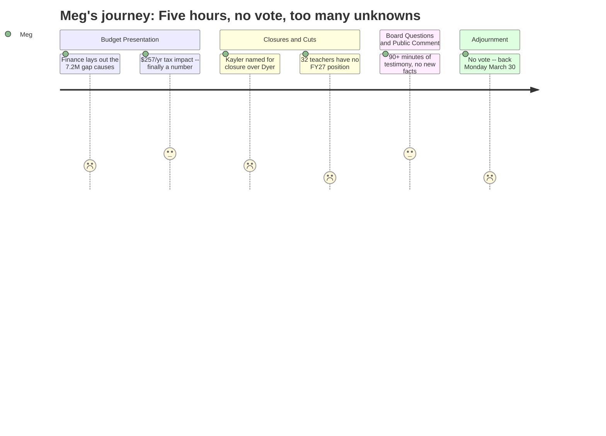

# Interpretation: Meg (PERSONA-011)
## Meeting: School Board Budget Workshop -- March 23, 2026 -- 2026-03-23

### Structured Points

#### 1. Tax increase is $257/year -- the number everyone will ask about
- **Fact:** The proposed FY27 budget delivers the 6% tax increase the city council authorized, translating to approximately $257 in additional property taxes per year for the average household.
- **Source:** Transcript [25:47] — Finance Director Abigail Ketchem: "it works out to about $257 additional per year."
- **Emotional valence:** neutral
- **Threat level:** 2
- **Open question:** false

#### 2. Kayler is the recommended school closure -- not Dyer
- **Fact:** After analyzing all five elementary buildings and then narrowing to Kayler and Dyer, district leadership recommended Kayler for closure, citing factors including that Kayler sits at the end of a dead-end street with only one point of egress, lacks a reciprocal evacuation site, and involves fewer students in transition than a Dyer closure would.
- **Source:** Transcript [34:23–35:12] — Assistant Superintendent Dr. Prince presenting the six-domain analysis; [110:50–111:35] — Dr. Prince responding to board questions.
- **Emotional valence:** negative
- **Threat level:** 4
- **Open question:** true

#### 3. 32 teachers have no position in FY27 -- they're on a recall list, not officially fired
- **Fact:** Of the teachers association reductions, 11 staff were offered a different position and 32 were placed on a recall list -- meaning they have no job in the FY27 budget but retain first-eligibility for any vacancy that opens in their certification area before an outside hire is made.
- **Source:** Transcript [57:25–58:11] — Dr. Prince presenting teacher association impacts.
- **Emotional valence:** negative
- **Threat level:** 4
- **Open question:** true

#### 4. Pre-K seats are actually increasing by 40 -- through outside funding
- **Fact:** Although the district is not adding local pre-K dollars, it is expanding pre-K access by 40 seats through three partnerships: 8 CDS-funded seats for students with special education needs, a new United Way off-site classroom, and 16 Head Start seats in a donated in-kind classroom.
- **Source:** Transcript [32:02–32:49] — Dr. Prince presenting pre-K update.
- **Emotional valence:** positive
- **Threat level:** 1
- **Open question:** false

#### 5. Option A vs. Option B is still unresolved -- and it determines how many times your kid changes schools
- **Fact:** The board did not vote on which elementary configuration to adopt. Option A (pre-K/grade 1 at two "primary" schools, grades 2–4 at two "intermediate" schools) would create two transitions in the elementary years. Option B (all four schools K–4) would create one. The district's leadership team explicitly favors Option A as the path toward demographic equity and resource efficiency, but acknowledged Option B could be implemented for fall 2026 with Option A studied for fall 2027.
- **Source:** Transcript [35:59–48:45] — Principal Connelly presenting both options; [48:45–50:18] — district leadership recommendation; [113:55–116:13] — board questions on phasing.
- **Emotional valence:** negative
- **Threat level:** 4
- **Open question:** true

#### 6. FY26 may also end in deficit -- the crisis is not just FY27
- **Fact:** Finance Director Ketchem stated the district is projecting a deficit for the current fiscal year (FY26), in addition to the structural problems driving FY27 cuts. With the fund balance already depleted, any FY26 shortfall would require drawing on the city's fund balance and repaying it in a subsequent year -- likely through another tax increase.
- **Source:** Transcript [17:55–18:43] — Ketchem: "We are projecting a deficit for this fiscal year. FY27, we're at a limit, but this year is potentially a deficit."
- **Emotional valence:** negative
- **Threat level:** 5
- **Open question:** true

#### 7. A parent raised a Title VI civil rights question about closing Kayler -- it went unanswered
- **Fact:** A Kayler parent identified the school's student population as approximately 45% BIPOC and 30–35% multilingual learners, then asked the board and administration to explain what specific steps were taken to ensure the Kayler closure recommendation does not violate Title VI of the 1964 Civil Rights Act. Neither the board nor the administration provided an answer at the meeting; Chair DeAngelis said she wanted a legal answer, not quick research.
- **Source:** Transcript [163:01–163:47] — public comment; [299:39–300:26] — Chair's attempt to address questions at 11:15 pm.
- **Emotional valence:** negative
- **Threat level:** 3
- **Open question:** true

#### 8. No vote happened -- next meeting is Monday, March 30
- **Fact:** The board did not take action on school closure, grade configuration, or budget adoption at this workshop. The next scheduled meeting is Monday, March 30 at 6:00 pm. At least one board member pushed for an additional meeting sooner, but Chair DeAngelis said March 30 is what's on the books, with any additional meeting to be published on the city website.
- **Source:** Transcript [299:39] — Chair DeAngelis: "I'm not going to have us go back to going through debate and going into regular session and voting at 11:15"; [306:37–307:24] — adjournment discussion.
- **Emotional valence:** negative
- **Threat level:** 3
- **Open question:** true

---

### Journey Map

---

### Reactions

Ok so quick recap: no vote tonight. They went until 11:15pm and then adjourned. Next meeting is Monday March 30, 6pm -- that's when they're actually expected to vote on the school closure and budget. So if you were waiting to hear what happened, the answer is: not yet.

Here's what IS locked in. The proposed tax increase is $257/year for the average household -- that's the 6% ceiling the city council set. Total budget increase is only 3.3%, which they said is the lowest in five years. On positions: 78 total being cut, 42 of those are teachers. But here's the thing about the teachers -- 32 of them are on something called a "recall list." They don't have a job in next year's budget, but they get first crack at any vacancy (retirement, resignation) before the district can hire outside. So not officially fired, but no position. 11 others were offered a different role. That came from Dr. Prince around the two-hour mark. On elementary schools: Kayler is the one they're recommending close. Not Dyer. They ran a two-part analysis with all the principals and Kayler came out as the recommendation both times -- the big reasons cited were the dead-end street (only one way in or out) and no nearby building to use as an evacuation site. But the board has NOT voted on this yet.

The big unresolved thing that will directly affect families with elementary kids: they still haven't decided between Option A (split schools -- pre-K through 1st at two schools, 2nd through 4th at the other two) and Option B (all four schools stay K-4 like now). Option A means two transitions in elementary years. Option B means one. The district's administration is clearly pushing for Option A because of equity -- the idea is it lets them draw boundaries that mix the demographics across the whole city instead of keeping schools tied to neighborhoods. But no decision. Also worth flagging: a Kayler parent asked at public comment whether closing a school that's 45% BIPOC and 30-35% multilingual learners might violate Title VI of the Civil Rights Act. The chair said she wanted a legal answer, not quick research -- meaning that question is sitting open going into the vote. And one more thing I'm still thinking about: the finance director said FY26 -- THIS year -- might also end in deficit. No fund balance left to cover it. That part didn't get much attention in the room but it means this might not be the last round of cuts.