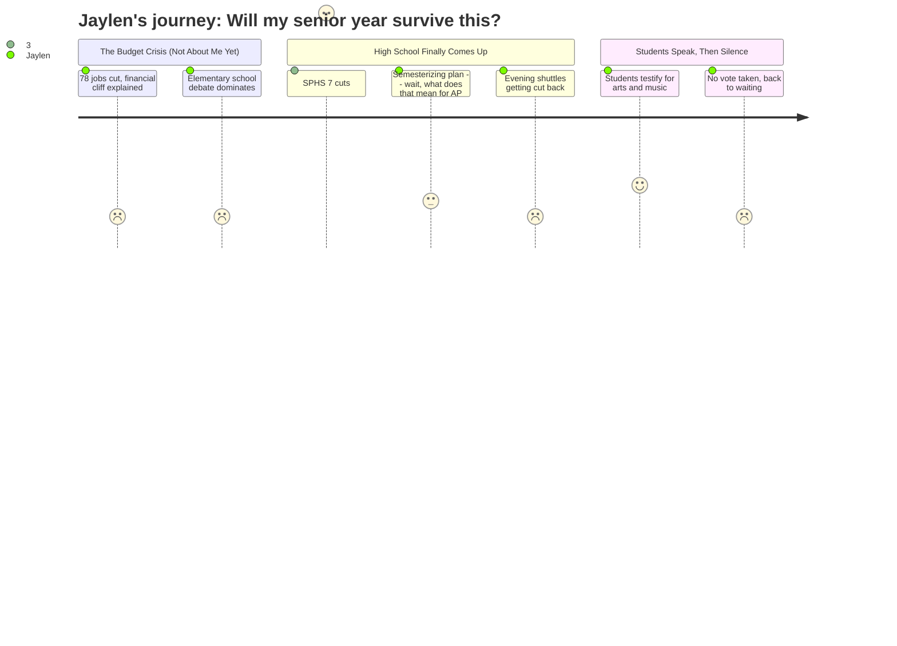

# Interpretation: Jaylen (PERSONA-012)
## Meeting: School Board Budget Workshop -- March 23, 2026 -- 2026-03-23

### Structured Points

#### 1. SPHS is losing 7 teaching positions — but 4 are already vacancies
- **Fact:** Principal Glenn confirmed 7 teaching positions are being reduced at the high school, but 4 of them are from retirements and vacancies that already exist. The cuts span "multiple content areas," but no specific departments were named.
- **Source:** [74:40–75:29]
- **Emotional valence:** neutral
- **Threat level:** 3
- **Open question:** true

#### 2. Glenn said all SPHS courses will stay within current section size limits
- **Fact:** Glenn explicitly stated that under the proposed staffing reductions, "all courses are going to remain within these ranges" and that the school can still allow "diverse course offerings to exist for our students, which is a value that's really important." Science class averages would increase from 18.8 to 21.8 students.
- **Source:** [76:15–77:52]
- **Emotional valence:** positive
- **Threat level:** 1
- **Open question:** false

#### 3. Credits are being semesterized — senior year planning just shifted
- **Fact:** SPHS is proposing to issue credit at the semester mark rather than year-end, allowing students to earn 0.5 credit in January and 0.5 in June. Glenn cited a fresh start at second semester, real-time credit recovery, and attendance incentives as benefits. As part of this change, one math teacher would shift to a learning lab role to provide targeted math support.
- **Source:** [77:52–79:31]
- **Emotional valence:** neutral
- **Threat level:** 2
- **Open question:** true

#### 4. After-school evening shuttles are being reduced
- **Fact:** Operations Director Nally said the district plans to cut its evening shuttle schedule, consolidating from multiple buses running separate east and west routes after 4 PM to potentially a single bus doing "a lap of the city." He acknowledged this represents "a decrease in the level of service" for students getting to and from after-school activities.
- **Source:** [80:18–81:04]
- **Emotional valence:** negative
- **Threat level:** 3
- **Open question:** true

#### 5. The percussion ed tech position is being cut — same as last year
- **Fact:** The budget proposes eliminating the percussion ed tech position shared between the middle school and high school. Multiple public commenters noted this identical position was proposed for cuts in last year's budget and restored after community outcry. The current ed tech is a certified special education teacher who supports students with IEPs and 504 plans across grades 5–12. One speaker confirmed five of the six ed tech III positions proposed for reduction are already vacant, making this the only currently-held position on the list.
- **Source:** [67:30–67:43]; public comment: Lucy [151:22–152:10], Jen Fletcher [199:41–202:44], Amy Haskins [218:19–220:39]
- **Emotional valence:** negative
- **Threat level:** 3
- **Open question:** false

#### 6. Student board members got five minutes, then had to leave to study
- **Fact:** Board Chair DeAngelis explicitly called on student Board Members Davidson and Cabessa to speak before public comment because they had studying to do and needed to leave early. Davidson said he had personally witnessed how disparities built up in elementary school carry directly into middle and high school, and expressed support for reconfiguration. The principal in the audience nodded when the chair acknowledged their departure.
- **Source:** [138:02–140:23]
- **Emotional valence:** positive
- **Threat level:** 1
- **Open question:** false

#### 7. Computer science is being cut at both the middle and high school
- **Fact:** Middle school computer science teacher Peter Wetzel spoke during public comment confirming his position is being eliminated. Another speaker noted that CS at the high school is not a required course and that with only one HS CS teacher remaining, access would drop further. Wetzel said his position had built a "middle school computer science curriculum from scratch" and called the cut a loss of "real 21st-century skill building."
- **Source:** Public comment: Gretchen Nelson [270:45–271:32]; Peter Wetzel [277:05–279:31]
- **Emotional valence:** negative
- **Threat level:** 2
- **Open question:** true

---

### Journey Map

---

### Reactions

Okay so I went to that board meeting last night and it was five hours long, and here's the thing — for like the first hour and a half it was basically all about which elementary school is closing, and I get that it matters but that's not my world. The part that actually hit me was when the high school principal got up. They're cutting seven teaching positions at SPHS but she said four of them are people who are already retiring or positions that are already empty, so like, we're not actually losing four teachers mid-career. And she specifically said all the courses are staying within their normal ranges, like they're not just cutting programs to save money. I was honestly a little relieved. But here's what she *didn't* say — she never said which content areas those other three real cuts are coming from. "Multiple content areas." That's it. So I have no idea if that includes theater. I have no idea if the teacher I was counting on for senior year is gone. That's the part I'm going to be thinking about all week.

The other thing they announced is they're changing how credits work — like instead of getting a full credit at the end of the year, you'd get half at January and half in June. They're calling it semesterizing. I actually think that could be good for some people, like if you're bombing a class you get a reset point. But I'm also thinking about AP classes — does that mess with how those work? Do college transcripts look different? Nobody explained that part. And then the operations guy got up and said they're cutting the evening shuttle routes. Not eliminating them completely, but going from multiple buses to maybe one bus doing a loop. He literally said it's "a decrease in the level of service." Cross-country meets run late. Theater rehearsals run late. That's not a small thing to me — that's how people get home.

The part that actually made me the most frustrated though was the percussion ed tech thing. Multiple people got up during public comment and said this exact same position got cut in last year's budget and they had to fight to get it back, and here we are again. I'm in theater, not band, but I know what it means when arts positions keep going on the chopping block every single year — it means they're the first thing leadership thinks to cut and the last thing they actually fight to protect. And honestly? The two students who are actually on the board — Davidson and Cabessa — they got called up early specifically because they had to leave to go study. Which is kind of cool that they're there at all, but also kind of the whole problem. Students are the whole point of this and we had to leave before public comment even started. No vote happened. They're meeting again Monday. I still don't know if my programs exist next year.