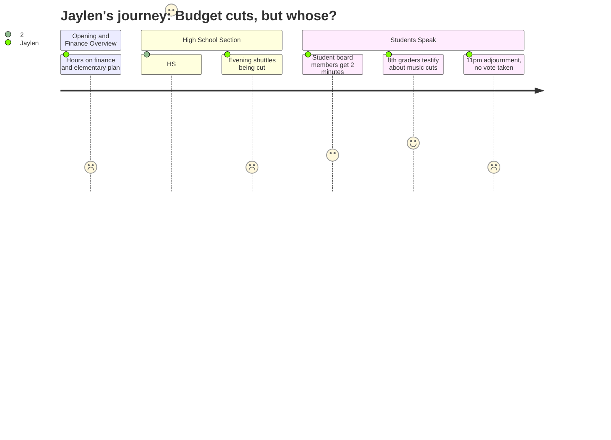

# Interpretation: Jaylen (PERSONA-012)
## Meeting: School Board Budget Workshop -- March 23, 2026 -- 2026-03-23

### Structured Points

#### 1. SPHS at Its Lowest Enrollment in Recent Memory
- **Fact:** Principal Glenn opened the high school section with an enrollment graph showing SPHS projected to start FY27 at its lowest enrollment "in recent memory," approximately 40 students below the current year. Declining enrollment was framed as the primary justification for proportional teaching cuts.
- **Source:** [73:54–74:00]; FY27 Budget Presentation, Slide 61
- **Emotional valence:** negative
- **Threat level:** 3
- **Open question:** true

#### 2. Seven Teaching Positions Cut at SPHS, Including Art
- **Fact:** SPHS will lose 7 teaching positions across multiple content areas — Science (2), English (1), World Language/ESOL (1), Special Education Case Managers (2), Social Work (1), Career and Technical Education (1), and a 0.5 FTE Art position. Four of the seven are retirements or existing vacancies.
- **Source:** [74:40]; FY27 Budget Presentation, Slide 37
- **Emotional valence:** negative
- **Threat level:** 4
- **Open question:** true

#### 3. Evening Shuttle Service Being Cut
- **Fact:** The operations director announced plans to reduce the evening shuttle schedule, which currently runs three to four unassigned buses after 4 PM to move students to after-school activities. The proposed change consolidates to one bus doing a single loop of the city — explicitly described as "potentially decrease the level of service."
- **Source:** [80:18–80:50]
- **Emotional valence:** negative
- **Threat level:** 3
- **Open question:** true

#### 4. SPHS Courses Being Semesterized
- **Fact:** SPHS proposed issuing credit by semester rather than by year, so a full-year course would earn 0.5 credit at the midpoint and 0.5 at year's end. Administration framed this as beneficial for attendance incentives and credit recovery, but acknowledged it would require a new formal midterm schedule and a shift of one math teacher to a learning lab role.
- **Source:** [77:52–79:31]
- **Emotional valence:** neutral
- **Threat level:** 2
- **Open question:** true

#### 5. Student Board Members Speak Briefly, Then Sent Home to Study
- **Fact:** Board Chair DeAngelis preemptively announced to the room that student board members Davidson and Kabesa needed to leave early because "they both have studying to do." Both were given time to speak in the board questions section before exiting. Davidson said he supports reconfiguration, observes equity disparities firsthand across middle and high school, and called change "somewhat inevitable."
- **Source:** [97:36]; [138:02–140:23]
- **Emotional valence:** positive
- **Threat level:** 1
- **Open question:** false

#### 6. Eighth Graders Testify About Music Cuts
- **Fact:** Two eighth graders — Lucy and Samantha — spoke during public comment about the proposed elimination of the percussion ed tech position, describing specifically how the role enables band teachers to run full-ensemble rehearsals while the ed tech works separately with percussionists. Both noted that the ed tech is a certified special education teacher who makes the program accessible to students with IEPs. The board chair had to ask the audience three times not to applaud.
- **Source:** [151:22–154:47]
- **Emotional valence:** positive
- **Threat level:** 2
- **Open question:** true

#### 7. Five Hours of Meeting; About Five Minutes on the High School
- **Fact:** The combined middle and high school section ran from approximately [66:55] to [79:31] — roughly 13 minutes total, with the SPHS portion approximately 5 minutes. No board member asked a follow-up question specifically about SPHS course offerings or what current students should expect. Over 90 minutes of public comment was dominated entirely by elementary school concerns, with no SPHS student speakers.
- **Source:** [66:55–79:31] (MS and HS section); [11:43–66:55] (elementary section); [150:34–299:00] (public comment)
- **Emotional valence:** negative
- **Threat level:** 3
- **Open question:** true

---

### Journey Map

---

### Reactions

So I stayed up way too late trying to watch this meeting and here's what I can tell you: it was five hours, and I'd say four of them were about closing an elementary school I have never been to. Which I get — that's devastating for those families. But I'm a junior planning out senior year, and the high school principal got maybe five minutes on screen. She said they're cutting seven teachers at SPHS "across multiple content areas." One of them is an Art position — half a position — and then the board just moved on. No one asked which specific classes disappear. Science, English, Art — they're all listed on one slide — but nobody pressed on whether theater survives, or whether the AP sections I'm counting on still get offered, or what "multiple content areas" actually means for the kids who are registering for classes right now. The school newspaper wants to cover this budget and I genuinely cannot give them a straight answer about what's changing at our school, because nobody at that meeting gave a straight answer.

The cross-country thing is also messing with me. The operations guy announced they're cutting the evening shuttle runs — right now there are three or four buses after school moving kids to activities, and they want to go down to one bus doing a single loop of the city. He literally called it "a potential decrease in the level of service" and kept moving. No one on the board asked a follow-up question. That shuttle is how a bunch of kids on my team get home from late practice. For some families if that bus doesn't run, the sport doesn't run. They're also changing how you earn credit — something about getting credit at the semester instead of end of year — and they said it was good for students but they'd also need a whole new midterm schedule, and I couldn't tell if that was actually ready or just a thing that got announced.

The thing that actually landed was these two eighth graders who walked up to the mic during public comment and gave these calm, specific speeches about their band teacher being cut. One of them explained exactly what the ed tech does in a rehearsal — runs the percussion section in a separate room while the directors work with everyone else — and you could feel the whole room shift. I've done that. I stood at that podium last year when they were talking about cutting theater and that feeling is real. The two student board members each got like two minutes to speak before the chair announced to the whole room that they needed to leave early — she literally said "they have studying to do." And fine, we do, but also we are supposedly the entire reason this budget exists? Nothing got voted on. They ran out of steam at 11 pm and adjourned. Senior year is still a question mark.