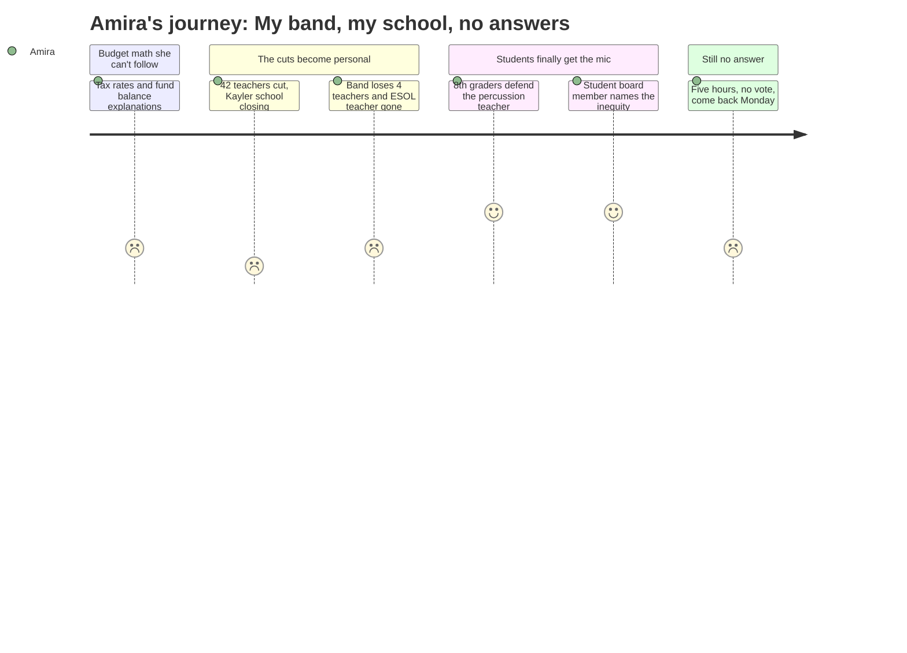

# Interpretation: Amira (PERSONA-013)
## Meeting: School Board Budget Workshop -- March 23, 2026 -- 2026-03-23

### Structured Points

#### 1. Band Is on the Chopping Block — Again
- **Fact:** The FY27 budget proposes cutting four related arts teachers at the middle school (reducing from 20 to 16) and eliminating the percussion ed tech position that supports band students in grades 5–12. Multiple public speakers noted this same position was nearly eliminated the previous year.
- **Source:** [68:29–70:02] Principal Stern's middle school presentation; public comment by Lucy [~151:55–152:59], Samantha [~153:47–154:33], Jen Fletcher [~199:40–201:58]
- **Emotional valence:** negative
- **Threat level:** 4
- **Open question:** true

#### 2. Kayler School Is Closing — and It's the Most Diverse Elementary
- **Fact:** The superintendent's budget recommends closing Kayler Elementary. A parent speaker identified Kayler as approximately 45% BIPOC and 30–35% multilingual learners. A separate speaker observed that none of the multilingual families were present at the meeting to speak for themselves.
- **Source:** [163:01] public comment, Jess Elsner; [217:32] public comment, Mia Proctor
- **Emotional valence:** negative
- **Threat level:** 3
- **Open question:** true

#### 3. The ESOL Teacher at the Middle School Is Being Cut
- **Fact:** The budget proposes eliminating one ESOL teacher at the middle school and discontinuing the co-teaching model — where a multilingual learner teacher works alongside a regular classroom teacher — described by Principal Stern as "best practice, but not required."
- **Source:** [68:29] Principal Stern; [71:35–72:22] ESOL reduction explanation; FY27 Budget Presentation, Slides 57–58
- **Emotional valence:** negative
- **Threat level:** 2
- **Open question:** true

#### 4. Two Student Board Members Spoke — Then Had to Leave for Homework
- **Fact:** Student board members Davidson and Kabisa were invited to speak before public comment and then excused early because they had schoolwork. Member Davidson said he had personally witnessed disparities across the community and that gaps in early education "show up" and "disrupt" middle and high school classrooms.
- **Source:** [137:48] Chair DeAngelis directing the student members to speak; [138:19–139:36] Member Davidson's statement
- **Emotional valence:** positive
- **Threat level:** 1
- **Open question:** false

#### 5. 32 Teachers Are on a List — With No Job Yet
- **Fact:** Under the proposed budget, 32 teachers have been placed on a "recall list," meaning their positions are eliminated but they could be called back if a vacancy opens. 42 total teaching positions are proposed for elimination districtwide.
- **Source:** [57:25] Dr. Prince's staffing presentation; FY27 Budget Presentation, Slide 36
- **Emotional valence:** negative
- **Threat level:** 4
- **Open question:** true

#### 6. Five Hours of Talking — No Vote
- **Fact:** Despite a five-hour meeting with hundreds of community members present, the board did not vote on closing Kayler, selecting a reconfiguration option, or adopting the budget. The board chair stated she would not have them vote at 11:15 at night. The next meeting is scheduled for March 30.
- **Source:** [~299:00] Board Chair DeAngelis: "I'm not going to have us go back to going through debate and going into regular session and voting at 11:15."
- **Emotional valence:** negative
- **Threat level:** 3
- **Open question:** true

#### 7. The Gifted Program Is Still in the Budget
- **Fact:** The FY27 budget book maintains the Academically Gifted program at 3.0 FTEs — unchanged from FY26 — with no proposed reductions to that program.
- **Source:** FY27 Budget Book, rows 673–684 ("ACADEMICALLY GIFTED")
- **Emotional valence:** positive
- **Threat level:** 1
- **Open question:** false

---

### Journey Map

---

### Reactions

So they spent basically five hours talking and then it was almost midnight and they said "come back next week"? Nobody voted on anything. Mom, I still don't know what's happening to my band class. They want to cut four music teachers — four! — plus the guy who teaches percussion, who is literally the reason the whole band works. And the kids who spoke, two eighth graders, they got up and said the exact same things people said last year when they tried to cut that same position. Last year they almost cut him and now they're doing it again. And every time someone clapped for the kids who spoke, the board chair got on the microphone and said stop, no clapping. Three times she said it. Why can't people clap for students who got up in front of a huge crowd and said something true?

The other thing I keep thinking about is Kayler. That's the school that's closing. And someone at the meeting said it's the school with the most Black and brown kids, and the most kids learning English — like, kids from families like ours. And a woman said she looked around the room and none of those families were there because nobody told them what was really happening in time. And when a parent asked whether closing Kayler violates civil rights laws, the board basically said they didn't have an answer yet. They'd get back to her. After five hours.

The only part where I felt like someone actually got it was when the student board members talked. One of them said he sees the unfairness every day — that if kids don't get what they need in elementary school, it follows them to middle school and high school, and it messes up the whole classroom. He said that out loud. And then he and the other student board member had to leave because they had homework and school the next day. The grown-ups stayed until midnight arguing and got nowhere. The students had to go home. I feel like that's kind of the whole problem.