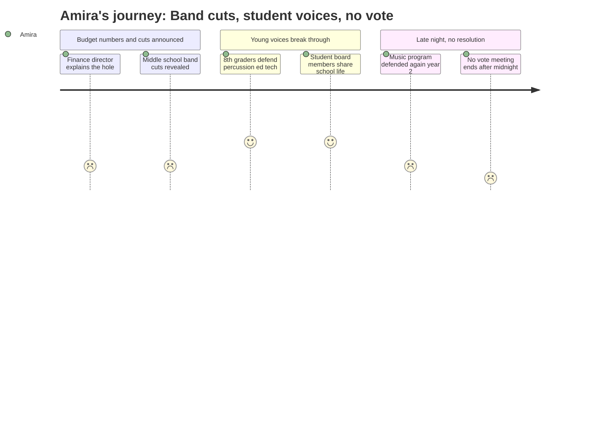

# Interpretation: Amira (PERSONA-013)
## Meeting: School Board Budget Workshop -- March 23, 2026 -- 2026-03-23

---

### Structured Points

#### 1. The percussion ed tech is being cut — and this already happened last year
- **Fact:** The percussion ed tech position at the middle and high school is proposed for elimination in this budget. Multiple speakers — including instrumental music teacher Jen Fletcher — pointed out that this exact cut was proposed 378 days earlier, community members came out and fought it, and it was restored. Now it's back on the chopping block.
- **Source:** Jen Fletcher public comment [198:54]: "378 days ago, I stood at this same podium to speak against proposed reductions to a general music position, as well as the percussion instructor ed tech position. It is disheartening to be here once again." Also Rebecca Stern at [67:43]–[68:29] presenting the official cut.
- **Emotional valence:** negative
- **Threat level:** 4
- **Open question:** true — Will the board restore it again the way they apparently did last year, or will it finally be gone for good?

#### 2. Four related arts teachers at the middle school are being eliminated
- **Fact:** The middle school is cutting from 20 to 16 related arts teachers. The teachers who remain will teach five classes a day instead of four. Principal Stern framed this as preserving course offerings — students won't have to choose between band and chorus — but four teachers are still gone.
- **Source:** Rebecca Stern at [68:29]–[70:02]: "we are proposing the reduction, however, of four teachers from 20 to 16 related arts teachers... they would teach five classes a day."
- **Emotional valence:** negative
- **Threat level:** 3
- **Open question:** true — Amira doesn't know which specific teachers are losing their jobs. Nobody told students.

#### 3. Two 8th graders from band got up and spoke at the microphone
- **Fact:** Lucy and Samantha, both 8th-grade students at SPMS, walked to the public comment podium during a five-hour meeting to defend the percussion ed tech. Lucy noted he is a certified special education teacher whose presence makes music accessible to all students. Samantha said the impact "is seen in the music that is produced."
- **Source:** Lucy at [151:22]–[152:10]: "Please don't compromise our music program." Samantha at [152:59]–[154:33].
- **Emotional valence:** positive
- **Threat level:** 1
- **Open question:** false

#### 4. Two student board members spoke about what school is actually like — then left to study
- **Fact:** Board Members Davidson and Cabessa, described as students themselves currently in the school system, spoke before leaving the meeting early because they had studying to do. Davidson said he has "seen the disparities in our community" and that they show up at the middle school and high school level, not just elementary. The board chair noted their presence and let them speak before public comment.
- **Source:** [138:02]–[140:23]: "I think Angela and I's experiences are pretty cool because we're in these systems that these decisions affect... I do support reconfiguration, and I think it's somewhat inevitable."
- **Emotional valence:** positive
- **Threat level:** 1
- **Open question:** false

#### 5. The one ESOL teacher at the middle school is being cut
- **Fact:** One ESOL teaching position at the middle school is proposed for elimination, based on a projected decrease of 11 students needing English language services. Principal Stern acknowledged the actual number won't be known until May, when access test scores arrive.
- **Source:** Rebecca Stern at [70:48]–[72:22]: "This is a determination to reduce staffing based on a decrease in the number of ESOL students that are coming into the middle school next year. You can see it's a decrease of 11 students projected..."
- **Emotional valence:** negative
- **Threat level:** 2
- **Open question:** true — For students Amira knows who are still learning English, what does losing the co-teaching model mean in practice?

#### 6. Some middle schoolers in band and chorus might lose PE entirely
- **Fact:** A public comment speaker and middle school PE teacher argued that because of scheduling, students enrolled in band, chorus, world language, or learning lab may lose access to physical education altogether under the proposed cuts — not just a reduction, but none at all.
- **Source:** Jamie Watson public comment [193:29]–[195:03]: "physical education will be reduced to only a half year. Some students, particularly those enrolled in band, chorus, world language, or learning lab, may lose access to physical education altogether."
- **Emotional valence:** negative
- **Threat level:** 3
- **Open question:** true — Amira is in band and the gifted pull-out program. Does this apply to her schedule specifically?

#### 7. A school administrator actually said out loud that related arts are "often the highlight" for students
- **Fact:** Principal Stern, while presenting the cuts to related arts, openly acknowledged that these classes are "often the highlight for students" at the middle school and that the district values students being able to take both band and chorus. This was a rare moment of an adult in authority saying what students already know.
- **Source:** Rebecca Stern at [69:17]: "Often the highlight for students, no offense to our literacy, math, and science teachers, but RAs are pretty exciting."
- **Emotional valence:** positive
- **Threat level:** 1
- **Open question:** true — If adults know it's the highlight, why is it what gets cut?

#### 8. 42 teachers are losing their jobs across the district, and students weren't told
- **Fact:** The district is eliminating 42 teacher positions as part of the proposed budget. Affected staff were notified the week of March 18th. Multiple community speakers mentioned that students and families found out from news coverage, word of mouth, or classmates — not from the district directly.
- **Source:** Finance presentation at [13:17]: "We are proposing losing 12% of our staff." Kate Heard public comment [213:35]: "many of us first learned about the possible closure of our school through the news, not from the district."
- **Emotional valence:** negative
- **Threat level:** 4
- **Open question:** true — Are any of Amira's teachers on that list? She still doesn't know.

---

### Journey Map

---

### Reactions

Most of the meeting was honestly about elementary schools — like five hours of adults arguing about which school should close and whether kids should switch buildings. And I get it, that's serious. But there's this whole part where they finally get to the middle school, and that's when I actually paid attention. They're cutting four related arts teachers. Four. That's band, PE, STEM, computer science — I don't even know exactly who yet, and I don't think they told students anything. And the percussion ed tech? They're cutting that position again. Jen Fletcher — she's one of the band directors — she got up and said 378 days ago she was standing at the exact same microphone saying the exact same thing. And they kept the position back then, and now here we are. I kept thinking, how does this keep happening to the same person, the same position, every single year?

The thing that actually got to me was when Lucy and Samantha — they're in 8th grade, they're in band — they walked up to the microphone in front of the whole room. All those adults. And they talked about what the percussion ed tech actually does, how he runs the percussion sectionals so the band can actually move faster, how he has a special ed certification so he makes band accessible for everyone. I don't know if I would've been able to do that. And then nobody clapped — the board chair kept cutting the clapping off — which honestly felt weird after what they said. Like they did this brave thing and the room just had to sit there in silence. But also there were two student board members, Davidson and Cabessa, who spoke about what it's actually like inside the schools before they left early to go study. That part felt different. Like someone actually at the table who knows what a middle school day feels like.

Here's what I can't stop thinking about though: they said students in band might not get PE at all next year. Not half a year — zero, if their schedule doesn't have room. And 42 teachers are being cut across the whole district, and nobody told students who. My parents hear about this from the news. I hear about it from friends in the hallway. Nobody sends us anything. The meeting ended at like 11 at night and they didn't even vote on anything. Everyone waited five hours and they said, come back Monday. I don't know if my teachers are staying. I don't know what my schedule looks like. And apparently this same exact fight happened last year, and the year before, and we're just going to keep doing this.