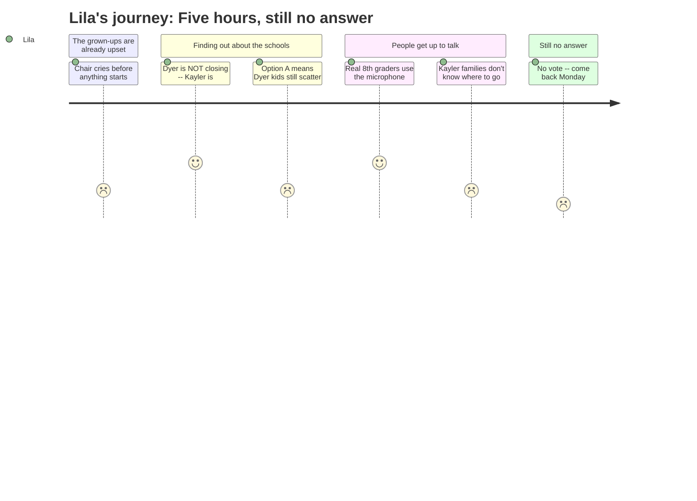

# Interpretation: Lila (PERSONA-014)
## Meeting: School Board Budget Workshop -- March 23, 2026 -- 2026-03-23

### Structured Points

#### 1. Dyer Is Not the School Closing — Kayler Is
- **Fact:** The administration announced that after evaluating all five elementary buildings twice using a six-domain analysis, the recommendation is to close Kayler — not Dyer. Kayler was selected partly because it sits at the end of a dead-end street with limited emergency egress, while Dyer and South Portland High School serve as reciprocal evacuation sites for each other.
- **Source:** [34:23--35:12]
- **Emotional valence:** positive
- **Threat level:** 2
- **Open question:** true

#### 2. Under Option A, Dyer Students in 2nd–4th Grade Would Still Have to Leave
- **Fact:** Option A reconfigures Dyer as a primary school serving only pre-K through 1st grade. This means students currently in 2nd, 3rd, and 4th grade at Dyer — as well as any current 1st graders, like Lila's younger sibling — would need to transfer to Brown or Skillen for their intermediate years, even though Dyer itself is not closing.
- **Source:** [36:45--37:33]
- **Emotional valence:** negative
- **Threat level:** 3
- **Open question:** true

#### 3. The Lady Running the Meeting Was Already Crying Before It Started
- **Fact:** Board Chair DeAngelis opened the meeting by describing how she burst into tears at dinner with friends when asked how she was doing — saying she hadn't realized how much she was holding inside. She asked the room for kindness and grace toward one another.
- **Source:** [03:06--03:56]
- **Emotional valence:** negative
- **Threat level:** 2
- **Open question:** true

#### 4. Real Kids Got to Stand at the Microphone
- **Fact:** Two 8th-grade students, Lucy and Samantha, came to the public comment microphone to speak about the percussion ed tech position and what the music program means to them. Lucy said her teachers and fellow musicians feel like family. Samantha said that even when a small grain of sand is moved, the entire beach feels its impact.
- **Source:** [152:10--155:19]
- **Emotional valence:** positive
- **Threat level:** 1
- **Open question:** false

#### 5. Kayler Kids Don't Know Where They're Going
- **Fact:** Multiple Kayler parents described the trauma of losing their school. Parent Morgan Kerr said Kayler children were going to be the "yo-yo" being pulled between whatever option the board chose. When asked directly where Kayler students would go after closure, the administration's answer was: "We don't have the answer to that at this point."
- **Source:** [297:11--298:51] and [303:32]
- **Emotional valence:** negative
- **Threat level:** 4
- **Open question:** true

#### 6. Teachers Are Losing Their Jobs — Including Maybe Ones at Dyer
- **Fact:** The budget proposes eliminating 78 positions district-wide, including 42 teachers. Staff across all schools were notified the week before this meeting. The administration confirmed that if the board moves forward with the superintendent's budget as presented, all impacted staff have been notified and no further reductions are anticipated.
- **Source:** [13:17] and [51:53--52:42]
- **Emotional valence:** negative
- **Threat level:** 4
- **Open question:** true

#### 7. There Will Be More Kids in Each Classroom
- **Fact:** Principal Connolly presented class size projections showing that both Option A and Option B result in increased average class sizes. Current district policy caps kindergarten through 2nd grade at 20 students per class and 3rd through 4th grade at 24 — and the presentation acknowledged that averages would rise toward those ceilings in both options.
- **Source:** [39:08--39:55]
- **Emotional valence:** negative
- **Threat level:** 2
- **Open question:** false

#### 8. They Still Didn't Decide Anything — Another Meeting Next Monday
- **Fact:** Despite a meeting that lasted over five hours and ended past 11 PM, the board did not vote on closing a school or choosing between Option A and Option B. The chair announced the next scheduled meeting is Monday, March 30th. One board member asked whether they could meet sooner than that; the chair did not commit to an earlier date.
- **Source:** [299:39--307:24]
- **Emotional valence:** negative
- **Threat level:** 2
- **Open question:** true

---

### Journey Map

---

### Reactions

So you know how everyone at school was saying Dyer was gonna close? My mom went to that huge meeting last night — she was there until almost midnight — and she said it's actually Kayler that's closing, not Dyer. Which is a relief but also really sad because I know some kids who go to Kayler and their whole school is just gone. There was a mom at the meeting who said the Kayler kids are going to be like a yo-yo getting pulled between schools no matter what they pick, and nobody could even answer the question of where those kids are going to go next year. My mom said when someone asked "if Kayler closes, where do those kids go?" the people in charge said they don't have an answer yet. That made me feel really bad.

There were actual 8th graders who got to stand up at the microphone and talk to everybody! A girl named Lucy said her band was like her family and she didn't want them to cut the music teacher. And another girl named Samantha said something about how even one grain of sand moving changes the whole beach. My mom said that was a really good thing to say. I want to do that someday — just walk up and say something and everyone has to listen.

The confusing part is that even though Dyer isn't closing, there's this other plan where schools only have certain grades. Like Dyer would only have little kids — kindergartners and first graders — so my little brother would have to move to a different school for second grade even though Dyer is still there. I don't totally understand it. And they didn't even vote! My mom said they're having ANOTHER meeting next Monday. The lady who runs everything was crying at the very beginning of the meeting, before she even said anything about schools — like actual real tears. I asked my mom why all the grown-ups keep crying about school and she didn't really have an answer. Neither does anybody else.