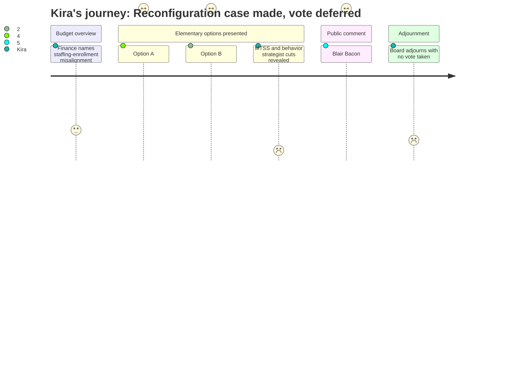

# Interpretation: Kira (PERSONA-015)
## Meeting: School Board Budget Workshop -- March 23, 2026 -- 2026-03-23

### Structured Points

#### 1. Option A presentation names MTSS resource allocation as a core operational advantage
- **Fact:** Principal Connolly explained that grade-span reconfiguration under Option A enables efficient allocation of Multi-Tiered Systems of Support resources, noting that in a K-4 school "you have staff that works across all grade levels K through four, which... requires that your kindergarten schedule looks very similar to your fourth-grade schedule because you have staff that teaches across." A grade-level building removes that scheduling constraint entirely.
- **Source:** Transcript [41:36–42:23]; Presentation Slide 22 (Option A Analysis)
- **Emotional valence:** positive
- **Threat level:** 1
- **Open question:** true

#### 2. Option B analysis explicitly states it cannot achieve demographic equity or efficient resource allocation
- **Fact:** The district's own Option B analysis slide named as a challenge that "this model will make it more challenging to reach our district goals of creating more heterogeneous schools and classrooms" and "this model will not bring us to the most efficient allocation of resources."
- **Source:** Transcript [46:22–47:58]; Presentation Slide 24 (Option B Analysis)
- **Emotional valence:** negative
- **Threat level:** 4
- **Open question:** true

#### 3. The sole full-time Regular Education Behavior Strategist position cut to zero
- **Fact:** The SPTA reduction list shows the elimination of "1 Regular Education Behavior Strategist," with the parenthetical "(none full time)" — meaning no full-time regular-education behavioral support specialist will exist district-wide in FY27, even as class sizes are projected to increase across all four remaining elementary schools.
- **Source:** Presentation Slide 37 (Teachers Association Reductions); Transcript [274:42–276:18]
- **Emotional valence:** negative
- **Threat level:** 5
- **Open question:** true

#### 4. Four MTSS positions eliminated, with eight remaining district-wide
- **Fact:** The SPTA reduction list includes "4 Multi Tiered Systems of Support Roles (2 math and 2 literacy)" with the notation "(8 remain)" — a one-third reduction in the district's intervention capacity, even as the proposal simultaneously increases class sizes and redistributes Kayler students into the remaining buildings.
- **Source:** Presentation Slide 37 (Teachers Association Reductions)
- **Emotional valence:** negative
- **Threat level:** 5
- **Open question:** true

#### 5. Blair Bacon testifies to the exact Band-Aid dynamic Kira has documented firsthand
- **Fact:** Blair Bacon, a RIF'd Skillen literacy interventionist with National Board Certification, testified that her position was "created because South Portland couldn't figure out another way to bridge the inequities across our elementary schools" and was "a Band-Aid on a wound too large." She explicitly called reconfiguration "the only way to face these problems head-on," warning that "consolidation without reconfiguring will only perpetuate the deep inequities in our schools."
- **Source:** Transcript [156:05–159:55]
- **Emotional valence:** positive
- **Threat level:** 2
- **Open question:** false

#### 6. South Portland's special education strategist-to-student ratio already second-worst among comparable districts
- **Fact:** The regional special education comparison shows South Portland at 210 students per strategist/coordinator — the second-highest ratio among eight comparable districts, with only Westbrook (591:1) doing worse. Gorham maintains 93.4:1. This baseline exists before the FY27 MTSS cuts take effect.
- **Source:** Presentation Slide 44 (Regional Special Education Comparison); Transcript [62:12–63:46]
- **Emotional valence:** negative
- **Threat level:** 4
- **Open question:** true

#### 7. Board adjourns without a vote; next scheduled meeting is March 30
- **Fact:** After more than five hours of testimony and board Q&A, the meeting adjourned on a motion by Member Smith without any vote on school closure, grade configuration, or the budget. Multiple board members pressed for an earlier follow-up; the chair confirmed only March 30 is currently scheduled, against an April 7 City Council hard deadline.
- **Source:** Transcript [299:39–307:24]
- **Emotional valence:** negative
- **Threat level:** 3
- **Open question:** true

---

### Journey Map

---

### Reactions

I texted my colleague at Dyer the moment I got home because I could not sleep on this. The district put it in their own slide deck — Option B "will make it more challenging to reach our district goals of creating more heterogeneous schools." They wrote that. And there are still board members wavering between the two options like it's a coin flip. I work at three buildings. I know what those schools look like on the inside. Sending half of Kayler's students into Skillen — where I'm already watching kids wait for MTSS services that don't have enough hours to reach them — doesn't fix anything. It just redistributes the overload. And we just cut four MTSS positions and zeroed out the one full-time regular ed behavior strategist in the whole district. Zero. While class sizes are going up. I need someone to show me that math.

The part of the night that hit me hardest was Blair Bacon. She was the interventionist at Skillen — basically the same role I do, different flavor — and she got RIF'd. She stood at that podium and said exactly what I say in planning periods between buildings: *"I was a Band-Aid."* That's the whole thing right there. We've been throwing individual specialists at the schools with the heaviest concentrations of need because the boundaries were never redrawn to reflect the city. It doesn't work. And the Boundaries and Configurations Committee apparently said the same thing two years ago, according to Kathy Mills from the music boosters of all people — and nothing happened. So now we're here cutting the Band-Aids while having a five-hour debate about whether to heal the wound.

What's keeping me up is the timeline and the strategist numbers. We're already sitting at 210 students per MTSS strategist — second-worst in the region — and that's before the FY27 reductions kick in. The kids on my caseload across three schools aren't abstract. I know which ones are on wait lists. I know which ones at Skillen don't get the same access as kids at Brown because the scheduling math doesn't work in a K-4 building. That's what Option A fixes — and Principal Connolly said it plainly at about 41 minutes in. But the board went home without voting. March 30 is the next meeting. April 7 is the City Council presentation. If they pick Option B because it *feels* like less disruption, we're going to spend the next three years doing the exact same thing Blair Bacon and I have been doing: throwing resources at symptoms while the structural problem stays untouched. I've seen what that looks like. I've lived it. I'm tired of it.