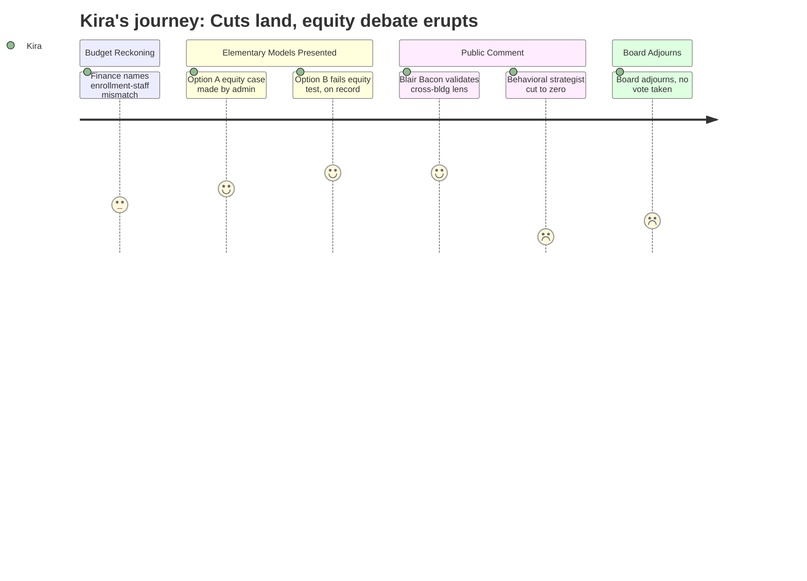

# Interpretation: Kira (PERSONA-015)
## Meeting: School Board Budget Workshop -- March 23, 2026 -- 2026-03-23

### Structured Points

#### 1. Administration makes the equity case for Option A from the inside
- **Fact:** Principal Connolly, presenting the reconfiguration options, explicitly stated that a grade-span configuration allows for "more efficiencies to how we allocate our human resources" for MTSS, and that targeting those resources to two primary schools instead of spreading them across all four would allow for more effective foundational literacy intervention.
- **Source:** Transcript [40:46–41:36]
- **Emotional valence:** positive
- **Threat level:** 2
- **Open question:** true

#### 2. Option B named — on the record — as perpetuating demographic segregation
- **Fact:** Principal Connolly stated that the full grade-band model (Option B) "does not address our goal of having more heterogeneous schools and classrooms," "does not bring us closer to the efficient allocation of resources," and carries the risk of returning to unequal class sizes across schools — with lower class sizes at one school and higher at the same grade level in another.
- **Source:** Transcript [46:22–47:58]
- **Emotional valence:** positive
- **Threat level:** 2
- **Open question:** true

#### 3. Blair Bacon names the cross-building equity failure from professional experience
- **Fact:** Blair Bacon, a National Board Certified literacy interventionist and multilingual endorsee who is part of the 2026 RIF class, testified that her Skillen interventionist position existed because "South Portland couldn't figure out another way to bridge the inequities across our elementary schools," calling it "a Band-Aid on a wound too large," and explicitly called on the board to vote for consolidation and reconfiguration.
- **Source:** Transcript [156:05–159:55]
- **Emotional valence:** positive
- **Threat level:** 1
- **Open question:** false

#### 4. Regular ed behavioral strategist eliminated with zero positions remaining
- **Fact:** Ed tech Nicholas Boggs testified that the proposed budget eliminates the one regular education behavioral strategist position, and that "when you look at that right next to it, it says that there is nobody else" — noting this coincides with increasing class sizes and predicting escalating behavioral incidents.
- **Source:** Transcript [274:42–275:30]; Slide 37 (teachers unit reductions)
- **Emotional valence:** negative
- **Threat level:** 5
- **Open question:** true

#### 5. Boundaries and Configurations Committee work cited as already done — and ignored
- **Fact:** Music Boosters fundraising chair Kathy Mills stated in public comment: "This isn't the first time that this has been talked about. The Boundaries and Configurations Committee put together thoughtful recommendations that no one did anything with. And so now we're in a position where we're forced to do something."
- **Source:** Transcript [221:25–222:13]
- **Emotional valence:** negative
- **Threat level:** 3
- **Open question:** true

#### 6. ESOL reduction at middle school tied to ACCESS test disruptions from January ICE activity
- **Fact:** Middle school principal Stern, explaining the rationale for reducing one ESOL position, acknowledged that the January ACCESS test was administered "when... we also had many students not coming to school" — a direct reference to ICE-related absences — and that fewer students than expected may have exited services as a result. The co-teaching model that benefits all students, including multilingual learners, "might be something that changes."
- **Source:** Transcript [71:35–72:22]
- **Emotional valence:** negative
- **Threat level:** 4
- **Open question:** true

#### 7. Board adjourns at 11:15 p.m. without voting — next meeting not until March 30
- **Fact:** The board adjourned without taking action on the school closure, configuration option, or budget. One board member asked aloud whether an earlier meeting could be explored; the chair indicated the next scheduled meeting is Monday, March 30. No earlier meeting was committed to.
- **Source:** Transcript [306:37–307:24]
- **Emotional valence:** negative
- **Threat level:** 3
- **Open question:** true

---

### Journey Map

---

### Reactions

I stayed until 11:15. My kids were already asleep when I got home. And the thing I keep coming back to is: they said it. On a slide deck. In a public meeting. Principal Connolly stood up there and told the board that Option B does not get us to heterogeneous schools, does not get us to efficient resource allocation, and will probably give us back the exact same situation we have now — low class sizes in some grade levels at one school, high at the same grade level somewhere else. That is the thing I have been saying at every building I work in for three years. I said it when I was waiting for a room to open up at Brown so I could see the kid who'd been waiting on my list since October. I said it when I was losing 45 minutes of instruction time every week just to drive between buildings. They finally said it with data, in a room full of people, and it's in the record now.

But here's what's going to keep me up: the behavioral strategist position is gone. And when you look at slide 37, there are zero left. Zero. We are about to increase class sizes and reduce the support architecture at the same time, and the one person whose job it is to help regular ed teachers manage kids who are escalating — gone. I work with some of those kids. I know those kids. When I'm at Building A and there's a crisis at Building B, who is handling it? The classroom teacher alone? The principal? I don't have a good answer to that, and I don't think the district does either. Nicholas Boggs was the only person in that room who named it clearly, and he's an ed tech, not a board member.

The other thing that got me was Kathy Mills saying out loud that the Boundaries and Configurations Committee already did this work and nobody did anything with it. I know that history. We've been in this spiral — committees, recommendations, nothing — and now we're doing it on a five-month clock because the fund balance is gone. Blair Bacon said it better than I could: she was the Band-Aid. And I know I have been too. If this board doesn't vote for Option A, we're going to be standing in this exact room in two years, talking about the same equity gaps, the same wait lists, the same kids who didn't get what they needed because we redistributed 160 students into the existing inequitable structures instead of rebuilding. And the people saying "slow down" — I hear them, I really do — but they're seeing one building. I'm seeing all of them. The data looks different from where I sit.