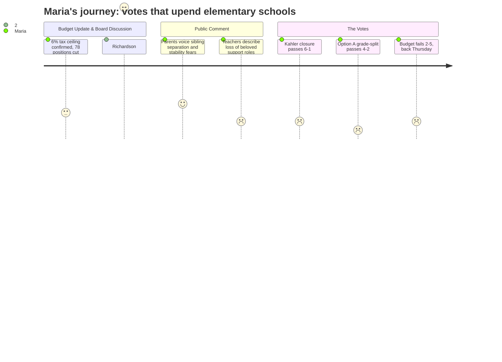

# Interpretation: Maria (PERSONA-001)
## Meeting: School Board Special Budget Meeting -- March 30, 2026 -- 2026-03-30

---

### Structured Points

#### 1. Kahler elementary school voted to close — 6 to 1
- **Fact:** After board members each gave their positions, the motion to file a school closing report with the Commissioner of Education for Kahler school passed 6-1, with Board Chair DeAngelis casting the only no vote. The closing would be effective at the end of the 2025-26 school year.
- **Source:** Transcript [265:00–275:00]; Agenda Item 4.1
- **Emotional valence:** negative
- **Threat level:** 3
- **Open question:** true — Which specific school will Kahler students be assigned to, and will families have any real choice? An intra-district waiver process was mentioned, but transportation is not provided for waivers. [Transcript ~261:00]

#### 2. Option A — grade split into PreK-1 and 2-4 buildings — passed 4 to 2
- **Fact:** The board voted on elementary reconfiguration and selected Option A (a Primary/Intermediate model splitting schools into PreK-Grade 1 buildings and Grades 2-4 buildings) over Option B (keeping K-4 at each school). Board members Holman, Dowling, Smith, and Risch supported Option A; Feller and Richardson voted for Option B. This configuration is to take effect at the start of the 2026-27 school year.
- **Source:** Transcript [276:00–284:00]; Presentation slides, "Options Presented 3.23.26"
- **Emotional valence:** negative
- **Threat level:** 5
- **Open question:** true — Where exactly will each child go? Attendance boundaries have not been drawn. Siblings in different grade bands could end up at different schools. No timeline was given for when families would be notified of specific placements. [Transcript ~260:00–264:00]

#### 3. Kindergarten class sizes projected at 20 students — board member called it "a nightmare"
- **Fact:** Board member Richardson explicitly stated that under the proposed budget, kindergarten class sizes would be 20 students and added, "that sounds like a nightmare." Richardson also cited cuts to four multi-tiered support specialist roles and the district's sole general-education behavior strategist, saying: "I don't understand why we would cut our only behavior education strategist. The person that we have is the go-between between general ed and special ed."
- **Source:** Transcript [123:00–124:00]
- **Emotional valence:** negative
- **Threat level:** 4
- **Open question:** true — What does a class of 20 kindergartners look like without the lunch aids, ed tech ones, and support staff who are also being cut?

#### 4. The FY27 budget failed to pass — another meeting on Thursday
- **Fact:** The motion to adopt the FY27 superintendent's budget as the board's proposal to city council failed 2-5. Board members Smith and Risch voted in favor; Holman, Feller, Richardson, DeAngelis, and Dowling voted against, citing concerns including the last-minute DEI position change, special education cuts, and a desire to first consult city council about fund balance. A follow-up board meeting was scheduled for Thursday, April 2nd at 6pm.
- **Source:** Transcript [285:00–291:00]
- **Emotional valence:** negative
- **Threat level:** 3
- **Open question:** true — The school closure and reconfiguration votes passed but the budget didn't. What does that mean for staffing and planning? Are the 78 position cuts still in effect even without an adopted budget?

#### 5. Community engagement process promised — but zero details available tonight
- **Fact:** Assistant Superintendent Prince presented a transition planning framework that included stakeholder meetings at each school (one for staff, one for families), a digital survey, and a representative committee. She stated that "the most intense part of our community engagement would be over the next six weeks." However, no attendance boundaries, staffing assignments, or specific school configurations have been determined — the administration stated those details require board action first.
- **Source:** Transcript [09:00–14:00]; Presentation slides, "Community Engagement" and "Process Outline"
- **Emotional valence:** neutral
- **Threat level:** 2
- **Open question:** true — If the engagement process starts now and runs six weeks, that takes families to mid-May. How much time is left to actually plan before September?

#### 6. The district's only general-ed behavior strategist is on the cut list
- **Fact:** The SPESPA president (Connie DeSanto) named this cut explicitly: "We have no other general ed behavior strategist for the whole district. Yet we have proposed to reduce the one we do have." An ed tech at Kahler also named this person as part of the team keeping her functional life-skills classroom safe — the behavior strategist is also a safety care trainer who taught staff how to physically protect themselves.
- **Source:** Transcript [167:00–168:00; 211:00–212:00]
- **Emotional valence:** negative
- **Threat level:** 4
- **Open question:** true — If this position is eliminated, who handles behavioral escalations in elementary classrooms next year, especially in a reconfiguration year when routines and relationships are disrupted?

#### 7. Board acknowledged the process was rushed — and one board member said the academic outcome data was shown for the first time tonight
- **Fact:** Board member Richardson stated: "Tonight was the first time we've seen in this entire process the academic outcomes of our elementary schools." The teachers' association survey (taken by approximately 50% of the union) showed 77% felt the budget process was rushed and that more detailed information should have been available much earlier. Member Richardson also said: "I still don't understand how reconfiguration is going to solve for that."
- **Source:** Transcript [108:00; 136:00–137:00]
- **Emotional valence:** negative
- **Threat level:** 3
- **Open question:** true — If the board is voting on a reconfiguration plan that reorganizes every elementary school in the city, and the academic rationale was only shown for the first time at the meeting where the vote was taken, what peer-reviewed research actually supports this specific model?

---

### Journey Map

---

### Reactions

Okay so I sat through five hours of that and I honestly don't even know where to start. They closed Kahler — like, actually voted to close it, six to one, tonight. I feel so awful for those families. Those kids are going to walk into a different school in September and their teachers are gone. And then right after that they voted for this Option A thing, the PreK-through-one and two-through-four split, and I just — I sat there doing the math for our kids and I don't even know what happens to them yet because nobody knows. They said attendance boundaries haven't been drawn. They said they'll tell us in about six weeks after some stakeholder meetings. Six weeks. School starts in September. I have two kids. They could be in two different buildings. Nobody said anything about that tonight. Not a single board member asked "hey, what does this mean for families with kids in multiple grades?"

The thing that I can't stop thinking about is what member Richardson said about kindergarten. She literally said twenty kids in a kindergarten class "sounds like a nightmare" — those were her exact words — and she's the only board member with kids actually in the district right now. And she still voted yes on the closure! But she voted no on Option A and no on the budget. The budget actually failed, which I didn't see coming. Five board members voted against it. So now we have a school that's closing and a reconfiguration that's starting and we don't even have a passed budget. There's a meeting Thursday but I don't understand what that fixes. They still have to cut 78 positions. That part doesn't change.

And I keep coming back to this: one of the things being cut is the only behavior strategist in the entire district for general ed. The woman at the microphone from the support staff union said it straight out — one person, whole district, gone. There's also the lunch aids, the ed tech ones, four of the multi-tiered support specialists. The teachers association survey said 78% of teachers think too many support staff are being cut. One of the ed techs at Kahler talked about what her classroom looks like — kids with the highest needs, some who've never been in school before, she's been spit on and bitten and she said the behavior strategist is the one who taught her how to keep herself safe. And that person is on the cut list. I know people talk about class sizes but it's the support around the kids that I keep thinking about. When my daughter is having a hard day, it's not her teacher who notices first. It's the ed tech. And those are the positions going first.