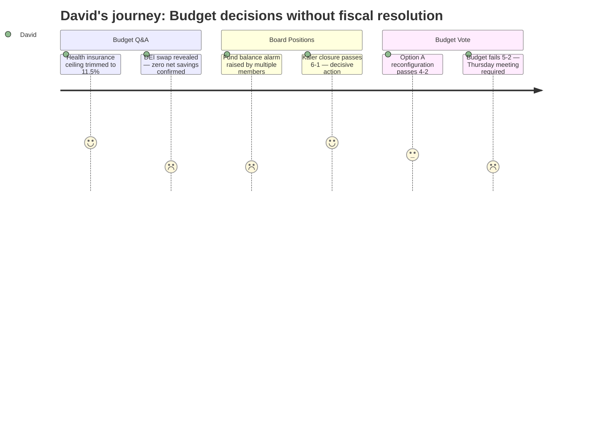

# Interpretation: David (PERSONA-002)
## Meeting: School Board Special Budget Meeting -- March 30, 2026 -- 2026-03-30

### Structured Points

#### 1. Health insurance ceiling revised to 11.5% -- a trackable data point
- **Fact:** The director of finance confirmed that the assumed 12% health insurance increase has been revised down to a maximum of 11.5%, following a letter from the insurer. The final figure will be known around April 10th.
- **Source:** Transcript [28:26--29:11], Member Feller Q&A with finance director
- **Emotional valence:** positive
- **Threat level:** 2
- **Open question:** true -- actual rate still unknown; could come in below 11.5%, which would open a modest budget line

#### 2. DEI director-to-strategist swap produces no confirmed net savings
- **Fact:** Board member DeAngelis pressed the administration on the last-minute change downgrading the DEI coordinator role to a teacher-unit strategist. The superintendent confirmed that if the position is filled through recall by a more senior SPTA member, total cost could be equal to or greater than the prior configuration. The overall budget bottom line did not change from the prior week.
- **Source:** Transcript [72:30--78:00], Board Chair DeAngelis exchange with Assistant Superintendent Prince
- **Emotional valence:** negative
- **Threat level:** 3
- **Open question:** true -- no dollar figure was locked in; the $8K cited savings figure is contingent on which recall-list member fills the role

#### 3. Fund balance is depleted -- no rebuild mechanism in FY27
- **Fact:** The administration explicitly stated the fund balance is exhausted, with "none available" for FY27. The presentation included a recommended policy consideration to adopt a fund balance minimum threshold, but no specific target dollar amount or rebuild timeline was proposed. Multiple board members raised this as a reason to seek city council supplemental funding.
- **Source:** Transcript [22:57--23:44]; Budget slides "Seeking Additional Funding" and "Recommended Policy Considerations"
- **Emotional valence:** negative
- **Threat level:** 5
- **Open question:** true -- no mechanism was approved to begin rebuilding reserves; Thursday's meeting will need to address this

#### 4. Per-pupil cost comparison surfaced -- $26,651 versus comparable districts
- **Fact:** Member Feller cited per-pupil spending figures directly in his school closure remarks: South Portland at $26,651, Gorham at $20,000, Windham at $21,600, Brunswick at $24,000, and Portland -- which serves twice the enrollment and a higher concentration of high-need students -- spending less per pupil than South Portland.
- **Source:** Transcript [83:27--83:50], Member Feller prepared remarks on school closure
- **Emotional valence:** neutral
- **Threat level:** 3
- **Open question:** true -- no explanation was offered for what share of the premium is driven by structural costs (five buildings, staff-to-student ratio) versus programming choices

#### 5. Director role table provides the clearest multi-year staffing record in the meeting
- **Fact:** The budget slide showing director FTE by role from FY21 through FY27 is the only document in the meeting evidence that provides an apples-to-apples multi-year comparison for any staffing category. It shows total director FTE growing from 10.8 in FY21 to 14 in FY25 before falling to 10 in FY27. No equivalent table was presented for teacher or ed tech positions.
- **Source:** Budget slides, "Changes in Director Roles" table
- **Emotional valence:** positive
- **Threat level:** 1
- **Open question:** true -- a comparable multi-year table for SPTA and SPESPA positions was not included; it is impossible to verify the claim that staffing grew by 82 positions while enrollment fell without a comparable source

#### 6. Kaler closure authorized 6-1 -- the one decisive outcome of the night
- **Fact:** The board voted 6-1 to authorize the superintendent to file a school closing report with the commissioner of education for Kaler Elementary, effective end of the 2025-26 school year. The dissenting vote was Member Rich, who expressed concern about process rather than the closure itself.
- **Source:** Transcript [275:09--275:46], vote tally by Chair DeAngelis
- **Emotional valence:** positive
- **Threat level:** 2
- **Open question:** false -- the closure decision is made; next question is implementation timeline

#### 7. Budget vote fails 5-2 -- no fiscal resolution tonight
- **Fact:** The FY27 superintendent's budget was rejected 5-2, with Smith and Rich voting in favor. The five "no" votes cited a range of concerns including the last-minute DEI position change, special education cuts, insufficient administrative reductions, and a desire to meet with city council before committing. The board is now scheduled to reconvene Thursday, April 2nd, with a city council presentation still on the calendar for April 7th.
- **Source:** Transcript [291:01--291:17], vote tally; [27:07--27:32], timeline slide
- **Emotional valence:** negative
- **Threat level:** 4
- **Open question:** true -- it is unclear which specific changes, if any, would flip the votes needed to pass the budget by Thursday

#### 8. Moving costs budgeted at $75K for either reconfiguration scenario -- no differential modeled
- **Fact:** The director of finance confirmed that $75,000 is budgeted for moving costs regardless of whether Option A or Option B was selected. When pressed by Member Richardson on whether a pre-K/K school (Option A) would require different -- and potentially more expensive -- furniture moves, the finance director acknowledged the hypothesis was "not incorrect" but said the current quote showed no significant difference. No final vendor quote was locked in.
- **Source:** Transcript [43:09--47:47], Member Richardson Q&A with finance director
- **Emotional valence:** neutral
- **Threat level:** 2
- **Open question:** true -- moving cost differential between options remains unresolved; teacher stipend cost ($250/teacher) also confirmed but aggregate not totaled in the meeting

---

### Journey Map

---

### Reactions

So here's where things landed: they voted to close Kaler, 6 to 1. They voted for Option A reconfiguration -- the primary/intermediate split -- 4 to 2. And then the actual budget? Failed, 5 to 2. So they made the two hard structural calls and punted on the budget itself. Thursday night, same place, round two.

The thing that stuck with me most was the DEI coordinator-to-strategist move. The chair literally walked through the math on it in real time -- if the position gets filled through the union recall list by someone senior, you could end up spending the same or more than before. The administration confirmed it. The bottom line didn't change from last week's proposal. So the district is claiming a 23% reduction in the director unit, but some of those "reductions" are just titles moving to a different line on the org chart with the same salary attached. That's not nothing -- it's the kind of accounting that looks good in a slide and falls apart when you read the footnote. Member DeAngelis pressed hard on it and deserves credit for that. But the number went into the vote uncorrected.

The fund balance piece is what I keep coming back to. The administration recommended -- again -- adopting a fund balance minimum threshold and a November budget timeline. Same recommendation as before. No motion was made on either. The budget failed in part because several board members want to go to city council first, but nobody on the board said what number they actually need in reserves or over what timeline. The chair made a reasonable point that any city council supplemental funding just seeds the reserve and still requires taxpayers to pay it back -- it's a loan, not a gift -- but that framing never really landed in the room. We're heading into Thursday with a board that agrees the reserve needs to be rebuilt, disagrees on how to get there, and has a city council presentation on the calendar for April 7th regardless of what happens Thursday. The timeline pressure is real and it's not getting softer.