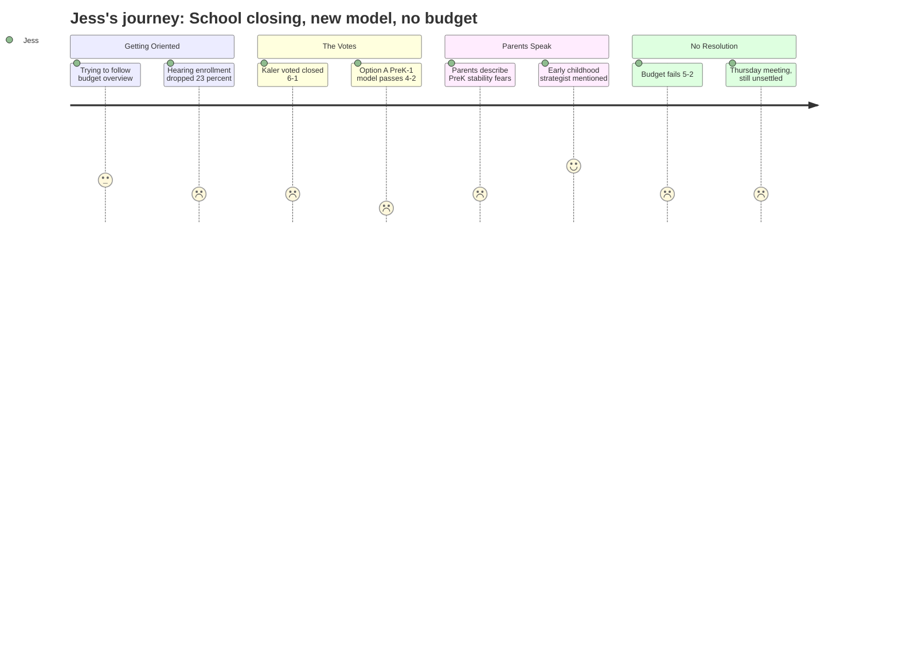

# Interpretation: Jess (PERSONA-003)
## Meeting: School Board Special Budget Meeting -- March 30, 2026 -- 2026-03-30

---

### Structured Points

#### 1. Option A -- PreK-1 / Grades 2-4 Split Model -- Passes 4-2
- **Fact:** The board voted 4-2 to adopt a "primary and intermediate" reconfiguration model in which elementary schools will be split into PreK-1 buildings and grades 2-4 buildings, effective fall 2026. A child entering kindergarten in 2027 or 2028 would switch school buildings after first grade -- at age six or seven.
- **Source:** [284:17] (board vote tally: Holman, Dowling, Smith, Risch for Option A; Feller and Richardson for Option B); FY27 Board Slides, Option A definition
- **Emotional valence:** negative
- **Threat level:** 4
- **Open question:** true

#### 2. Kindergarten Class Sizes Projected at 20-24 Students
- **Fact:** Multiple public speakers and Member Richardson explicitly flagged that the reconfiguration, combined with staff cuts, will push kindergarten class sizes to 20-24 students. Richardson called this prospect a "nightmare" on the record.
- **Source:** [123:25] (Richardson: "kindergarten is 20 students. That sounds like a nightmare.")
- **Emotional valence:** negative
- **Threat level:** 4
- **Open question:** true

#### 3. Kaler Elementary School Voted Closed -- Effective End of This School Year
- **Fact:** The board voted 6-1 to authorize the superintendent to file a school closing report with the state commissioner of education for Kaler elementary, effective end of the 2025-26 school year. The school map Jess has been researching is already being redrawn before her child enrolls.
- **Source:** [275:25] (closure vote); letter to commissioner language in FY27 Board Slides, Action 4.1
- **Emotional valence:** negative
- **Threat level:** 3
- **Open question:** true

#### 4. Elementary Enrollment Has Fallen 23% in Four Years
- **Fact:** District elementary enrollment has dropped from 1,401 to 1,080 students over four years -- a 23% decline -- while staffing grew. Member Feller confirmed "we've lost a hundred students due to demographic decline" on top of the fifth-grade cohort moving to middle school.
- **Source:** Fiscal Context summary; [83:27] (Feller prepared remarks)
- **Emotional valence:** negative
- **Threat level:** 3
- **Open question:** true

#### 5. An Early Childhood Strategist Position Is Being Added
- **Fact:** The superintendent's budget proposes adding a new "early childhood strategist" teacher position focused on the pre-K to kindergarten transition, IEP continuity, and the CDS (early childhood special education) handoff process -- a small, specific signal that someone is thinking about the youngest kids' pipeline.
- **Source:** [18:58]--[19:44] (superintendent's update: "three proposed new positions in the teacher's association. The early childhood strategist...")
- **Emotional valence:** positive
- **Threat level:** 2
- **Open question:** true

#### 6. The Board's Only Parent of Elementary-Age Children Said Class Sizes "Terrify" Her
- **Fact:** Member Richardson -- identified by another board member as "the only board member with elementary school aged children" -- said the proposed class sizes "terrify" her and that the cuts are "fundamentally altering the way that we provide educational opportunities to our children."
- **Source:** [93:34] (Richardson: "those class sizes terrify me"); [90:29] ("I'm the only board member with kids in the district right now")
- **Emotional valence:** negative
- **Threat level:** 4
- **Open question:** false

#### 7. Pre-K Placement Is Also Unclear Under Reconfiguration
- **Fact:** A parent in public comment identified herself as having "a son in first grade and a daughter going into pre-K -- who knows where for both of them," signaling that even incoming pre-K families cannot determine which building or program their child will land in under the new model.
- **Source:** [292:48] (Brit Begley, public comment)
- **Emotional valence:** negative
- **Threat level:** 4
- **Open question:** true

#### 8. Budget Failed to Pass -- Another Meeting Required Thursday
- **Fact:** The board voted 5-2 against adopting the FY27 budget. A continuation meeting is scheduled for Thursday, April 2 at 6 PM. The fiscal framework for the school year Jess's child will enter remains formally unresolved.
- **Source:** [291:12]--[291:59] (chair reads vote: Smith and Risch in favor; Holman, Feller, Richardson, DeAngelis, Dowling opposed; "that motion fails")
- **Emotional valence:** negative
- **Threat level:** 3
- **Open question:** true

---

### Journey Map

---

### Reactions

Okay so I just spent three hours watching this school board meeting after the baby finally went down and I genuinely don't know what to do with any of it. They voted to close one of the elementary schools -- Kaler -- AND they voted to completely change how all the elementary schools are organized. Starting next fall, there are going to be "primary schools" that only go through first grade and "intermediate schools" for grades 2 through 4. So when my kid starts kindergarten, she goes to one building for kindergarten and first grade, and then at age seven she switches to a completely different school for second grade. And then again after fourth grade for middle school. That is three school transitions before she's ten years old. I keep thinking about how long it took me to even find a pediatrician I trust and these people are asking a six-year-old to start over.

What I can't stop thinking about is the class size thing. Multiple people at the microphone mentioned kindergarten classes going up to 20, 21, 22 kids. And the board member who actually has young kids in the district -- she said those class sizes "terrify" her. That is a direct quote from the one person up there with actual skin in the game. "Terrify." Meanwhile the one thing that sounded like good news for us -- they're adding something called an "early childhood strategist" to help kids transition from pre-K into kindergarten -- got maybe two minutes of airtime in a five-hour meeting. And I still don't know what that actually means for families, or whether it survives whatever happens Thursday. Oh right, they also couldn't pass the budget. After voting to close a school and blow up the whole grade structure, they deadlocked on the money. Another meeting Thursday. Nothing is settled.

I've been trying to figure out for months whether South Portland schools are worth staying for and this meeting did not help. Someone in public comment said she has a daughter going into pre-K and literally said "who knows where" -- that's it, that's the answer for incoming families right now. And the district is losing kids fast, like 23% fewer elementary students in four years, but somehow it's also the most expensive per-pupil district in the region. I can't make those two things fit together in my head. I don't have time to go to Thursday's meeting but I'm going to be watching it on my phone while the baby sleeps and I'm going to feel exactly this bad afterward.