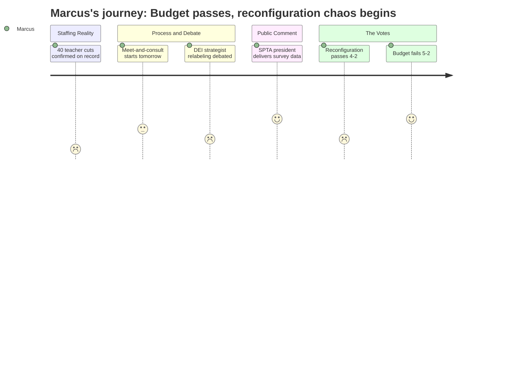

# Interpretation: Marcus (PERSONA-004)
## Meeting: School Board Special Budget Meeting -- March 30, 2026 -- 2026-03-30

---

### Structured Points

#### 1. The Cut Count Is Confirmed: 40 SPTA Positions Gone
- **Fact:** The superintendent's updated proposal eliminates a net 40 positions from the teachers' bargaining unit -- down from 42 because two director-level roles were reclassified as SPTA instructional strategists. This represents 11% of the unit, with 60+ educators expected to actually leave the district.
- **Source:** Superintendent Prince presentation [~20:00--22:00]; FY27 Board Slides, Reductions table
- **Emotional valence:** negative
- **Threat level:** 5
- **Open question:** false

#### 2. Meet-and-Consult for Teachers Starts the Next Morning
- **Fact:** The operations director confirmed that meet-and-consult sessions with the SEA began the morning of March 30, and the teachers' association session was scheduled for March 31 -- the day after this meeting -- with ed techs to follow on Thursday.
- **Source:** [~31:00--34:00] Operations Director Natalie and Dr. Prince responding to board member Dowling's process questions
- **Emotional valence:** neutral
- **Threat level:** 2
- **Open question:** true -- The meet-and-consult is not a negotiation and has no binding deadline. What happens if the district and SPTA can't reach consensus on working condition changes? The path to impact bargaining and potential contract reopening was described by SPTA president Gay, but the outcome is uncertain.

#### 3. Director-to-Strategist Reclassification: Real Savings or Shell Game?
- **Fact:** The administration reclassified the DEI Director and an Assistant Director of Special Education as "instructional strategists" within the SPTA bargaining unit, claiming a 23% reduction in the director unit. Board member DeAngelis challenged this directly, noting it produced no meaningful bottom-line savings and that the positions could be filled by recalled teachers at higher cost depending on their lanes and steps. Middle school teacher Rachel Healy made the same argument at the public microphone, calling the framing "misleading" and stating these roles would not involve direct instruction.
- **Source:** [~71:00--78:00] Board discussion, DeAngelis and Prince; [~148:00--150:00] Rachel Healy public comment
- **Emotional valence:** negative
- **Threat level:** 3
- **Open question:** true -- Per SPTA VP Kate Porter, Article 18 of the teacher contract requires the district to fill new positions from the recall list before hiring. Do these "instructional strategist" roles carry administrative duties that conflict with what teachers on recall were hired to do? And who decides?

#### 4. SPTA Survey: 80% of Members Say Too Many Certified Positions Cut
- **Fact:** SPTA President Sarah Gay reported that approximately 50% of union members responded to a recent survey. Of those: 77% said the budget process was rushed; 78% said too many support staff roles were cut; 80% said too many certified professional positions from the bargaining unit were cut.
- **Source:** [~136:00--137:00] Sarah Gay public comment; [~137:00--138:00] additional survey context
- **Emotional valence:** positive
- **Threat level:** 2
- **Open question:** false

#### 5. The Only General Education Behavior Strategist in the District Is Being Eliminated
- **Fact:** Board member Richardson and SPESPA president Connie DeSanto both called out the elimination of the district's sole general education behavior strategist -- the person responsible for safety care training for staff -- along with four multi-tiered support specialist positions. Richardson described this as "forcing kids to special ed" and said she didn't understand how it aligned with the district's stated equity and belonging goals.
- **Source:** [~122:00--125:00] Richardson's budget remarks; [~167:00--168:00] DeSanto public comment; [~211:00--212:00] Kate Murray (Kahler ed tech) public comment naming the behavior strategist
- **Emotional valence:** negative
- **Threat level:** 4
- **Open question:** false

#### 6. Reconfiguration Passes 4-2 With No Staffing Plan
- **Fact:** The board voted 4-2 to adopt Option A (Primary/Intermediate grade-band model), effective fall 2026, with four months to plan. The administration acknowledged teacher assignments cannot be determined until after the board decision, and the meet-and-consult process with the teacher's association on reconfiguration details had not yet begun.
- **Source:** [~283:00--284:00] Vote (Holman, Dowling, Smith, Risch in favor; Feller, Richardson opposed); [~50:00] Dr. Prince on teacher movement: "We have not been able to start that conversation with our teacher association yet because we don't yet have a decision"
- **Emotional valence:** negative
- **Threat level:** 4
- **Open question:** true -- How will teacher placement decisions be made? What role will seniority play? When will affected staff know which school they're assigned to? Will summer planning work be compensated?

#### 7. Budget Fails: 5 Votes Against, Another Meeting Thursday
- **Fact:** The board voted 5-2 against adopting the FY27 superintendent's budget, with Holman, Feller, Richardson, DeAngelis, and Dowling all voting no. Stated reasons included objections to the last-minute DEI reclassification, unresolved special education position cuts, and a desire to first speak with city council about fund balance support. A follow-up meeting was scheduled for Thursday, April 2.
- **Source:** [~290:00--292:00] Vote tally; [~288:00--292:00] DeAngelis, Richardson, Holman explaining their no votes
- **Emotional valence:** positive
- **Threat level:** 1
- **Open question:** true -- Will Thursday produce any position restorations, or is this primarily a conversation about tax revenue and fund balance with no impact on the 40 SPTA cuts?

---

### Journey Map

---

### Reactions

Hey -- did you see what happened last night? The budget actually failed. Five to two. DeAngelis, Feller, Richardson, Holman, Dowling all voted no. I almost fell out of my chair. It's not over -- there's another meeting Thursday -- but the fact that there wasn't a rubber stamp on 40 teacher cuts at 11 o'clock at night, that's something. Feller said he'd vote yes only if the percussion ed tech came back, which, fine, I get it, but honestly the bigger issue is Richardson and DeAngelis pushing for a city council conversation about fund balance before they sign off. That's the right call. We've been saying for weeks this is a city-level problem, not just a school problem.

But here's what kept me up: reconfiguration passed. Four to two. Option A -- that pre-K through one, two through four split. And they voted on it before the budget even passed, before anyone has talked to us about what it actually means for assignments, before anyone can tell you which school you're going to or whether you're teaching the same grade you taught this year. Sarah Gay was up there with the SPTA survey -- 80% of members who responded said too many certified positions are being cut, 78% said too many support staff -- and Dr. Prince acknowledged meet-and-consult with teachers was starting the morning after the meeting. The morning after. Not weeks ago, not when they were designing this plan. The morning after they voted for a full elementary restructuring. And the administration was pretty clear in the Q&A: until there's a board decision, we haven't been able to start that conversation. So we've been planning something that affects every teacher in those four buildings without a single real conversation with our association about it.

The other thing I can't get out of my head is this DEI director situation. They moved the position from Director to Coordinator last week -- which was already a $20K pay cut for the person in the role -- and then tonight they announced they're moving it again to an "instructional strategist" in our bargaining unit for about $8K more in savings. DeAngelis said it right out loud: you're affecting more lives but not saving more money. Rachel Healy said it from the public mic even more clearly: these strategist jobs they're calling "teacher positions" won't involve direct instruction. They're administrative work with a teacher contract stapled to them. And we know from Article 18 that if it's in our unit, it goes through recall first -- meaning someone already on that list could get the job at a higher step than whoever was holding the director role. The savings could be zero. So what did we actually accomplish? We lost the only BIPOC person in a leadership role, reorganized the boxes on the org chart, and called it a 23% reduction in administration. I'm not buying it.