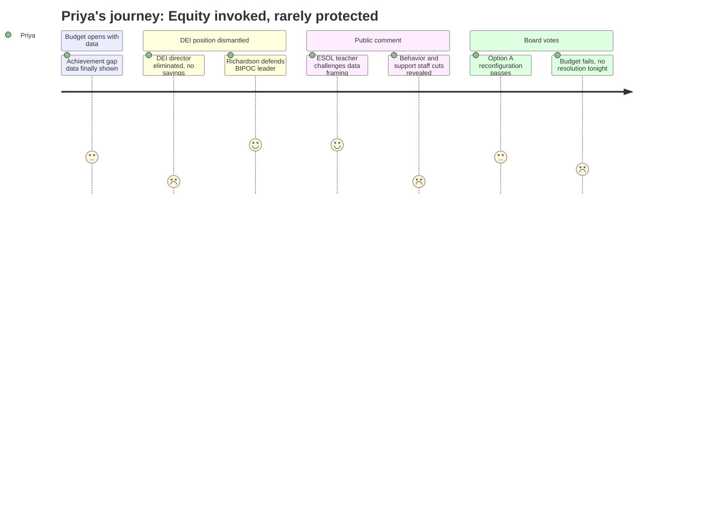

# Interpretation: Priya (PERSONA-005)
## Meeting: School Board Special Budget Meeting -- March 30, 2026 -- 2026-03-30

### Structured Points

#### 1. DEI Director Eliminated with No Net Cost Savings -- and the Incumbent is the Only BIPOC Central Office Leader
- **Fact:** The March 30 budget revision proposed downgrading the Director of Diversity, Equity and Belonging to a teacher-unit "instructional strategist" -- a change that saves no additional money beyond the coordinator demotion already accepted. Board member Holman explicitly stated that the incumbent had already taken a $20,000+ pay cut and is "the one person we have in leadership who is a BIPOC person," and that this further demotion "for no reason we're not saving any money" eliminates the district's only BIPOC central office leader.
- **Source:** Transcript [72:30--76:24]; FY27 Board Slides -- Director and Administrator Changes table
- **Emotional valence:** negative
- **Threat level:** 5
- **Open question:** true

#### 2. Achievement Gap Data Surfaced -- Then Functionally Dropped
- **Fact:** The assistant superintendent opened with NWEA math data showing achievement differences of "as much as 25%" across elementary schools, and the equity goal slide documents a BIPOC/white math gap of 22.1% in the current year, an ML/non-ML math gap of 37.4%, and an IEP/non-IEP gap of 32.5%. This is the first time this data appeared in the budget discussion, according to member Richardson. It was shown, attributed to "systemic barriers," and then the meeting moved on without any interrogation of which budget lines directly address these specific subgroups.
- **Source:** Transcript [07:16--09:35]; FY27 Board Slides -- Equity Goal Detail table (25-26 column)
- **Emotional valence:** negative
- **Threat level:** 4
- **Open question:** true

#### 3. ESOL Teacher Dismantles the Evidence Base for Reconfiguration as Equity
- **Fact:** Middle school ESOL teacher Kara testified that the only academic outcome data presented -- NWEA math scores -- is taken by all students including those on their first day in the country, making it a language proficiency proxy rather than a math measure. She called for using ACCESS testing data and seal of biliteracy rates instead, and said the data as shown "tells me which schools have the most multilingual learners because they do not, they cannot show what they can do."
- **Source:** Transcript [181:06--184:26]
- **Emotional valence:** positive
- **Threat level:** 3
- **Open question:** true

#### 4. Reconfiguration Transition Plan Explicitly Includes Multilingual Families and IEP Families
- **Fact:** The community engagement plan presented by the assistant superintendent specifically names "families of multilingual students" and "students with IEPs" as required representation on the transition committee, alongside families from all schools, board and administration. This is written into the slides and verbally confirmed.
- **Source:** Transcript [10:23--11:09]; FY27 Board Slides -- Community Engagement section
- **Emotional valence:** positive
- **Threat level:** 2
- **Open question:** true

#### 5. The District's Only General Education Behavioral Strategist Is Being Cut
- **Fact:** SPESPA president Connie DeSanto testified that the budget proposes reducing "the only general ed behavior strategist in the entire district," the person who serves as the bridge between general education and special education referrals. Board member Richardson independently flagged this cut, saying "we are essentially forcing kids to special ed with that cut." This position was not itemized or defended in the budget slides.
- **Source:** Transcript [167:17--168:03]; Transcript [123:08--123:55]
- **Emotional valence:** negative
- **Threat level:** 5
- **Open question:** true

#### 6. Equity Initiative Data Shows Demonstrable Results -- at the Schools Facing the Most Disruption
- **Fact:** Parent and educator Meredith Diamond testified with specific numbers: after one year of an equity initiative, Kaler's achievement rate rose 12.83% and Skilling's rose 9.79%, narrowing the gap between those schools and Small from 25.28% to 7.76%. This data was presented publicly but received no response from the board or administration, and the initiative driving those gains was not cross-referenced with any proposed budget line being preserved.
- **Source:** Transcript [170:07--172:43]
- **Emotional valence:** negative
- **Threat level:** 4
- **Open question:** true

#### 7. Reconfiguration Passes Without the Support Infrastructure That Would Make It Equitable
- **Fact:** The board voted 4-2 to adopt Option A (Primary/Intermediate reconfiguration) effective fall 2026 -- but the same meeting failed to pass the budget that would fund operations, left unresolved the cuts to behavioral support, counseling, ESOL, and special education positions, and produced no commitment to the data-driven equity planning that Meredith Diamond, Kara the ESOL teacher, and the SPESPA president all identified as prerequisites for reconfiguration to actually close gaps rather than widen them.
- **Source:** Transcript [283:30--284:17] (reconfiguration vote); Transcript [289:38--291:11] (budget vote fails)
- **Emotional valence:** negative
- **Threat level:** 4
- **Open question:** true

#### 8. Board Chair Acknowledges the Board Has No BIPOC Representation
- **Fact:** Board chair DeAngelis, responding to a public comment about the representativeness of a seven-person board making sweeping decisions, acknowledged: "we don't have representation of BIPOC" on the board, and noted the board represents not just parents and students but also non-citizens who cannot vote. No plan to address this structural gap was offered.
- **Source:** Transcript [257:15--258:04]
- **Emotional valence:** negative
- **Threat level:** 3
- **Open question:** true

---

### Journey Map

---

### Reactions

Okay so I want to tell you about this meeting because I'm still processing it. They opened with actual achievement gap data. Like, real numbers -- a 22% gap between white and BIPOC students in math, a 37% gap for multilingual learners. And the assistant superintendent said it out loud: "our white students performed substantially above our BIPOC students." I genuinely leaned forward. I thought, finally, they're building to something. And then they just... moved on. No line item was tied back to those numbers. No one asked which cuts would widen those gaps. The data was there to justify reconfiguration, not to interrogate the budget. It was equity as decoration.

And then it got worse. They proposed -- this is the March 30 revision, the one they just introduced that night -- to take the DEI Director position, which had already been demoted to coordinator with a $20K pay cut, and downgrade it again to a teacher-unit "instructional strategist." Member Holman said it plainly: this saves no additional money, and this person is the only BIPOC person in central office leadership. None of it saves money. They just wanted the optics of cutting another director title. They are eliminating their only BIPOC leader to respond to pressure about the director count, and they're doing it for free. I needed to hear Richardson say what she said: "we're eliminating the one person we have in leadership who is a BIPOC person, and for no reason, we're not saving any money." That was one of the clearest things anyone said all night. But it still passed in the final budget proposal as written, even though the budget itself failed.

Here's what I keep coming back to: the ESOL teacher -- Kara -- got up and said something I've been trying to explain to people for years. The NWEA math data they used to justify reconfiguration is being administered to kids on their first day in the country. It measures language, not math. She asked them to look at ACCESS scores, at seal of biliteracy rates, at which schools are actually supporting multilingual learners to exit services. Nobody responded. And that same meeting, the support staff union president told the board that the only general ed behavioral strategist in the entire district is on the cut list -- the one person keeping kids from being pushed straight into special ed referrals. They voted to reconfigure the elementary schools in four months. They voted to close Kaler. And they couldn't pass a budget that leaves the supports for the kids with the highest needs completely unresolved. The question I'm sitting with is: if this reconfiguration goes forward with that gaping hole where the wraparound support used to be, who absorbs the cost? The same kids it was supposed to help.