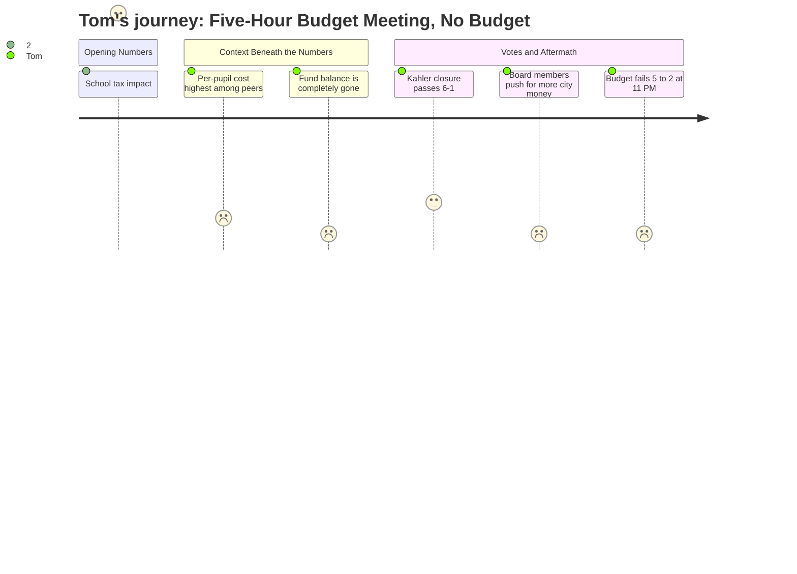

# Interpretation: Tom (PERSONA-006)
## Meeting: School Board Special Budget Meeting -- March 30, 2026 -- 2026-03-30

### Structured Points

#### 1. The Number That Matters: $257 Per Household
- **Fact:** The assistant superintendent confirmed the FY27 budget would add $257 annually to the school portion of the tax bill on the average South Portland home (assessed at $514,000), representing a 6% school tax increase. Total mil rate across all categories would rise 5.1%.
- **Source:** Transcript [25:15--26:47]; Slide "FY27 Proposed Budget Tax Impact"
- **Emotional valence:** negative
- **Threat level:** 3
- **Open question:** true -- The school portion is only part of the bill. Tom wants to know what the total household impact is when city and county increases are added, and whether there's any chance this goes higher if the budget fails and gets reworked.

#### 2. South Portland Spends More Per Pupil Than Every Comparable District
- **Fact:** Board member Feller stated that South Portland spends $26,651 per pupil -- more than every comparable district he cited: Gorham at $20,000, Windham at $21,600, Brunswick at $24,000, and even Portland, which serves twice the enrollment with a higher concentration of high-needs students, at a lower per-pupil cost.
- **Source:** Transcript [83:00--84:15]
- **Emotional valence:** negative
- **Threat level:** 4
- **Open question:** true -- Tom wants to know why South Portland is the most expensive, and whether anyone is accountable for that gap. The district never directly answers this in the meeting.

#### 3. Enrollment Shrank, Staffing Grew -- Nobody Explains How That Happened
- **Fact:** Board member Feller stated that South Portland lost about 300 elementary students over recent years (including 200 fifth graders moved to middle school and roughly 100 due to demographic decline) while staffing grew by 82 positions during the same period. This is presented as a key driver of the structural deficit.
- **Source:** Transcript [83:00--84:15]; Fiscal Context
- **Emotional valence:** negative
- **Threat level:** 4
- **Open question:** true -- No board member or administrator explains who approved the staffing growth while enrollment was falling, or whether anyone was flagging this problem in prior budgets. Tom would want names and accountability.

#### 4. The Rainy Day Fund Is Gone
- **Fact:** The assistant superintendent confirmed the district's fund balance has been fully depleted and stated explicitly that any additions to FY27 funding will make FY28 even harder. She proposed policy guardrails to prevent future depletion but acknowledged none currently exist.
- **Source:** Transcript [22:57--24:30]; Slide "Seeking Additional Funding"
- **Emotional valence:** negative
- **Threat level:** 5
- **Open question:** true -- Tom would want to know when the fund balance was drained, under whose watch, and why the board is only now proposing a minimum threshold policy.

#### 5. Five of Seven Board Members Voted Against Their Own Budget
- **Fact:** The motion to adopt the FY27 superintendent's budget failed 5-2 at approximately 11:00 PM. Members Smith and Risch voted in favor; members Holman, Feller, Richardson, DeAngelis, and Dowling voted no. No revised budget was presented. A follow-up meeting was scheduled for Thursday, April 2.
- **Source:** Transcript [291:00--292:00]
- **Emotional valence:** negative
- **Threat level:** 4
- **Open question:** true -- Tom now has no certainty about what the final budget will be or whether it might be higher than the 6% already proposed.

#### 6. Some Board Members Are Pushing to Ask the City for More Money
- **Fact:** Multiple board members -- including Richardson, Holman, and DeAngelis -- advocated for going back to city council to request additional funding to rebuild the fund balance. The board chair clarified that city council has no money to gift; any city involvement would mean a loan from the city's own fund balance or a request that taxpayers approve a higher school tax ceiling in June.
- **Source:** Transcript [69:00--70:57]; [255:00--256:30]; [286:00--290:00]
- **Emotional valence:** negative
- **Threat level:** 4
- **Open question:** true -- Tom doesn't know yet whether the June referendum will ask for 6% or something higher. He's a direct voter on that referendum and has no answer tonight.

#### 7. At Least One Concrete Decision Got Made: Kahler Will Close
- **Fact:** The board voted 6-1 to authorize the superintendent to file a school closing report for Kahler elementary school with the state commissioner of education, effective end of the 2025-26 school year. This was the one motion that passed cleanly.
- **Source:** Transcript [275:00--276:00]
- **Emotional valence:** positive
- **Threat level:** 1
- **Open question:** false -- The decision is made. Tom may not be emotionally invested in which school closes, but he recognizes this as the one outcome the board actually resolved tonight.

---

### Journey Map

---

### Reactions

Well, they were in there for five hours last night. I watched part of it online. And you know what they got done? They voted to close Kahler school -- that passed -- and they picked a plan to split the elementary grades into two buildings. Fine. But then they couldn't pass their own budget. Five to two. The same budget their own superintendent put together. Five of seven board members voted no on it. So now we're going back Thursday, and we still don't have a number for the June vote. I've got the $257 figure from tonight -- that's the school portion of the increase on an average-priced home -- but I don't actually know if that's what ends up on the ballot because some of those board members want to go back to the city council and ask for even more.

Here's what nobody's explaining to me. Board member Feller read off the per-pupil numbers tonight. South Portland is at $26,651 per student. Gorham's at twenty thousand. Windham's at twenty-one six. Portland -- which is twice our size and has more high-needs kids -- still spends less per pupil than we do. How does that happen and who's responsible for it? And in the same breath, he said enrollment dropped by three hundred kids over recent years while the district added over eighty staff positions. That's the actual problem right there. That's how you burn through a reserve fund and end up with an 8.4 million dollar hole. The reserve fund, by the way, is gone. Zero. The assistant superintendent said it herself -- anything they add to this year's budget makes next year even harder. Some board members apparently missed that memo, because they're talking about asking the city to lend them money.

I'll give them credit for one thing: the school closure vote actually happened. Six to one, Kahler closes. That's a real decision. But I've been around long enough to know that closing one small school on a budget crisis this size is like bailing out a sinking boat with a coffee cup. They said the savings are around $400,000. The problem is $8.4 million. And now we're heading into another meeting Thursday, possibly with a higher tax ask than what they've been advertising, and the board can't even agree on what they're voting for. I'm going to that June referendum. And I'm going in with a lot of questions that nobody answered last night.