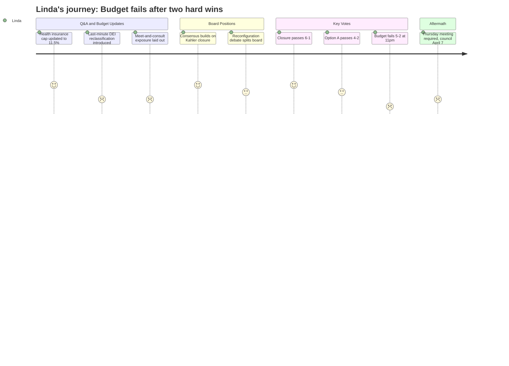

# Interpretation: Linda (PERSONA-007)
## Meeting: School Board Special Budget Meeting -- March 30, 2026 -- 2026-03-30

### Structured Points

#### 1. Health Insurance Cap Confirmed at 11.5% -- Small but Real Relief
- **Fact:** The director of finance confirmed that the maximum health insurance increase has been revised downward from 12% to 11.5%, with the final rate expected around April 10th. The budget has already been adjusted to reflect this ceiling.
- **Source:** [28:26--29:11]
- **Emotional valence:** positive
- **Threat level:** 2
- **Open question:** true -- Final rate still unknown; even a 11.5% max on health insurance for a district this size is a significant cost driver that could shift before the city council presentation.

#### 2. Last-Minute DEI Director-to-Strategist Change: No Net Savings, Real Risk
- **Fact:** The superintendent introduced a same-night change reclassifying the DEI Director position to an SPTA instructional strategist, on top of the prior downgrade from Director to Coordinator. Board member DeAngelis challenged the move directly: the change produces no guaranteed savings (recall rights under Article 18 mean a more senior teacher could fill the role at equal or higher cost), removes the district's only BIPOC senior leader, and was added to the proposal the night of the vote.
- **Source:** [72:30--78:00]
- **Emotional valence:** negative
- **Threat level:** 4
- **Open question:** true -- What was the actual governance rationale for this change the night of a vote? If it doesn't save money and creates legal and HR risk, why was it introduced at this meeting rather than in committee?

#### 3. Meet-and-Consult Obligations Already Running -- No Guaranteed Timeline
- **Fact:** The district confirmed it is already in meet-and-consult processes with SPTA (teachers), SPESPA (ed techs), and SEA (bus drivers) over working condition changes including bus drivers assigned to cafeteria duties. Administration confirmed that meet-and-consult has no mandatory completion deadline, that school can open without resolution, and that unresolved disputes can escalate to prohibited practice complaints with the Maine Department of Labor.
- **Source:** [30:47--37:10]
- **Emotional valence:** negative
- **Threat level:** 4
- **Open question:** true -- The board has authorized positions and working condition changes that are now in active labor dispute. There is no deadline. If even one of these escalates, implementation for fall is jeopardized.

#### 4. Superintendent's Fund Balance Policy Recommendation
- **Fact:** The superintendent's presentation explicitly recommended two policy actions: adopting a fund balance minimum threshold and usage policy, and adopting a budget timeline and strategy by November 1st each year. These are framed as essential to preventing the district from returning to this crisis position.
- **Source:** [23:44--24:30] and FY27 Board Slides -- "Recommended Policy Considerations"
- **Emotional valence:** positive
- **Threat level:** 1
- **Open question:** false -- This is exactly the kind of structural governance fix that responsible board members have been pushing for. The recommendation is formally on record.

#### 5. School Closure (Kahler) Passes 6-1
- **Fact:** The motion to authorize the superintendent to file a school closing report with the Commissioner of Education for Kahler School passed with six votes in favor. Member DeAngelis cast the sole opposing vote. The closure is authorized under 20-A MRSA Sections 4102 and 4103, effective end of the 2025-26 school year.
- **Source:** [273:25--275:00]
- **Emotional valence:** positive
- **Threat level:** 2
- **Open question:** true -- The letter to the commissioner requires a brief explanation of how students will be redistributed, and that detail is not yet determined -- it depends on which reconfiguration option the board chose.

#### 6. Option A (Primary/Intermediate Reconfiguration) Passes 4-2
- **Fact:** The board voted 4 in favor of Option A (PreK-1 primary schools at Dyer and Small; grades 2-4 intermediate schools at Brown and Skillin) versus 2 in favor of Option B (full grade band K-4 at all schools). Members Feller and Richardson voted for Option B; the motion for Option A carried. The full community engagement process -- stakeholder meetings, surveys, union consultations on staffing assignments -- has not yet been designed.
- **Source:** [284:17--284:17]
- **Emotional valence:** neutral
- **Threat level:** 3
- **Open question:** true -- The board authorized a reconfiguration model for fall 2026 with no completed staffing plan, no finalized attendance zones, no transportation routing, and meet-and-consult processes not yet concluded.

#### 7. FY27 Budget Fails 5-2 -- City Council Presentation on April 7 Proceeds Without an Approved Budget
- **Fact:** The motion to adopt the FY27 superintendent's budget as the board's proposal for city council failed 5-2 (Smith and Risch in favor; Holman, Feller, Richardson, DeAngelis, and Dowling opposed). A Thursday April 2 meeting is required. The April 7 city council presentation is still scheduled, meaning the board will go before council without a formally adopted budget.
- **Source:** [291:12--291:59]
- **Emotional valence:** negative
- **Threat level:** 5
- **Open question:** true -- What specific changes would get a majority? Feller stated a single condition (percussion EdTech reinstatement). DeAngelis cited DEI position and special education concerns. Richardson raised fundamental objections to the budget's prioritization. There is no clear path to five votes by Thursday.

#### 8. No Agreement on City Council Strategy -- Clock Is Running
- **Fact:** Multiple board members expressed interest in meeting with the city council to discuss fund balance support or a higher tax guidance number, but no motion was made and there is no consensus on what would be asked. Board chair DeAngelis clarified that the city council cannot gift money -- any support would be a loan from the city's fund balance reserve, which the city is also obligated to protect.
- **Source:** [69:22--71:10] and [254:07--255:40]
- **Emotional valence:** negative
- **Threat level:** 4
- **Open question:** true -- If the board goes to city council on April 7 without a passed budget and without a defined ask, the meeting will be unproductive and the timeline collapses further.

---

### Journey Map

---

### Reactions

Two out of three. That's what I'm taking home tonight. Closure passed -- 6-1, which is as clean as you're going to get on a decision this painful -- and reconfiguration passed 4-2. Those are real decisions. They're recorded. The superintendent can start the commissioner letter, the transition planning has authorization. On those two things, this board did its job. I was holding my breath on reconfiguration because we had Feller and Richardson clearly not there, and I genuinely wasn't sure which way Risch was going to land until they actually called the vote. Four votes is a majority. It holds.

The budget failing was predictable in hindsight, but it still lands hard. Smith and Risch voted yes, everyone else said no, and now we're going back Thursday and then to city council on the seventh with nothing formally adopted. What I cannot figure out is what number gets to five. Feller's ask is the clearest -- put the percussion EdTech back in and he's a yes, he said that plainly -- but that's two votes. DeAngelis has concerns about the DEI change and some special ed positions, and Richardson has objections that sound more fundamental, about the whole shape of the cuts. If I were doing vote math right now I'd say we get there Thursday only if someone comes in with a specific amendment that addresses the DEI director question directly and Feller gets his EdTech. That's doable. But nobody left tonight with a commitment.

The thing that's actually going to keep me up is the meet-and-consult exposure. We have simultaneous processes running with SEA, SPTA, and SPESPA, and tonight's testimony from the SEA president made clear that the bus driver cafeteria assignment is not going to go smoothly. There's no deadline. The administration said it clearly -- we've started school before without settled contracts, there are prohibited practice complaint routes, it can just... drag. We authorized a budget and a reconfiguration that both depend on working conditions that are now actively in dispute. And the one thing I wanted to see formalized tonight -- the fund balance policy, the November budget timeline -- passed only as a recommendation in a slide, not as actual board policy. We have the superintendent on record asking for it. Thursday is the moment someone needs to move that. If we're going to pass this budget and go to council, we should walk in there with a fund balance policy already on the books.