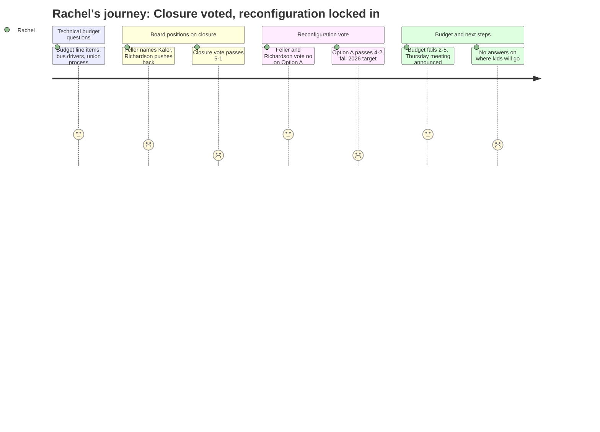

# Interpretation: Rachel (PERSONA-008)
## Meeting: School Board Special Budget Meeting -- March 30, 2026 -- 2026-03-30

### Structured Points

#### 1. Kaler closure voted through 5-1
- **Fact:** The board voted 5-1 to authorize the superintendent to file a school closing report for Kaler with the Commissioner of Education, effective end of the 2025-26 school year. Member Feller named Kaler specifically in his prepared remarks, citing its enrollment of 164 students and 68% utilization rate as the lowest in the district.
- **Source:** [81:52--275:47] Board positions on closure; vote tally read by board chair
- **Emotional valence:** negative
- **Threat level:** 4
- **Open question:** true — Rachel's children are not at Kaler, but this vote signals the board is willing to act on closure quickly and without the process she expects.

#### 2. Option A reconfiguration passes 4-2 — affects every elementary family
- **Fact:** The board voted 4-2 to adopt Option A, the Primary and Intermediate model, restructuring all remaining elementary schools into PreK-1 buildings (Dyer, Small) and grade 2-4 buildings (Brown, Skilling), effective fall 2026. This means every elementary family — not just Kaler families — faces a structural school reassignment.
- **Source:** [276:33--284:17] Motion by member Feller, seconded by member Risch; vote tally by board chair
- **Emotional valence:** negative
- **Threat level:** 5
- **Open question:** true — Rachel does not yet know which building her child will be assigned to, whether siblings will be together, or what the attendance boundaries will be.

#### 3. No one can say where students will go or when parents will be told
- **Fact:** Community member Ishmael Daniels directly asked what the timeline would be for telling Kaler parents where their children would attend, and whether families could visit their new school in advance. Dr. Prince responded that the assignment could not be communicated until after the board decided on reconfiguration, and that the intra-district waiver process exists — but does not include transportation.
- **Source:** [237:04--261:56] Public comment by Ishmael Daniels; response by board chair and Dr. Prince
- **Emotional valence:** negative
- **Threat level:** 5
- **Open question:** true — Rachel now knows the sequence: vote first, plan second, notify families third. With fall 2026 approximately 97 days away, the timeline terrifies her.

#### 4. The community engagement plan is six weeks of stakeholder meetings
- **Fact:** Dr. Prince outlined the transition engagement plan: one staff meeting and one family meeting per school, a digital survey, and a committee with representation from all schools. She described "the most intense part" of engagement as happening over the next six weeks. No details on attendance boundaries, class composition, or sibling policy were available.
- **Source:** [09:35--67:07] Superintendent's update; response to member Richardson's timeline question
- **Emotional valence:** negative
- **Threat level:** 4
- **Open question:** true — Rachel heard multiple community members echo that one meeting per school is insufficient, and member Feller agreed on the record, calling for at least one in-person and one virtual session.

#### 5. The only board member with elementary-aged children voted against both closure and Option A
- **Fact:** Member Richardson, who described herself as "the only board member with kids in the district right now" and "the only board member with elementary school aged children," voted no on the Kaler closure and no on Option A reconfiguration. She stated she could not support the pace, said staff morale was "very low," and expressed worry that the community was being divided.
- **Source:** [89:41--109:13] Member Richardson's positions on closure and reconfiguration
- **Emotional valence:** negative
- **Threat level:** 3
- **Open question:** false — This is not reassuring to Rachel; it confirms her worst instinct that the people closest to the decision are the most alarmed by it.

#### 6. The budget failed — and another meeting is Thursday
- **Fact:** The budget vote failed 2-5, with members Holman, Feller, Richardson, DeAngelis, and Dowling voting no. The board chair announced a continuation meeting for Thursday, April 2 at 6 PM, and confirmed the budget must still be presented to city council on April 7.
- **Source:** [285:03--293:34] Budget vote tally; board chair announcement
- **Emotional valence:** neutral
- **Threat level:** 2
- **Open question:** true — The closure and reconfiguration decisions are locked in, but the budget is still open. Rachel doesn't know if that changes anything for her children.

#### 7. The administration says it is prepared to execute — and points to the middle school merger as a model
- **Fact:** Dr. Prince stated the elementary leadership team has already begun transferring approximately 80 action items from the Mahoney-Memorial middle school merger process, and that a principal (Karen from Kaler) has been assigned to the transition on special assignment. She said the administration feels "prepared to execute on either plan."
- **Source:** [13:30--15:04] Superintendent's transition planning overview
- **Emotional valence:** positive
- **Threat level:** 2
- **Open question:** true — Rachel hears this as reassuring in tone but hollow in substance. The middle school merger had a longer timeline; multiple speakers said no comparable elementary reconfiguration has been completed in under 12 months anywhere in the country.

---

### Journey Map

---

### Reactions

So the closure passed. They're closing Kaler. Five to one. And then — and this is the part I can't stop thinking about — they also voted for Option A, which means it's not just Kaler families who got upended tonight. It's all of us. Every single elementary family. Starting in the fall, the PreK-1 kids go to Dyer and Small and the 2-4 kids go to Brown and Skilling. So if you have a first grader and a third grader, they are in different buildings. That is what just happened tonight and I still can't fully process it.

The thing that killed me was this dad — Ishmael — who got up and said, essentially: okay, you're closing my daughter's school, can you at least tell me when we'll know where she's going so I can go visit the new school and meet the teachers? And the answer was basically, we can't tell you that yet, we need to make these other decisions first. And they did make those decisions — they voted for Option A — and STILL the answer is "we'll communicate as soon as possible." His daughter has 97 days until school starts. And the only board member up there with actual elementary-aged kids, Richardson, voted no on both things and said the pace of this is reckless. I keep coming back to that. She's the only one who lives what we live every morning.

I know they're going to have Thursday's meeting and there's supposed to be this community engagement process over six weeks — stakeholder meetings at each school, a survey, some kind of committee. But they just voted on the thing tonight. How are you going to do six weeks of engagement on a decision that's already been made? What exactly are we giving input on? Attendance boundaries? Maybe. Class sizes? We still don't know. Whether siblings stay together? Nobody said a word about that. A woman got up and said she has three kids in elementary and the moment she's been waiting for — all three in the same building — is now gone. A quarter of that room is in some version of that situation. And the board sat there and voted anyway, at eleven o'clock at night, after a five-hour meeting, on something that changes where my kid goes to school in September.