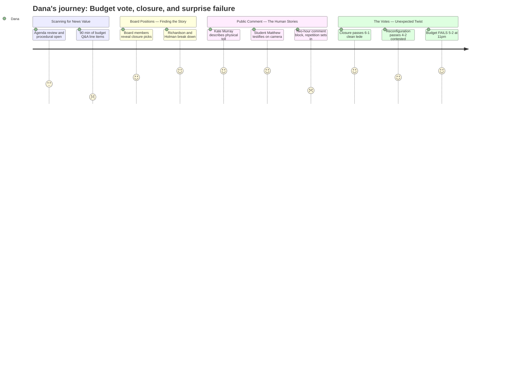

# Interpretation: Dana (PERSONA-009)
## Meeting: School Board Special Budget Meeting -- March 30, 2026 -- 2026-03-30

### Structured Points

#### 1. Kaler School Closure Passes 6-1 — The Headline Is Clear
- **Fact:** The board voted 6-1 to authorize the superintendent to file a school closing report with the Commissioner of Education for Kaler Elementary, effective end of the 2025-26 school year. Only board member DeAngelis voted no.
- **Source:** [275:47--276:00] transcript vote call; corroborated by agenda item 4.1
- **Emotional valence:** negative
- **Threat level:** 5
- **Open question:** false — this is the clean lede. School is closing.

#### 2. Board Member Richardson's On-Camera Breakdown Speech
- **Fact:** Member Richardson, the only board member with elementary-age children currently enrolled, delivered an extended emotional speech admitting she hasn't been sleeping, has been "yelling at my kids a lot," and "barely talked to my husband," describing the decision as "the most intense thing I've ever gone through." She also walked the halls of Kaler on Friday.
- **Source:** [90:29--93:34] transcript
- **Emotional valence:** negative
- **Threat level:** 4
- **Open question:** true — is she willing to do an on-camera interview? That speech is a segment by itself.

#### 3. Board Member Holman Chokes Up Over His Son's First School
- **Fact:** Board member Holman broke down mid-statement, disclosing that Kaler was where his son attended a summer English language program when he arrived in the country at age five and a half: "That was my first memory of having a child in a school. And I'm very sorry." He did not finish his sentence and had to pause.
- **Source:** [94:26--95:12] transcript
- **Emotional valence:** negative
- **Threat level:** 3
- **Open question:** true — this is a 15-second moment that tells the whole story visually. Timestamp this for the SPC-TV recording.

#### 4. Budget Fails 5-2 at 11 PM — The Story Isn't Over
- **Fact:** After closing a school and voting for a full elementary school restructuring, the board could not pass the FY27 budget itself. The vote failed 5-2, with only Smith and Risch voting yes. The primary stated objections included last-minute changes to the DEI director position, cuts to special education, and the desire to first meet with city council. A follow-up board meeting was scheduled for Thursday, April 2.
- **Source:** [291:09--291:12] transcript; budget meeting scheduled "this Thursday at 6pm" per [293:34]
- **Emotional valence:** negative
- **Threat level:** 5
- **Open question:** true — Thursday is the meeting to send a crew to.

#### 5. Board Chair DeAngelis Objects to Eliminating the District's Only BIPOC Leader
- **Fact:** Board chair DeAngelis stated she could not support the budget in part because the last-minute change demoting the DEI director to a teacher-level "strategist" role effectively eliminates "the one person we have in leadership who is a BIPOC person" — with no actual net cost savings. She called it affecting "more people" for no fiscal reason.
- **Source:** [75:38--76:24] transcript
- **Emotional valence:** negative
- **Threat level:** 4
- **Open question:** true — this is a counter-narrative to the administration's framing and has a human face. Who is this person?

#### 6. A Middle School Student Testified — and Landed Punches
- **Fact:** Matthew Emory, a student at South Portland Middle School, addressed the board directly about the computer science teacher and the percussion EdTech, saying the situation is "like building a zoo exhibit, buying the animals, but not hiring a zookeeper." He argued related arts teachers are more important than math teachers for most students' futures.
- **Source:** [160:18--162:10] transcript
- **Emotional valence:** positive
- **Threat level:** 2
- **Open question:** false — this is strong b-roll and a clean soundbyte. Get this kid on camera.

#### 7. Special Ed Ed Tech Describes Physical Toll at Kaler — While Her Team Is Being Cut
- **Fact:** Kate Murray, a special education ed tech at Kaler working with the highest-need students, told the board she has been "bit, hit, spit at, urinated on, and vomited on" — and that what keeps her going is her team. She noted that the general education behavior strategist who trained her in safety protocols is among the positions being eliminated.
- **Source:** [210:37--215:22] transcript
- **Emotional valence:** negative
- **Threat level:** 5
- **Open question:** true — this is the human cost of both the cuts and the closure in one person. Will she talk on camera?

#### 8. Reconfiguration Passes 4-2 — With Two Board Members Explicitly Confused or Opposed
- **Fact:** Option A (a Primary/Intermediate model splitting elementary schools into PreK-1 and grades 2-4 buildings) passed 4-2, with Holman, Dowling, Smith, and Risch voting yes and Feller and Richardson voting no. Both no-voters explicitly cited lack of a detailed plan — Feller said "I need to know what it's gonna look like to vote for it," and Richardson said "we are asking them to do a lot already with 12% less staff."
- **Source:** [284:17--284:38] transcript; Feller remarks at [102:10--104:30]; Richardson remarks at [105:16--109:13]
- **Emotional valence:** negative
- **Threat level:** 4
- **Open question:** true — a 4-2 vote on something this consequential, with explicit "I'm confused" on the record from a board member, is a fragile mandate.

---

### Journey Map

---

### Reactions

Okay so here's your story: South Portland school board meets for five hours, votes to close an elementary school, votes to restructure every other elementary school in the city — and then *cannot pass the budget to pay for any of it.* That's your lede. The school is closing, the system is being completely rebuilt, and they're coming back Thursday because they couldn't get five votes on the money. I was watching the SPC-TV feed and I have timestamps. This is a two-parter minimum, probably three.

The moments are there. The board member with kids in the district — Richardson — she literally said on the record she hasn't slept, she's been yelling at her kids, barely talking to her husband. That's a human being breaking in real time, not a press release. And Holman — older guy, immigrant background — he started talking about his son's first school being Kaler and just stopped mid-sentence. Couldn't finish. Those are the two shots I need. Pull up the SPC-TV recording around the 90-minute mark and you'll find Richardson at roughly 1:30:29, Holman just after. I also want to find the special ed ed tech who said she gets "bit, hit, spit at, urinated on, and vomited on" and what keeps her going is her team — and then said her team is being cut. That is your human cost of a school closing. She may talk.

Thursday is the meeting to send a crew to. The budget failed 5-2. The board chair voted no over a DEI director demotion that saves zero dollars — she said that on the record. Feller won't vote yes unless the percussion EdTech is reinstated. Richardson won't vote yes without a city council conversation about fund balance. These are not soft objections — they're named conditions. And meanwhile, the district has to present something to city council by April 7th. The clock is real. For b-roll: Kaler Elementary exterior, the kids who walk past the ed tech's house on the way to school, the modular classrooms behind Small School that are coming back into play. The visual story is a neighborhood school with 164 kids in it and a closing date.