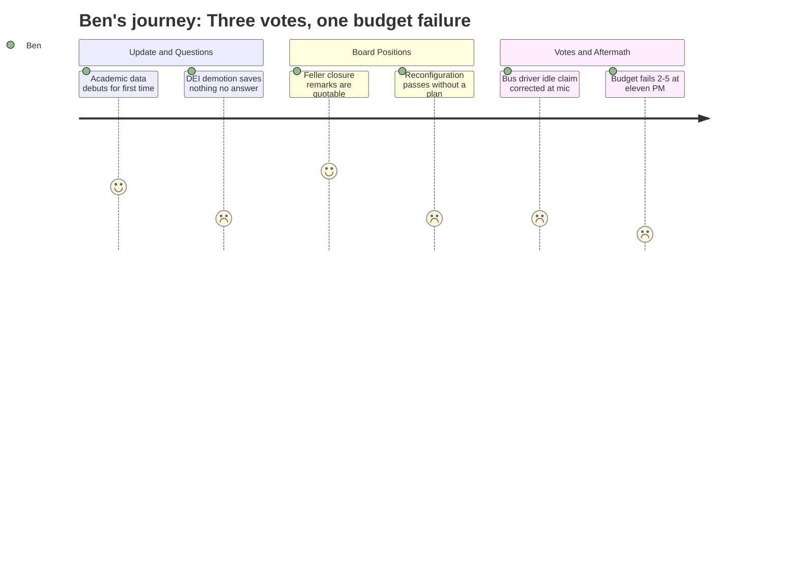

# Interpretation: Ben (PERSONA-010)
## Meeting: School Board Special Budget Meeting -- March 30, 2026 -- 2026-03-30

### Structured Points

#### 1. The budget fails five to two at eleven o'clock at night
- **Fact:** After passing both a school closure motion and a reconfiguration model, the board voted 2-5 against adopting the FY27 superintendent's budget. Smith and Risch voted yes; Holman, Feller, Richardson, DeAngelis, and Dowling all voted no, citing concerns ranging from the last-minute DEI position change to special education cuts to wanting a city council conversation before finalizing anything.
- **Source:** Transcript [285:00–291:00]
- **Emotional valence:** negative
- **Threat level:** 4
- **Open question:** true

#### 2. Member Feller delivers the most data-rich five minutes of the entire budget season
- **Fact:** Feller read prepared remarks comparing South Portland's per-pupil cost of $26,651 to Gorham at $20,000, Windham at $21,600, Brunswick at $24,000, and Portland — which serves twice the enrollment and a higher concentration of high-need students — at less per pupil than South Portland. He cited Kaler's enrollment of 164 students (lowest in the district by a significant margin), its 68% utilization rate, and walkability distances to neighboring schools. The closure motion passed 6-1, with DeAngelis the sole no vote.
- **Source:** Transcript [82:00–88:00]; [272:00–275:00]
- **Emotional valence:** positive
- **Threat level:** 2
- **Open question:** false

#### 3. Option A passes four to two with no attendance lines, no staffing plan, no community input yet
- **Fact:** The board voted 4-2 to approve Option A — the Primary/Intermediate (PreK-1 and 2-4) reconfiguration model — effective for the 2026-27 school year. Members Feller and Richardson both voted no, explicitly stating they support reconfiguration in principle but cannot vote for something without a detailed implementation plan. The assistant superintendent confirmed that boundary lines and specific staffing configurations cannot begin until the board makes a decision — which happened tonight, at ten-something, in front of several hundred people.
- **Source:** Transcript [97:00–105:00] (board positions on reconfiguration); [283:00–284:00] (vote tally)
- **Emotional valence:** negative
- **Threat level:** 4
- **Open question:** true

#### 4. DEI director eliminated with no measurable savings — and a board member names it plainly
- **Fact:** During the question period, a board member challenged the administration's last-minute change: the DEI director position had been moved from coordinator to a teaching-unit strategist, saving approximately $8,000 beyond the prior step down — and potentially nothing if someone with higher years of experience fills it through the union recall process. The same member identified the person being displaced as "the one person we have in leadership who is a BIPOC person" and called it an elimination with no financial justification. The administration acknowledged the marginal savings had been redirected to cover facility risk reserves.
- **Source:** Transcript [72:00–77:00]
- **Emotional valence:** negative
- **Threat level:** 4
- **Open question:** true

#### 5. "They're not just sitting there from nine-thirty to one" — the SEIU president corrects the record
- **Fact:** The director of operations had earlier presented a plan to use bus drivers for cafeteria setup during their midday hours, framing it as using paid time that was otherwise idle. The SEIU president came to the microphone during public comment and corrected this directly: drivers average 42–63 midday trips per week, plus a one-hour lunch break. A bus driver followed her and raised safety concerns about performing custodial tasks for which drivers are not trained, noting injuries had already occurred. The board had been operating on the faulty "idle time" premise when they discussed the plan.
- **Source:** Transcript [29:00–31:00] (operations director presentation); [142:00–145:00] (SEIU president and driver testimony)
- **Emotional valence:** negative
- **Threat level:** 3
- **Open question:** true

#### 6. Chair clarifies: the city is not offering to give the district anything
- **Fact:** Multiple board members and community speakers throughout the night referenced a potential "offer" from city council and the canceled council meeting as evidence that city government was prepared to help close the gap. Chair DeAngelis corrected this at the end of public comment: the city council has no money to give. The only mechanism would be a short-term loan from the city's fund balance — which itself carries reserve obligations — not a gift or a transfer. The distinction matters for what "going to city council" actually means.
- **Source:** Transcript [254:00–255:00]
- **Emotional valence:** neutral
- **Threat level:** 3
- **Open question:** true

#### 7. Tonight was the first time school-level academic outcome data appeared in this process
- **Fact:** The assistant superintendent opened her update with NWEA math performance data for each elementary school, comparing fall 2024 to fall 2025. Member Richardson said explicitly during board discussion that this was the first time this data had appeared. A parent speaker during public comment (Meredith Diamond) then reanalyzed the same slide and argued it showed the positive impact of equity initiatives already underway — drawing the opposite conclusion from the district's framing of it as evidence that reconfiguration is necessary.
- **Source:** Transcript [07:00–09:00] (data presentation); [170:00–172:00] (parent reanalysis in public comment)
- **Emotional valence:** neutral
- **Threat level:** 3
- **Open question:** true

#### 8. One position becomes one board member's stated condition for the entire budget
- **Fact:** Member Feller announced he would vote yes on the budget on a single condition: reinstatement of the percussion ed tech. The administration had included a dedicated slide in tonight's presentation explaining why the position remained cut despite sustained community pressure. The position was not reinstated. Feller voted no on the budget. A band director came to the microphone during public comment and directly rebutted the administration's claim that surrounding districts use a one-teacher model — citing Cape Elizabeth, Scarborough, and Westbrook as counterexamples with more expensive arrangements than a full-time ed tech.
- **Source:** Transcript [121:00–122:00] (Feller's stated condition); [200:00–203:00] (band director's rebuttal)
- **Emotional valence:** neutral
- **Threat level:** 2
- **Open question:** true

---

### Journey Map

---

### Reactions

Okay, so here's the lede: the South Portland school board closed Kaler, voted to blow up the elementary grade structure into a PreK-1 and 2-4 model, and then couldn't pass the budget to pay for any of it. Five to two. At eleven at night. That's the story — three decisions on the table, two went through, the third cratered. And now they've got a city council presentation scheduled for April seventh, which is one week away, and Thursday's meeting is not optional. I need to call the business office tomorrow to understand what the scenarios actually are, because the chair's explanation of "we can still go to city council but they're not giving us anything, just maybe a loan" was the clearest thing said all night and it seemed to surprise half the people in the room.

The reconfiguration vote is the part I can't fully make sense of as a story yet. Four members voted yes for a PreK-1/2-4 model where, as of last night, there are no attendance lines, no staffing assignments, no community input formally scheduled. The assistant superintendent said they literally couldn't begin that work until the board voted — which they did, at ten o'clock, in front of a packed lecture hall. Feller and Richardson both said they believe in reconfiguration and can't vote for it without a plan. Feller said if it passed he'd help rally the community around it. It passed. So now you have a majority decision for a school structure that is going to be workshopped over the next six weeks of "intense community engagement" that hasn't started yet. I want to find a parent who has two kids who will be in separate elementary buildings for the first time starting in September. The logistics story — two school calendars, two pickup schedules, two parent-teacher conference nights — that's what makes this real for a Forecaster reader.

The thing I can't shake is the DEI director situation. This needs more reporting. A board member — I need to pin down who exactly from the recording — laid out during the question period that the DEI director position has been demoted three times in three weeks: director to coordinator ($21K savings), then coordinator to a teaching-unit strategist ($8K more, maybe nothing depending on union recall). The same person said directly that this is the district's only BIPOC person in a leadership role, and that the change saves no meaningful money — the administration confirmed the marginal savings were just shifted to facility reserves. The chair later cited the DEI position change as one of her reasons for voting no on the budget. So you have a board that just voted to reconfigure schools in the name of equity, simultaneously voting down a budget partly because it eliminates the only equity-focused leader who's also the only BIPOC person in district leadership — with no savings to show for it. I don't know yet whether that's a story about bad optics or something more deliberate. But I need to find out who this person is and whether they'll talk to me.