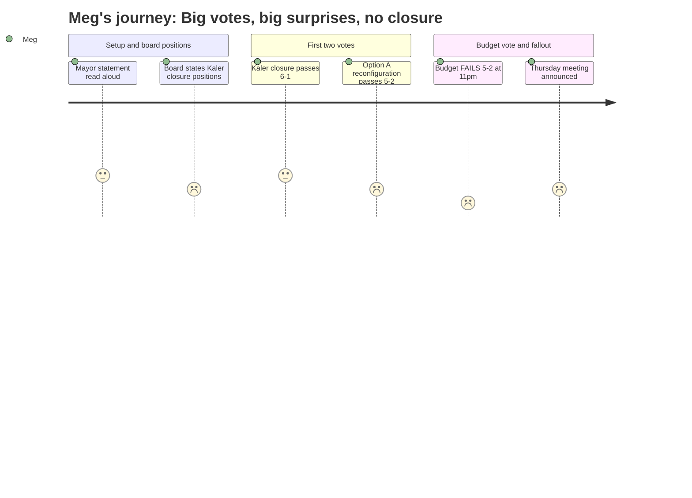

# Interpretation: Meg (PERSONA-011)
## Meeting: School Board Special Budget Meeting -- March 30, 2026 -- 2026-03-30

### Structured Points

#### 1. Kaler Closes — Vote Was 6-1
- **Fact:** The board voted 6-1 to authorize the superintendent to file a school closing report with the commissioner of education, naming Kaler as the school to be closed effective end of the 2025–26 school year. Board chair DeAngelis cast the sole no vote.
- **Source:** Transcript [00:275:00–00:276:00], confirmed against motion language read aloud by the chair; agenda item 4.1
- **Emotional valence:** negative
- **Threat level:** 4
- **Open question:** true — no attendance boundary map was presented; Kaler families don't yet know which school their kids are being sent to or when they'll be told

#### 2. Reconfiguration (Option A) Passes — But Nobody Can Explain the Details
- **Fact:** The board voted approximately 5-2 in favor of Option A — the Primary/Intermediate split model (PreK–1 at Dyer and Small; grades 2–4 at Brown and Skillin) — with Feller and Richardson both voting for Option B (K–4 full-grade-band). Board chair DeAngelis stated clearly "I believe reconfiguration is what is right for kids."
- **Source:** Transcript [00:283:00–00:284:00]; confirmed against slide deck Option A/B descriptions
- **Emotional valence:** negative
- **Threat level:** 4
- **Open question:** true — no attendance boundaries, no staffing maps, no confirmed school assignments; Meg cannot tell her group chats where any specific child will go to school next fall

#### 3. Budget FAILS — Only Two Yes Votes
- **Fact:** The FY27 superintendent's budget was rejected 5-2. Smith and Risch voted yes. Holman, Feller, Richardson, DeAngelis, and Dowling all voted no. The meeting is not over — a follow-up board meeting is scheduled for Thursday, April 2 at 6 p.m. in the high school lecture hall.
- **Source:** Transcript [00:291:00–00:292:00]; agenda item 4.3; board communication at close of meeting
- **Emotional valence:** negative
- **Threat level:** 4
- **Open question:** true — what changes between now and Thursday? Will the board ask city council for more money? What's actually on the agenda?

#### 4. Tax Impact Number Is Confirmed: $257/Year for Average Home
- **Fact:** The school portion of the FY27 tax increase equals $257 per year for a home valued at $514,000 — a 6% increase to the school levy only. The total property tax rate increase across all categories (school, municipal, county, metro) is 5.1%.
- **Source:** Transcript [00:25:00–00:26:00]; slide deck "FY27 Proposed Budget Tax Impact" table
- **Emotional valence:** neutral
- **Threat level:** 2
- **Open question:** false — this number was confirmed and stable from the prior week's presentation

#### 5. Feller's Ultimatum on the Percussion EdTech
- **Fact:** Board member Feller stated he would support the budget only if the percussion EdTech position was reinstated: "I'm prepared to support this budget. If the EdTech position is put back in." The position was not reinstated, the administration defended the cut with a dedicated slide, and Feller voted no. A public speaker (Christine Dobson) directly called out Feller for this conditional vote at the podium.
- **Source:** Transcript [00:121:00–00:122:00] for Feller's statement; [00:298:00–00:299:00] for Dobson's response; slide deck "Percussion EdTech" slide
- **Emotional valence:** negative
- **Threat level:** 3
- **Open question:** true — will the percussion EdTech be reinstated by Thursday? Is this actually the sticking point, or is it symbolic?

#### 6. DEI Director Position Changed Again Tonight — With No New Savings
- **Fact:** The superintendent presented a last-minute change: the DEI director position would be downgraded further, from coordinator to SPTA instructional strategist. Board member DeAngelis stated this saves no additional money compared to the coordinator proposal and eliminates "the one person we have in leadership who is a BIPOC person." The superintendent confirmed the bottom-line budget figure is unchanged from last week.
- **Source:** Transcript [00:72:00–00:78:00]; slide deck "FY27 Director and Administrator Changes" table showing DEI moved to "SPTA Instructional Strategist"
- **Emotional valence:** negative
- **Threat level:** 3
- **Open question:** true — if it saves no money, why was this change made tonight? DeAngelis explicitly said she can't support the budget partly because of this

#### 7. Health Insurance Max Drops Slightly — Marginal Good News
- **Fact:** The projected health insurance increase has been revised downward from 12% to a maximum of 11.5% for FY27. The director of finance confirmed this is now the ceiling, not a final figure, and has been incorporated into the current budget model.
- **Source:** Transcript [00:28:00–00:29:00], member Feller questioning the finance director
- **Emotional valence:** positive
- **Threat level:** 1
- **Open question:** false — this is confirmed and already baked in

#### 8. Enrollment Discrepancy Called Out at the Podium
- **Fact:** Board member Feller cited Kaler's enrollment as 164 students. Community member Ishmael Daniels walked to the mic and stated the correct number is 182. The superintendent's team later clarified at [00:269:00]: "The correct enrollment is 164 students" — the 182 figure includes preschool students who attend an off-campus program and are not physically in the Kaler building.
- **Source:** Transcript [00:86:00] Feller's statement; [00:237:00] Daniels' correction; [00:269:00–00:270:00] Dr. Prince's clarification
- **Emotional valence:** neutral
- **Threat level:** 2
- **Open question:** false — the record was clarified during the meeting; 164 is the correct in-building enrollment

---

### Journey Map

---

### Reactions

ok so if you watched tonight here's the actual summary. THREE votes were on the table. Vote 1: Kaler closes. PASSED 6-1 — only DeAngelis voted no. Vote 2: which reconfiguration model. They went with Option A — that's the PreK–1 / grades 2–4 split — passed about 5-2, Feller and Richardson both voted for Option B (keeping K–4 at each school). Vote 3: the actual budget. FAILED. 5-2. Only Smith and Risch said yes. So there is ANOTHER MEETING this Thursday April 2 at 6pm, same place, high school lecture hall. They have to present SOMETHING to city council on April 7 so Thursday is basically the hard deadline.

The biggest thing nobody in my feed has mentioned yet: the budget failing doesn't mean the cuts go away. The 78 positions are still on the table. What it means is the board wants changes before approving it — DeAngelis wouldn't vote yes because of the DEI director position (they moved it to a teacher-track role TONIGHT with zero additional savings, and she pointed out it eliminates the only BIPOC person in district leadership), and Feller said flatly he won't vote yes unless the percussion ed tech gets reinstated. Richardson had a longer list of concerns — kindergarten classes of 20 students, cutting the behavior ed specialist, PE being gutted at the middle school. So watch Thursday for whether any of those things get addressed.

One thing I need to flag for anyone tracking numbers: there was a moment where Feller said Kaler enrollment is 164 and a dad in the audience came up and said no it's 182. The superintendent clarified at the very end — 164 is correct for students actually in the building; the higher number includes preschoolers at an off-campus site. So 164 is the number you should be using. The $257/year tax increase figure (school portion only, for a $514k home) was confirmed — that hasn't changed from last week. And health insurance cap came down slightly from 12% to 11.5% max, already in the budget.