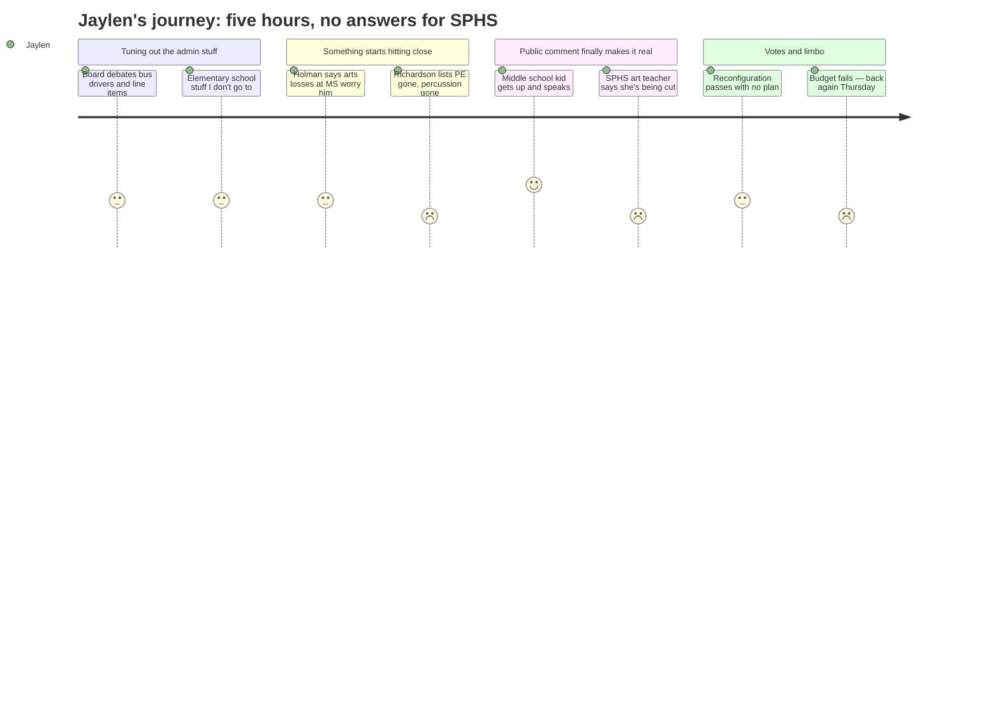

# Interpretation: Jaylen (PERSONA-012)
## Meeting: School Board Special Budget Meeting -- March 30, 2026 -- 2026-03-30

---

### Structured Points

#### 1. An art teacher at SPHS is being cut
- **Fact:** Hannah, an art teacher currently at South Portland High School, testified that her position is being eliminated — her second time being laid off by the district in two years. She described students who don't speak English connecting through her class and said "to strip students of their access to art is to strip them of their humanity."
- **Source:** Transcript [189:48--193:42]
- **Emotional valence:** negative
- **Threat level:** 5
- **Open question:** true — If there's one fewer art teacher at SPHS, what happens to theater? To the other arts electives Jaylen is counting on for senior year?

#### 2. Physical education is being eliminated from the middle school
- **Fact:** Board member Richardson, cataloguing what she couldn't support in the budget, said plainly: "We have cut physical education from our middle school." She connected this directly to student mental health, saying "we all know what it does to our bodies and mind when we move them."
- **Source:** Transcript [122:22--125:26]
- **Emotional valence:** negative
- **Threat level:** 4
- **Open question:** true — If PE is gone from the middle school, is it protected at the high school? No one addressed what these cuts mean at SPHS specifically.

#### 3. A middle school student went up to that microphone
- **Fact:** Matthew Emory, a student at South Portland Middle School, testified in favor of keeping the computer science teacher and the percussion ed tech. He told the board: "Most kids aren't interested in science or math. They're interested in band, art or singing. I've never once heard a kid in gym class say, I wish I could be in science right now."
- **Source:** Transcript [160:18--161:50]
- **Emotional valence:** positive
- **Threat level:** 1
- **Open question:** false

#### 4. The percussion ed tech is being cut and the band director explained exactly what that means
- **Fact:** The district's proposal eliminates the percussion ed tech position. Band director Jen Fletcher testified that this position provides direct instruction to 50-plus students per day, and that she currently runs classes of 35+ students — already over the related arts cap. Member Feller said he would only vote for the budget if the percussion ed tech was reinstated; the administration declined to return the position.
- **Source:** Transcript [48:34--49:20] and [200:40--202:57]
- **Emotional valence:** negative
- **Threat level:** 4
- **Open question:** true — Who teaches percussion next year? What happens to students who are mid-program?

#### 5. A board member said out loud that losing arts at the middle school is the thing that worries him most
- **Fact:** Board member Holman, speaking about what he wished city council could help fix, said: "I don't know if this appeal to city council could ever change something. I think the loss of related arts positions at the middle school, very formative time, is a really hard time to lose positions like that when we need kids to explore and begin to think."
- **Source:** Transcript [68:37--69:23]
- **Emotional valence:** positive
- **Threat level:** 2
- **Open question:** true — Holman also said he didn't know if there was any hope. Naming the problem isn't the same as fixing it.

#### 6. Forty teachers are being eliminated and no one said which ones are at SPHS
- **Fact:** The budget eliminates 40 teacher positions (11% of the teachers' unit). Member Feller acknowledged "more than 60 talented, early career educators and staff who will leave the district." No board member or administrator broke down where those cuts fall by school during the meeting.
- **Source:** Transcript [120:03--120:49]; Slides, "Reductions for FY27" table
- **Emotional valence:** negative
- **Threat level:** 4
- **Open question:** true — Which teachers at SPHS are on this list? Are any AP teachers affected? Theater staff?

#### 7. The budget failed — five board members voted no
- **Fact:** The third vote of the night — to adopt the FY27 superintendent's budget — failed 5-2. Members Holman, Feller, Richardson, DeAngelis, and Dowling all voted no. The meeting adjourned without a passed budget and a follow-up board meeting was scheduled for Thursday, April 2.
- **Source:** Transcript [290:26--291:59]
- **Emotional valence:** neutral
- **Threat level:** 3
- **Open question:** true — What changes by Thursday? Does a failed budget mean more cuts, fewer cuts, or just more chaos?

#### 8. Students had no formal role in this process — and one person in public comment named that
- **Fact:** A parent, Catherine, asked the board to consider calling a special referendum so voters could weigh in, citing "a clear gap of representation, particularly in those most impacted." No student other than Matthew and one read statement from a freshman at SPHS were heard. The board chair noted there were four empty board seats in November with no opposing candidates.
- **Source:** Transcript [204:28--206:01]; [162:36--164:10]
- **Emotional valence:** negative
- **Threat level:** 2
- **Open question:** true — The board says this is "for the kids." But there's no seat at the table for kids.

---

### Journey Map

---

### Reactions

Okay so I was watching the stream until like 11:30 and here's what actually matters if you go to SPHS. There's an art teacher there — she's been there two years, got laid off once before by the same district, and now they're cutting her again. She talked about students who literally don't speak English yet and art is the one class where they can actually participate. She goes up to that mic at like 9:30 at night and tells the board "to strip students of their access to art is to strip them of their humanity" and you could tell she's been holding that together for weeks. And the board just kind of sat there. Nobody said, yeah, we're keeping your job. So that's SPHS. That's this year. I don't know what that means for drama or if she's the only one but it's bad.

The thing that kind of hit different though — there was this kid from the middle school, Matthew, who just went up to the mic and told them the percussion ed tech shouldn't be cut and that most kids don't care about science, they care about band and art. He's like our age, maybe younger, and he just said it straight. And that was the most I felt seen in five hours of watching adults talk about "what's best for students" while no students were in the room with any actual power. One board member — Richardson, the one with little kids — actually listed out what these cuts mean for real: PE is gone from the middle school, the percussion teacher is gone, the behavior support person is gone. She couldn't vote for it. Five board members couldn't vote for it. So the budget failed. Which sounds like good news but honestly it just means they're doing it again Thursday and nobody knows what changes.

The thing that's going to keep me up is that nobody in that entire five-hour meeting talked about what this means for SPHS specifically. Like, what are my AP options senior year? Is theater funded? They talked about elementary school reconfiguration for literally hours. They listed every line item for supplies and bus driver schedules. But if you asked right now what classes still exist at the high school next fall — nobody said. The board chair said the district is "prepared for change." That's not an answer. If I'm going to the mic on Thursday I need to know: which teachers at my school are on this list? Because right now I'm supposed to be planning senior year and I genuinely don't know if the programs I'm counting on still exist.