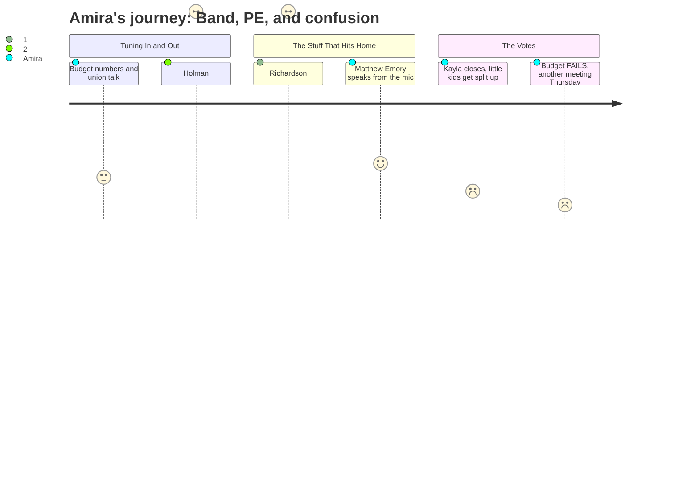

```yaml
---
schema_version: "1.0"
meeting_id: "2026-03-30-school-board"
persona_id: "PERSONA-013"
persona_name: "Amira"
meeting_date: 2026-03-30
meeting_title: "School Board Special Budget Meeting -- March 30, 2026"
interpretation_date: 2026-03-31
interpreter_model: "claude-sonnet-4-6"
---
```

# Interpretation: Amira (PERSONA-013)
## Meeting: School Board Special Budget Meeting -- March 30, 2026 -- 2026-03-30

---

### Structured Points

#### 1. The Percussion Ed Tech Is Still Getting Cut
- **Fact:** The superintendent's budget still proposes eliminating the percussion ed tech position at the middle school. Despite 32 emails from community members and multiple public speakers defending the role, the administration created a dedicated slide explaining why the cut stands, noting that "most other schools" use a single band teacher model. The position was only reinstated in FY26 using reserve funds that no longer exist.
- **Source:** Transcript [22:10], [48:34]; Presentation slide "Percussion EdTech"
- **Emotional valence:** negative
- **Threat level:** 5
- **Open question:** true

#### 2. A Middle School Student Got Up and Said What Everyone Was Thinking
- **Fact:** Matthew Emory, a student at South Portland Middle School, spoke during public comment about the computer science teacher and the percussion ed tech. He said cutting the ed tech "could heavily affect the music program" and asked directly: "who will teach the percussion?" He also said related arts teachers are "more important" because "most kids aren't interested in science or math — they're interested in band, art, or singing."
- **Source:** Transcript [160:18--161:50]
- **Emotional valence:** positive
- **Threat level:** 2
- **Open question:** false

#### 3. A Board Member Said Out Loud: We Cut PE at the Middle School
- **Fact:** Board member Richardson stated during budget discussion: "We have cut physical education from our middle school... we all know what it does to our bodies and mind when we move them." She also named a specific PE teacher whose position was eliminated — someone she said had been providing access to extracurricular activities for students who didn't otherwise have that access.
- **Source:** Transcript [123:55--125:26]
- **Emotional valence:** negative
- **Threat level:** 4
- **Open question:** true

#### 4. A Board Member Said Cutting the DEI Director Means Losing the Only BIPOC Leader
- **Fact:** Board member Davison refused to support the last-minute change moving the DEI director position to a lower-level "strategist" role, saying it "eliminates the one person we have in leadership who is a BIPOC person" and called out that the move saves essentially no money while causing additional harm to a person who already accepted a demotion. The budget ultimately proposed eliminating the Director of Diversity Equity and Belonging role entirely.
- **Source:** Transcript [75:38--77:57]; Presentation slide "FY27 Director and Administrator Changes"
- **Emotional valence:** negative
- **Threat level:** 3
- **Open question:** true

#### 5. Board Member Holman Said She Was Scared About Losing Middle School Related Arts
- **Fact:** Before the votes, board member Holman said she doesn't know if talking to city council will change anything but expressed specific concern: "The loss of related arts positions at the middle school — very formative time — is a really hard time to lose positions like that when we need kids to explore and begin to think."
- **Source:** Transcript [68:00--68:37]
- **Emotional valence:** positive
- **Threat level:** 2
- **Open question:** true

#### 6. Kayla School Is Closing
- **Fact:** The board voted 6-1 to authorize the superintendent to file a school closing report for Kayla Elementary. Board members described it as painful — member Richardson, who said she is the only board member currently with elementary-aged children, called it "devastating." Kayla has 164 students. Their families do not yet know which school their children will attend next year.
- **Source:** Transcript [275:25--276:00]; Agenda item 4.1
- **Emotional valence:** negative
- **Threat level:** 3
- **Open question:** true

#### 7. The Little Kids Are Getting Split Into Different Schools Starting Next Year
- **Fact:** The board voted 4-2 in favor of Option A — a "Primary and Intermediate" reconfiguration model where some schools would become Pre-K through 1st grade and others 2nd through 4th grade. This means elementary students in South Portland will change schools after 1st grade. Multiple parents and a licensed social worker expressed concern about the impact on the youngest students' sense of stability and trust.
- **Source:** Transcript [284:17]; Presentation slide "Options - Presented 3.23.26"
- **Emotional valence:** negative
- **Threat level:** 3
- **Open question:** true

#### 8. The Board Couldn't Even Agree on the Budget — Another Meeting Is Thursday
- **Fact:** The board voted 5-2 against adopting the FY27 budget. Reasons given included the last-minute DEI position change, unresolved special education staffing concerns, and multiple members wanting to first talk to the city council about adding money for a fund balance. Because the budget wasn't passed, a third meeting is scheduled for Thursday, April 2. The budget still needs to be presented to city council by April 7.
- **Source:** Transcript [291:09--291:38], [293:34]
- **Emotional valence:** negative
- **Threat level:** 4
- **Open question:** true

---

### Journey Map



---

### Reactions

Okay so my friend told me to watch this and I did for like two hours and now I can't sleep. They actually might kill band. Like not close it completely but without the percussion teacher it's basically broken — who's going to teach drums? The band director can't watch 145 kids AND teach percussion at the same time. There was a whole entire slide the district made basically saying "we know everyone is upset about this but we're still doing it." A WHOLE SLIDE. And then member Feller said he wouldn't vote yes on the budget unless they put that position back, and then the budget didn't pass anyway, so now what? More cuts? I feel like I'm watching adults play a game where I don't know the rules and my band program is one of the pieces they're moving around.

The best part — and I mean the only good part — was this kid Matthew from the middle school got up and literally said what everyone was feeling. He said most kids aren't interested in math and science, they care about band and art and singing. He said cutting the percussion ed tech is "insane." He's right. And one of the board members, member Holman, said she was scared about losing "related arts positions at the middle school" because it's a "formative time." At least someone up there gets it. But Richardson also said out loud that they cut PE — like actual PE class — and the teacher who ran extracurriculars for kids who couldn't afford outside sports. That person is gone. That's real. I know kids who counted on that.

The thing that really got me though was when one of the board members said they were cutting the DEI director and replacing her with some other job that saves basically no money — and another board member said basically: she's the only BIPOC person in leadership and you're getting rid of her for no reason. And nobody really answered that. My mom would want to know about that. She always notices when people who look like us disappear from places. And then at the very end the whole budget didn't even pass and now there's another meeting on Thursday and I don't even understand what that means for my school year. Are MORE things getting cut? Is band still happening? Nobody said. Adults made all these big decisions in one night and then couldn't agree on the most important thing, and now everyone just has to wait again.