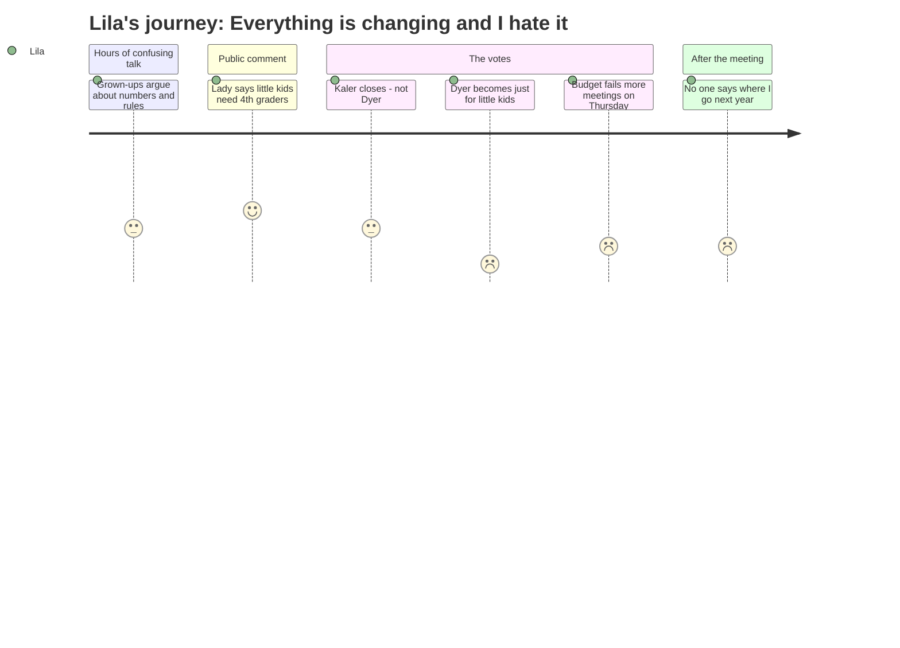

# Interpretation: Lila (PERSONA-014)
## Meeting: School Board Special Budget Meeting -- March 30, 2026 -- 2026-03-30

### Structured Points

#### 1. Kaler Is Closing — Not Dyer
- **Fact:** The board voted 6-1 to close Kaler elementary school. Dyer is not being closed. The motion named "the Kaler school" as "unnecessary or unprofitable to maintain" and authorized the superintendent to file a school closing report with the commissioner of education.
- **Source:** [267:19--275:00], transcript
- **Emotional valence:** neutral
- **Threat level:** 2
- **Open question:** true

#### 2. Dyer Becomes a "Little Kids Only" School — All the Big Kids Move Out
- **Fact:** The board voted 4-2 to adopt Option A, the Primary and Intermediate model. Under this plan, Dyer becomes a PreK–1 school beginning in September 2026. All 2nd, 3rd, and 4th grade students currently at Dyer will be reassigned to intermediate schools (Brown or Skillin). The K–4 school Lila has attended since kindergarten will no longer exist in that form.
- **Source:** [283:30], transcript; Option A definition, FY27 Board Slides [presentation]
- **Emotional valence:** negative
- **Threat level:** 5
- **Open question:** true

#### 3. A Woman Described Exactly What Fourth Graders Do — and What Will Be Lost
- **Fact:** Licensed clinical social worker Shannon Sine testified during public comment that cross-age relationships are essential to young children's development. She said: "Community is seen when the nervous kindergartner sees a cool fourth grader come in and hug that teacher. They know that that teacher can be trusted." Under Option A, Dyer will have no older students for its youngest children to watch and learn from.
- **Source:** [147:10], transcript
- **Emotional valence:** positive
- **Threat level:** 2
- **Open question:** false

#### 4. Nobody Can Say Where Any Kid Is Going Yet
- **Fact:** Kaler parent Ishmael Daniels asked when families would be told which school their children would attend next year, saying he wanted families to have time to visit the buildings and meet the staff. The superintendent responded that the district could not yet say which school any child would go to because the board still needed to vote on the plan first. Even after the votes were taken, no specific school assignments were given to any family.
- **Source:** [237:50] and [264:15], transcript
- **Emotional valence:** negative
- **Threat level:** 4
- **Open question:** true

#### 5. One Board Member Has Young Kids and Said She Feels It
- **Fact:** Board member Richardson identified herself as "the only board member with kids in the district right now" and "the only board member with elementary school aged children." She said: "I feel deeply this decision. I know so many of you all in this room, our kids have played on playgrounds together on sports teams at rec camp."
- **Source:** [90:29], transcript
- **Emotional valence:** positive
- **Threat level:** 1
- **Open question:** false

#### 6. Grown-Ups Keep Saying Kids Are Resilient
- **Fact:** Multiple board members invoked children's resilience to explain their votes. Board member Richardson argued that young children "shouldn't have best friends" and that she welcomed the experience of new kids entering her son's classroom because "they are so excited to meet new friends — it's like a celebration for them." The word "resilient" was used by several speakers to minimize concerns about disruption.
- **Source:** [91:16], transcript
- **Emotional valence:** negative
- **Threat level:** 1
- **Open question:** false

#### 7. They Couldn't Finish — Another Meeting This Thursday
- **Fact:** The budget vote failed 5-2, leaving one of the three required motions unresolved. The board chair announced an additional meeting on Thursday, April 2 at 6 PM. Families still do not know which school their children will attend next year or when that information will be shared.
- **Source:** [291:12] and [293:34], transcript
- **Emotional valence:** negative
- **Threat level:** 3
- **Open question:** true

---

### Journey Map

---

### Reactions

Okay so my mom came home REALLY late last night, like after eleven, and I was pretending to be asleep but I wasn't. I heard her and my dad talking and I could tell something bad happened. I finally asked her and she said: it's Kaler. Kaler is the school that's closing, not Dyer. So I thought, okay, maybe it's okay? But then she said that Dyer is going to change. Like next year it's only going to be for really little kids — kindergarten and first grade — and all the 2nd graders and 3rd graders have to go somewhere else. My little brother is in first grade, so he gets to stay. But all the older kids have to leave. And I'm going to middle school in the fall anyway, but it still feels really really bad. Because Dyer won't be Dyer anymore. The school I've gone to since kindergarten is basically going away.

My dad told me something from the meeting that made me feel like somebody in that room actually got it. A lady was there — I think she helps kids with their feelings, like for her job — and she said that when a little kindergartner is nervous, they watch what the older kids do. Like they see a fourth grader go hug their teacher in the hallway, and that's how the little kid learns the teacher is safe. THAT IS LITERALLY ME. I do that. I hug my teacher all the time and the little kids see me. And now four people voted yes so that's not going to happen anymore at Dyer, because there won't be any fourth graders there for the little kids to watch. Two people voted no. I wish two more people voted no.

The thing I keep thinking about is where is everyone going. Like where is Mia going? Where is Oliver going? All my friends who are still in 2nd and 3rd grade — where are THEY going? A dad at the meeting asked almost that exact question and the answer was basically: we don't know yet. HOW do they not know? They just voted to move everyone around but nobody knows where? Mom said there's another meeting this Thursday because they couldn't even finish deciding everything. She might go to that one too. I want someone to just tell me that my friends are all going to the same school together and that the new school is going to be okay. But nobody at that meeting could say that. Not even close.