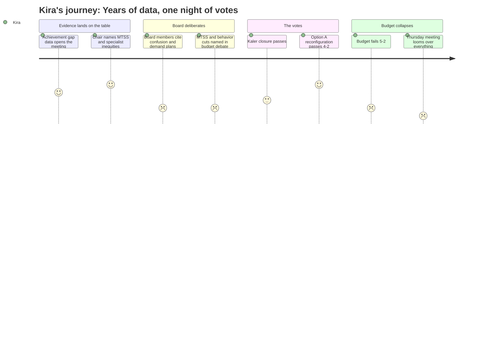

# Interpretation: Kira (PERSONA-015)
## Meeting: School Board Special Budget Meeting -- March 30, 2026 -- 2026-03-30

### Structured Points

#### 1. Achievement gap data finally presented as the opening frame
- **Fact:** Assistant Superintendent Prince opened the substantive portion of the meeting with NOIA math performance data showing up to a 25% achievement difference between elementary schools, explicitly grounding the reconfiguration recommendation in student equity outcomes rather than budget necessity alone.
- **Source:** [07:16–08:49]; Presentation slide 5 ("Academic Outcomes for All Students")
- **Emotional valence:** positive
- **Threat level:** 1
- **Open question:** false

#### 2. Board Chair explicitly names MTSS access and specialist inefficiency as reconfiguration rationale
- **Fact:** Board Chair DeAngelis listed "staffing inefficiencies which include ESOL and strategists and specialists," "inconsistent access to multi-tiered systems of support," and "inequitable access to programming for the academically gifted" as documented rationales for why reconfiguration benefits students — mirroring exactly the cross-building conditions Kira observes professionally every week.
- **Source:** [115:26–117:43]
- **Emotional valence:** positive
- **Threat level:** 1
- **Open question:** false

#### 3. Option A (Primary/Intermediate reconfiguration) passes 4-2
- **Fact:** The board voted 4-2 to adopt the Primary and Intermediate grade band model (PreK–1 and Grades 2–4) for fall 2026, with Holman, Dowling, Smith, and Risch in favor and Feller and Richardson opposed.
- **Source:** [283:30–284:17]
- **Emotional valence:** positive
- **Threat level:** 1
- **Open question:** true

#### 4. Four multi-tiered support specialist roles cut from the budget
- **Fact:** Member Richardson explicitly named the elimination of "four multi-tiered specialists roles" as a specific concern, arguing the budget cuts the exact intervention infrastructure that reconfiguration depends on to serve high-need students equitably — precisely the conditions Kira has documented across buildings.
- **Source:** [123:08–123:55]
- **Emotional valence:** negative
- **Threat level:** 5
- **Open question:** true

#### 5. District's only general education behavior strategist proposed for elimination
- **Fact:** Support staff union president Connie identified that the budget proposes to cut "the one" general ed behavior strategist in the entire district — a person who also serves as the district's only safety care trainer — with no stated replacement plan.
- **Source:** [167:17–168:03]
- **Emotional valence:** negative
- **Threat level:** 5
- **Open question:** true

#### 6. ESOL teacher names the cross-school access inequity Kira lives daily
- **Fact:** Middle school ESOL teacher Kara described students at some schools waiting years for math specialist access while students at other schools receive it immediately, and described ESOL pull-out sessions with "three lessons happening in one room" — specific operational conditions that Kira observes across her building route every week.
- **Source:** [184:09–184:42]
- **Emotional valence:** positive
- **Threat level:** 2
- **Open question:** false

#### 7. Budget fails 5-2; reconfiguration implementation now uncertain
- **Fact:** The FY27 budget failed 5-2 (only Smith and Risch voting in favor), requiring a Thursday meeting, and leaving the implementation of the reconfiguration vote — already passed — without a funded operational plan or confirmed staffing structure.
- **Source:** [289:38–291:12]
- **Emotional valence:** negative
- **Threat level:** 4
- **Open question:** true

---

### Journey Map

---

### Reactions

They actually voted for it. Option A, 4-2. I've been traveling between three buildings watching the same kids sit on MTSS wait lists for years while other kids two miles away get immediate access, and tonight the board voted to do something about it. DeAngelis even read the list out — staffing inefficiencies with specialists, inconsistent MTSS access, kids isolated because no one else in their building speaks their home language — that is my entire job description. That's what I see on my route every single week. The Boundaries and Configurations committee called this out over twenty years ago and the board at the time did nothing. Tonight they actually voted.

But I cannot sleep, because buried inside the budget that just failed is something that should make everyone who voted for reconfiguration lose sleep too: they cut four multi-tiered specialist positions and the only general ed behavior strategist in the entire district. One. We have one. She's also the district's only safety care trainer — the support staff union president said that out loud and the room barely flinched. We just voted to restructure four elementary schools into a completely new configuration, we're going to be absorbing 164 Kaler students into buildings that are already stretched thin, and we're doing it without the intervention infrastructure that makes differentiated instruction actually work. You can't close the achievement gap that the assistant superintendent showed on that opening slide if you've already cut the people who close it. That's not equity. That's reconfiguration on paper.

The DEI position debate was demoralizing to watch from where I was sitting. No real savings, a person who already accepted a demotion, and now another title change that moves the role further from actual curriculum leadership. And then Feller's line in the sand was the percussion ed tech — one position, out of 78 — and I understand that community cares deeply about the music program. But if you were in those buildings the way I've been in those buildings, watching kids cycle in and out of referrals because there's no one to catch them before they get there, you'd pick a different hill. Thursday is going to be brutal. I don't know if what passed tonight holds, and that's what's going to keep me up.