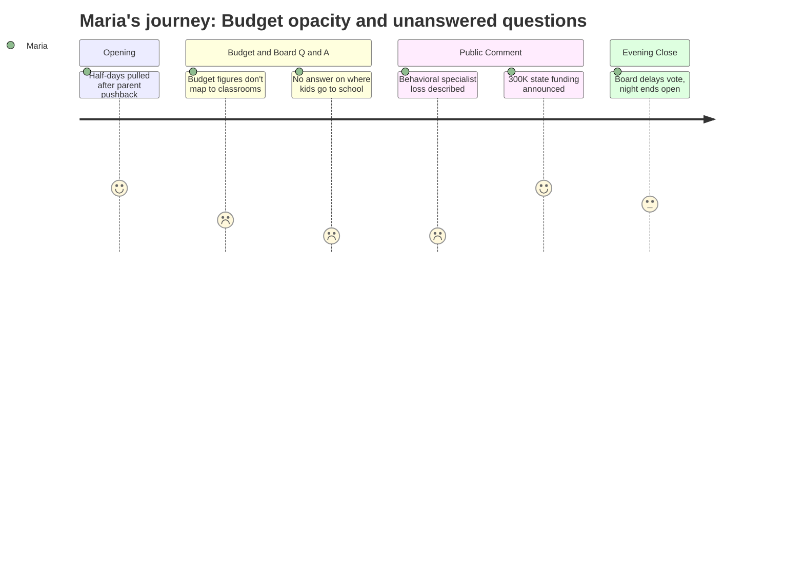

# Interpretation: Maria (PERSONA-001)
## Meeting: School Board Regular Meeting -- April 2, 2026 -- 2026-04-02

---

### Structured Points

#### 1. Board pulls early release proposal after parent pushback
- **Fact:** The board chair opened the meeting by removing from the agenda a proposal to add up to four early release days (May 13, 20, 27, June 3) for reconfiguration planning, citing hardship on working families. The board voted unanimously to remove it and will instead pursue a one-day state waiver.
- **Source:** [02:24]–[08:39]
- **Emotional valence:** positive
- **Threat level:** 1
- **Open question:** true — Board member Richardson noted the original ask was two days of planning; a single-day waiver may be insufficient, leaving the adequacy of reconfiguration preparation unresolved.

#### 2. Elementary behavioral specialist position eliminated — "the middle layer disappears"
- **Fact:** A statement read on behalf of the district's elementary general education behavioral strategist (who could not attend) described working with nearly 60 individual students this year — more than 40 with formal behavior plans she developed — across four of the five elementary schools. She stated that eliminating this role "does not eliminate those needs. It removes the system we have in place to respond to them," warning that students will either receive no meaningful behavioral support in general education or be fast-tracked to special education referrals.
- **Source:** [101:14]–[105:56]
- **Emotional valence:** negative
- **Threat level:** 4
- **Open question:** true — No speaker from the district provided a specific plan for who will design and oversee tier-two and tier-three MTSS behavioral interventions across elementary schools next year. The administration pointed to BCBAs and instructional strategists as future coverage, but the mechanics of that handoff were not detailed.

#### 3. Attendance boundaries still unknown — no answer on busing and walkability
- **Fact:** Member Feller asked directly how attendance boundaries will be determined and whether children will be bused across the city. Dr. Prince declined to provide specifics, saying she did not want to "get ahead of" the community listening sessions scheduled to begin the following week, and that boundary decisions would be shaped by family input on priorities including walkability.
- **Source:** [53:46]–[54:33]
- **Emotional valence:** negative
- **Threat level:** 4
- **Open question:** true — With reconfiguration scheduled for the coming school year, families have no information about school assignments, bus ride lengths, or how geographic priorities will be weighed. The district committed to publishing a formal timeline by the end of the following week, but no boundary framework was described.

#### 4. Class sizes rising as supports are cut — IEP concentration acknowledged
- **Fact:** With 13 elementary teachers eliminated, Member Feller pressed on compliance with the district's class size policy. Dr. Prince acknowledged that some current classes already have 50% of students with IEPs and that the district cannot draw attendance boundaries based on IEP status. She described regular-education ed techs as partial mitigation and cited reconfiguration's potential to allow grade-level grouping across larger cohorts as a pedagogical benefit.
- **Source:** [57:42]–[63:05]
- **Emotional valence:** negative
- **Threat level:** 4
- **Open question:** true — The district has no written policy capping the IEP percentage within a general education classroom. No speaker described how teachers will manage larger classes with higher concentrations of students with identified needs, given simultaneous reductions in behavioral support.

#### 5. $300,000 in new state funding announced mid-meeting — with significant uncertainty
- **Fact:** The SSPA president announced during public comment that union and staff outreach to the state legislature had yielded a projected $300,000 in additional funding (approximately $150,000 tied to homeless student population, $150,000 tied to economically disadvantaged students). Later in the meeting, a board member reported receiving a text from a state representative suggesting EPS formula changes could yield an additional $750,000 for the following year, though that figure came from a different legislator and was described as potentially a one-year change.
- **Source:** [122:05]–[123:39]; [264:08]–[264:20]
- **Emotional valence:** positive
- **Threat level:** 2
- **Open question:** true — The exact amount, durability, and intended use of these funds were unresolved at the close of the meeting. Multiple board members stated they wanted the money directed to student-facing staff positions, but no action was taken and the administration had not yet produced a recommendation.

#### 6. Board defers budget vote — no budget adopted as of meeting close
- **Fact:** After unanimously voting to convene a meeting with city council, the board declined to vote to adopt the superintendent's budget proposal. Several members said they were not ready to approve a budget without firmer figures on the new state funding. The board discussed potentially convening again on Monday before the April 7 council presentation, contingent on receiving a funding number.
- **Source:** [261:10]–[279:06]
- **Emotional valence:** neutral
- **Threat level:** 2
- **Open question:** true — It is unclear whether additional funds will be confirmed in time for a Monday meeting, how much of the new funding will be directed to restoration of positions, and which positions the administration will recommend restoring versus holding in reserve.

#### 7. Occupational therapist cuts raise safety alarms in functional life skills classrooms
- **Fact:** A speech-language pathologist at Dyer and a special education teacher at Skillin testified that embedded OTs in functional life skills classrooms effectively cover the work of two ed tech positions — including crisis support during behavioral escalations. The Skillin teacher described ending her day in a physical restraint, working with a long-term substitute in a role that could not be filled, and said cutting the OT would leave classrooms understaffed in unsafe conditions.
- **Source:** [163:13]–[168:38]; [188:46]–[191:07]
- **Emotional valence:** negative
- **Threat level:** 3
- **Open question:** true — The district maintains that OT service minutes can be met with 3.8 FTE and group delivery. Whether staffing can cover acute behavioral crises in self-contained classrooms — distinct from scheduled service minutes — was not addressed.

#### 8. Listening sessions announced for elementary families
- **Fact:** Dr. Prince announced 13 upcoming listening sessions: one per school for staff, one per school for families, one open public session at the high school, and two online sessions. A digital survey had already received approximately 200 responses from families and staff. Building-level administrators are co-facilitating. Sessions will focus on community priorities around reconfiguration, including transportation, walkability, and student assignment.
- **Source:** [49:54]–[56:07]
- **Emotional valence:** positive
- **Threat level:** 1
- **Open question:** true — The board voted to reconfigure before these sessions were announced. It is not established how community input will constrain or shape boundary decisions that have already been set in motion.

---

### Journey Map

---

### Reactions

They actually pulled the early release days. I know that sounds like a small thing, but I've been texting people in the group chat all week about it and I was genuinely relieved when the chair said it right at the start. They heard us. For about ten minutes I thought maybe this was going to be a different kind of meeting. And then we were back to five hours of feeling like I was watching something fall apart in slow motion. The part that's going to keep me up: someone stood up to read a statement from the behavioral specialist — she covers Brown, Small, Dyer, and Skillin — because she couldn't be there herself. She worked with almost 60 kids this year. Forty of them had formal behavior plans that she wrote and managed. Her entire position is getting cut. And she said it so plainly: "Eliminating this role does not eliminate those needs. It removes the system we have in place to respond to them." I've been saying this in PTA conversations for months and couldn't put it this clearly. She's the person who catches kids before they fall into special ed. That's the middle layer. And it's just gone.

Meanwhile, class sizes are going up. A board member pushed on this and found out that some classes already have 50% of kids with IEPs. Fifty percent. And there's no written policy anywhere about how they manage that concentration. So bigger classes, less support, no behavioral safety net. And then the question everyone in my neighborhood has been asking — where are our kids actually going to school next year? Member Feller asked Dr. Prince directly: are we going to be bused across the city? She said she doesn't want to get ahead of the listening sessions. The listening sessions that start next week. School starts in four months. I still cannot tell you where my kid is going to school in September. I don't know if they'll walk there. I don't know if they'll be on a bus for forty minutes. They've been at the same school for three years and we genuinely do not know.

The one real piece of news: one of the union leaders announced mid-meeting that their trips to Augusta had gotten us $300,000 in additional state funding — tied to homeless and low-income student counts — and a board member said she'd gotten a text about potentially $750,000 more from the EPS formula. That's real money. Because of that, the board decided not to vote on the budget tonight, which I think is actually right, even though it means more uncertainty. I'm going to share the funding news in the parent chat tomorrow morning because people need to know there's something concrete to fight for. But I'm also going to tell them: show up to the listening session at our school. They're saying this is how they'll shape the boundaries. I genuinely don't know if our input will change anything at this point, but I'm not staying home to find out.