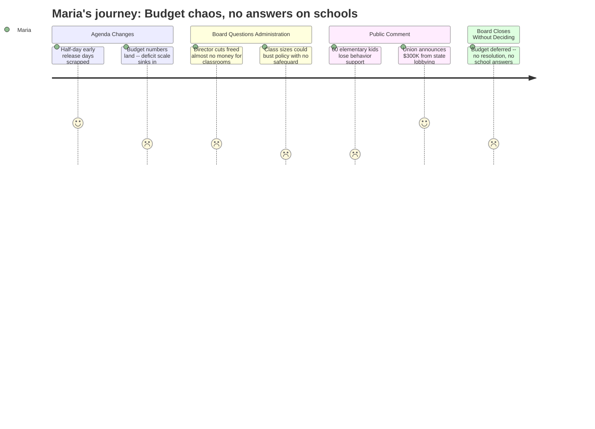

# Interpretation: Maria (PERSONA-001)
## Meeting: School Board Regular Meeting -- April 2, 2026 -- 2026-04-02

---

### Structured Points

#### 1. Half-Day Early Release Days Pulled From the Agenda
- **Fact:** The board chair announced he would accept a motion to remove Agenda Item 4.1 — four additional PreK–4 early release days in May and June — after parents pushed back hard. The board voted unanimously to remove it.
- **Source:** Transcript [03:12]–[08:39]; Agenda Item 4.1
- **Emotional valence:** positive
- **Threat level:** 2
- **Open question:** true — A waiver for one fewer student day is being explored, but no concrete plan for how teachers will get enough transition prep time was put on the table.

---

#### 2. The Behavioral Specialist Who Supports 60 Elementary Kids Is Being Cut
- **Fact:** A statement from Jenna Goldstein Walsh, the district's elementary general-education behavioral specialist, was read aloud. She works directly with nearly 60 students across Brown, Small, Dyer, and Kayla, providing formal behavior plans and social-emotional supports. Eliminating her position does not eliminate those student needs — it removes the system designed to address them before kids are referred to special education.
- **Source:** Transcript [101:14]–[106:00], public comment (read by Nicholas Boggs)
- **Emotional valence:** negative
- **Threat level:** 5
- **Open question:** true — Administration said BCBAs and instructional strategists will absorb this work, but no one explained concretely who designs tier-two behavioral interventions for 60 general-ed elementary kids next year.

---

#### 3. Class Sizes Could Exceed District Policy With No Written Safeguard
- **Fact:** Board member Feller pressed the superintendent on what happens when a new student enrolls mid-year and pushes a class over the district's policy limit. The superintendent acknowledged this has already happened in individual classrooms this year, and that past practice included capping enrollment at a school (e.g., Kayla could not accept more kindergartners). No written policy governs the IEP composition limit either — there is nothing that caps the percentage of students with IEPs in a single classroom.
- **Source:** Transcript [57:42]–[60:48]
- **Emotional valence:** negative
- **Threat level:** 4
- **Open question:** true — With 13 fewer elementary teachers next year, what specific action protects a classroom that hits 21 or 22 students, especially with reduced behavioral support staff?

---

#### 4. An FLS Classroom Teacher Ended Her Day in a Physical Restraint — and the OTs Being Cut Are Her Backup
- **Fact:** Stacy Lauren, a special education teacher at Skillin, testified that each of the two OT positions being eliminated covers the equivalent of two ed tech positions in functional life skills classrooms. She described ending her school day in a physical restraint because she was understaffed, with a substitute filling an open ed tech slot that had never been properly filled.
- **Source:** Transcript [166:17]–[168:38], public comment
- **Emotional valence:** negative
- **Threat level:** 4
- **Open question:** false — The situation is clear. The open question is what the board will do about it.

---

#### 5. Union Advocacy at the State House Produced $300,000 in New Funding — During the Meeting
- **Fact:** Connie DeSanto, president of the support staff union SSPA, announced during public comment that she had just received a text: South Portland is set to receive approximately $300,000 in additional state funding — $150,000 tied to the homeless student population and $150,000 for economically disadvantaged students — as a direct result of union leaders making personal trips to Augusta to lobby lawmakers. All three employee unions called on the board to use these funds for student-facing positions.
- **Source:** Transcript [121:38]–[123:39], public comment (Connie DeSanto)
- **Emotional valence:** positive
- **Threat level:** 2
- **Open question:** true — Board members debated whether to use the funds for positions or the fund balance. No decision was made.

---

#### 6. Nobody Knows Which School Their Elementary Child Will Attend Next Year
- **Fact:** Board member Feller called out an "absolute information vacuum" around attendance boundaries. The superintendent said boundary decisions would be informed by upcoming listening sessions — meaning they will not be set until after parent input is gathered. Parents in the audience confirmed they have no idea whether their children will be assigned to their neighborhood school or bused across the district.
- **Source:** Transcript [52:58]–[54:33]; public comment (multiple speakers including Vladimir Corian, Aiden Rehan, Kate LaTuro)
- **Emotional valence:** negative
- **Threat level:** 5
- **Open question:** true — No timeline for boundary announcements was given.

---

#### 7. The Board Did Not Vote on the Budget — and Will Try Again Monday
- **Fact:** The board voted unanimously to convene a meeting with the city council to seek budget guidance, but declined to vote on the FY27 superintendent's budget. Several members said they wanted to incorporate the new state funding information before acting. A possible Monday meeting was discussed but not confirmed.
- **Source:** Transcript [261:10]–[279:06]; Agenda Item 4.3
- **Emotional valence:** negative
- **Threat level:** 3
- **Open question:** true — The budget remains unresolved. Maria doesn't know if any positions will come back, which schools will have which staff, or what her child's year will look like.

---

#### 8. Cutting Director Roles Did Not Free Up Money for Classroom Positions
- **Fact:** Board members Feller and Holman expressed frustration that converting two director positions (DEI Director, Assistant Director of Special Education) into instructional strategist roles saved roughly $20,000–$30,000 each — not nearly enough to restore beloved student-facing positions. Holman said directly she had "expected to see money liberated" and found the outcome "disappointing."
- **Source:** Transcript [39:50]–[46:00]
- **Emotional valence:** negative
- **Threat level:** 3
- **Open question:** true — If director restructuring didn't produce savings, where does the money come from to restore a behavior specialist, an OT, a computer science teacher, or a percussion ed tech?

---

### Journey Map

---

### Reactions

Okay so the half-day thing getting pulled at the very start — that actually felt like a small miracle. Like, they heard us. Parents pushed back and they listened, same meeting. I was genuinely surprised. But that warm feeling lasted maybe ten minutes, because then the budget numbers went up on the screen and I'm just sitting there doing the math in my head — 78 positions, 42 teachers, 13 at the elementary level alone — and I keep thinking, my kid's school has how many teachers? Where does that leave her classroom?

The moment that really got me — the one I keep replaying — was when this man got up and read a statement from the behavior specialist. Her name is Jenna Goldstein Walsh and she works across four elementary schools, and she said she's worked directly with almost 60 individual students this year. Sixty kids. Behavior plans, social-emotional support, the kids who are struggling in class but aren't quite in special education yet. And her position is being cut. The administration's answer was basically "the BCBAs and instructional strategists will cover it." That's not a plan, that's a prayer. And then later in the meeting, an FLS teacher at Skillin got up — I think she said she wasn't even planning to come, she was in the middle of dinner — and she described ending her school day in a physical restraint with a student because she was so understaffed. And the two OTs they're cutting are essentially her backup. I don't even know what to do with that information except feel sick.

The one genuinely hopeful thing was Connie DeSanto from the support staff union getting up and announcing mid-meeting — she literally got a text during the meeting — that the unions' advocacy at the state house got us $300,000 in new funding. Teachers drove to Augusta on their own time and made it happen. $300,000. The unions immediately said: use it for student-facing positions, not administration. And the board didn't vote on anything. They're meeting with the city council, maybe meeting again Monday, and we still don't know which school our kids will be attending in September. I'm going to be sharing that $300,000 news in the parent group chat tonight because people need something to hold onto, but honestly I'm exhausted and I still don't have a single answer for my daughter about next year.