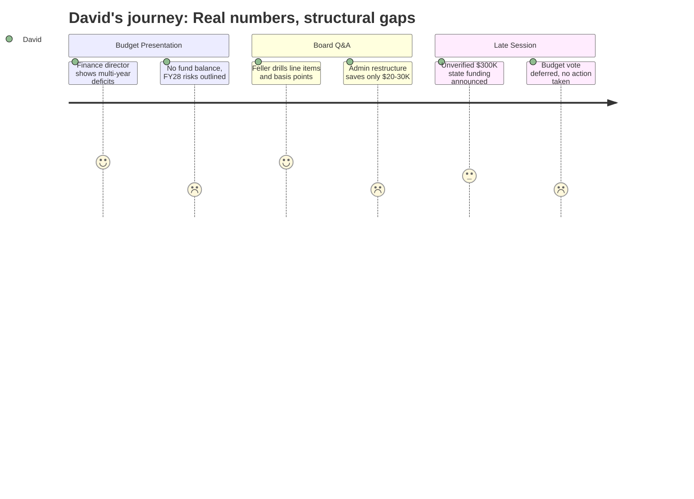

# Interpretation: David (PERSONA-002)
## Meeting: School Board Regular Meeting -- April 2, 2026 -- 2026-04-02

### Structured Points

#### 1. Finance Director Formally Documents Years of Systematic Under-Budgeting
- **Fact:** Abigail Ketchen presented a multi-year pattern of budget shortfalls on predictable line items: tuition reimbursement ran over budget in FY23, FY24, FY25, and is projected over again in FY26; electricity overruns totaled $138K, $211K, and $165K in consecutive years, with FY26 projected at roughly $368K over. She framed this as a deliberate correction -- FY27 budgets these items to actual rather than wishful figures.
- **Source:** [15:41--20:24], Slide 6 "FY27 adjusts from prior under-budgeting"
- **Emotional valence:** positive
- **Threat level:** 2
- **Open question:** false

#### 2. Zero Fund Balance Confirmed; 9-12% Benchmark Articulated for First Time
- **Fact:** The finance director stated explicitly that the district has no savings buffer and that this eliminates any ability to absorb optimistic budgeting. Board member Feller then asked what a well-managed fund balance looks like; Ketchen cited the city's own minimum of 9% of operating costs. At the current ~$75M budget, 9% equals roughly $6.75M -- against a current balance of zero.
- **Source:** [19:39--20:24], [69:21--71:41]
- **Emotional valence:** negative
- **Threat level:** 5
- **Open question:** false

#### 3. FY28 Structural Cost Pressures Identified but Not Solved
- **Fact:** Ketchen's forward-looking slide explicitly names four compounding pressures that this budget does not resolve: contractual labor costs growing faster than 6% annually (the tax increase ceiling), utility cost trajectories, a debt service increase of $300K+ due to the athletic turf bond, and the Skillin boiler as a potential new debt obligation.
- **Source:** [20:24--21:12], Slide 7 "Preparing for FY28 and Beyond"
- **Emotional valence:** negative
- **Threat level:** 4
- **Open question:** true

#### 4. Administrative Restructuring Produces Minimal Savings
- **Fact:** Board members Feller and Holman pressed on whether replacing director roles with instructional strategist roles freed up meaningful dollars to restore student-facing positions. The finance director estimated only $20-30K in net savings per substitution, depending on lane and step placement, because instructional strategists earn base pay plus contractual extras. Board member Holman called this "disappointing" and said she had expected money to be "liberated."
- **Source:** [23:34--24:19], [45:59--46:45]
- **Emotional valence:** negative
- **Threat level:** 3
- **Open question:** true

#### 5. SRO Budget Jumps from $191K to $220K; Rationale Is a City-Supplied Estimate
- **Fact:** Member Feller flagged that the school resource officer line item rises by approximately $60K year-over-year (the budget book shows $191K actual FY26 to $221K projected FY27). The finance director confirmed the figure is provided by the city as the cost for two officers at 85% effort; the district enters it without independent verification.
- **Source:** [24:43--25:50], Budget Book Cost Center 9 row 3132
- **Emotional valence:** neutral
- **Threat level:** 2
- **Open question:** true

#### 6. Unverified $300K-$750K State Funding Announced Mid-Meeting
- **Fact:** Near the end of the meeting, board member Richardson reported receiving a text message that union lobbying in Augusta had secured approximately $300K in additional targeted state aid ($150K for economically disadvantaged students, $150K for homeless student population). Shortly after, member Feller reported a separate text suggesting an EPS formula change could yield an additional $750K -- but noted that source gave a different number and the figure may be one-year-only. Neither amount was confirmed or modeled into the budget before the vote was deferred.
- **Source:** [122:05--123:39], [264:09--265:08]
- **Emotional valence:** neutral
- **Threat level:** 2
- **Open question:** true

#### 7. Fund Balance Policy Referred to Committee -- A Structural Signal
- **Fact:** When member Feller asked whether the board should adopt a formal fund balance policy, board chair DeAngelis confirmed that superintendent Prince had already proposed routing the question through the policy committee. The district currently has no adopted fund balance target; the city's own floor of 9% of operating expenses was cited as a reasonable starting benchmark.
- **Source:** [70:54--71:41]
- **Emotional valence:** positive
- **Threat level:** 1
- **Open question:** false

#### 8. Budget Vote Deferred with Unresolved Questions About New State Funds
- **Fact:** The board took unanimous action to convene a meeting with city council but did not vote to adopt the FY27 superintendent's budget as the board's proposal (agenda item 4.3). Board members cited the unverified state funding figures as a reason to wait. The board chair noted that if no board action occurs before Tuesday, the superintendent's budget -- not the board's -- is what goes to council.
- **Source:** [261:10--279:06], Agenda Item 4.3
- **Emotional valence:** negative
- **Threat level:** 3
- **Open question:** true

---

### Journey Map

---

### Reactions

The finance director did something I've been waiting for this whole budget season -- she actually showed the multi-year actuals. Electricity overruns of $165K, $211K, $138K in consecutive years, and they were still budgeting *below* what they spent. That's not bad luck, that's a broken process. Her thesis was basically: we've been lying to ourselves about costs for years, and when you have no fund balance, every dollar of wishful thinking eventually becomes a layoff. I thought that was a clear-eyed diagnosis and it's the kind of framing I'd want to see from a finance director. The bad news is that the gap she's describing has been building for at least four budget cycles and this year is the reckoning.

What I'm actually worried about is FY28. They were explicit that labor costs grow faster than 6% by contract even in a steady year, debt service is going up another $300K+ because of the turf bond, utilities are trending up, and the Skillin boiler is an unpriced liability sitting in the background. They've burned through the fund balance entirely -- the city's own benchmark is 9% of operating costs as a floor, which at this budget size is around $6.75M they should be holding in reserve but don't have. They got one year of hard cuts. They haven't solved the structural problem. And there's still no fund balance policy on the books, just a referral to committee. I flagged that for follow-up.

The mid-meeting news about $300K-$750K in potential state funding sounded exciting in the room but it's the kind of thing that derails a budget process. One board member got a text with one number, another got a different number, nobody knows if it's recurring or one-time, and now the vote is deferred until maybe Monday. I get why they paused, but that's unverified mid-meeting intel driving a $75M budget decision. The finance director tried to level-set -- she's right to be skeptical until the number is confirmed and the recurrence question is answered. If it's one-year money, using it to restore positions just pushes the FY28 problem back and makes it worse.