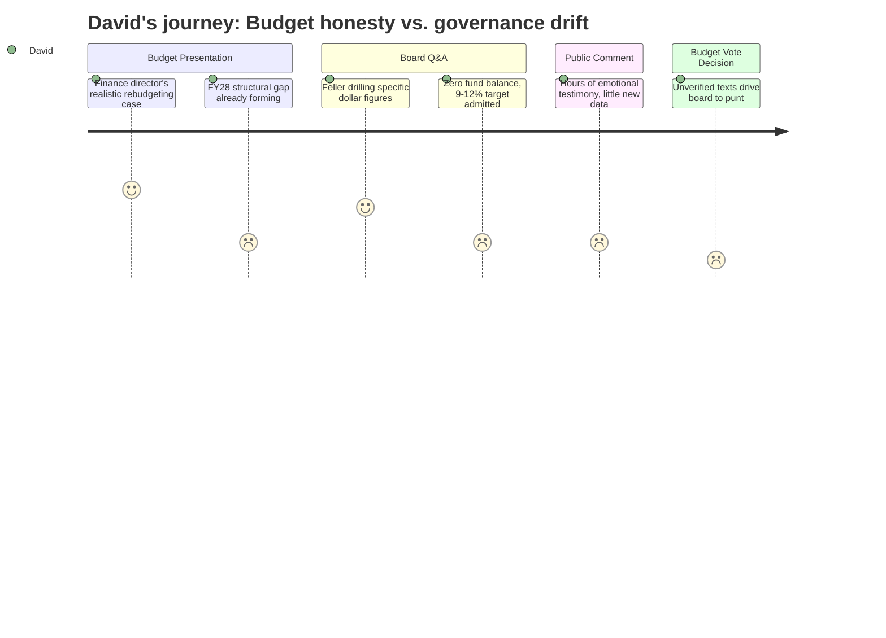

# Interpretation: David (PERSONA-002)
## Meeting: School Board Regular Meeting -- April 2, 2026 -- 2026-04-02

### Structured Points

#### 1. Finance Director Names the Under-Budgeting Pattern
- **Fact:** Finance Director Ketchen presented four years of actuals showing tuition reimbursement was under-budgeted by $41K, $153K, $140K, and an estimated $30–62K in FY23–FY26. Electricity was under-budgeted by $138K, $211K, $165K, and an estimated $368K+ in the same period. She stated explicitly that FY27 is designed to budget to realistic actuals rather than optimistic assumptions, and argued that doing so protects personnel in future years.
- **Source:** Transcript [16:28–20:24]; Budget presentation Slide 6
- **Emotional valence:** positive
- **Threat level:** 2
- **Open question:** false

#### 2. Fund Balance Is Zero — Target Should Be 9–12% of Operating Budget
- **Fact:** When Member Feller asked about fund balance norms, Finance Director Ketchen confirmed the district holds essentially no reserve and stated that a well-managed district should maintain 9–12% of operating costs in savings — roughly $6.75M–$9M on a $75M budget. The current FY27 budget proposal does not seed the fund balance at all.
- **Source:** Transcript [69:21–70:54]
- **Emotional valence:** negative
- **Threat level:** 4
- **Open question:** true

#### 3. FY27 Does Not Solve the Structural Problem — FY28 Gap Is Already Forming
- **Fact:** Ketchen stated directly that FY27 "resets our financial path but does not solve our core problems." She identified the following forward pressure: labor costs increase by more than 6% annually by contract; utilities are rising at high rates; debt service will increase by $300K+ in FY28 due to the athletic turf bond; and the Skillin boiler may require new debt. Declining enrollment also reduces non-local tax revenue.
- **Source:** Transcript [20:24–21:58]; Budget presentation Slide 7
- **Emotional valence:** negative
- **Threat level:** 4
- **Open question:** true

#### 4. Member Feller Drills into Specific Figures — Someone Is Doing the Math
- **Fact:** Member Feller asked at least seven quantitative questions during the budget segment: the exact dollar value of the health insurance basis point change ($52K per 0.5%); the net savings from converting a director to an instructional specialist ($20–30K, not a meaningful reduction); whether diesel/fuel cost assumptions had been updated with recent price increases (they had not); and why the SRO line item increased by approximately $60K (from $158K to $220K, a city-provided figure).
- **Source:** Transcript [22:46–26:38]
- **Emotional valence:** positive
- **Threat level:** 1
- **Open question:** false

#### 5. Health Insurance Savings Went to Capital — Not to Fund Balance
- **Fact:** The 0.5-percentage-point reduction in the health insurance projection (from 12% to 11.5%) freed up approximately $52K. Despite prior statements suggesting that any savings would go toward seeding the fund balance, the finance director confirmed this money was reallocated to capital costs — specifically, toward the high school chimney stack project estimated at $700K. A community member raised the contradiction at the end of public comment; the board did not directly resolve it.
- **Source:** Transcript [36:42–37:28], [94:16–95:01], [236:08–236:55]
- **Emotional valence:** negative
- **Threat level:** 2
- **Open question:** true

#### 6. Portland Bus Maintenance Contract Has Not Been Updated Since 2017
- **Fact:** Director of Operations Mike Nally disclosed during board Q&A that the district's contract with Portland — under which South Portland provides a mechanic and parts to service Portland's bus fleet — was last updated in 2017. The district is being reimbursed at nine-year-old rates. Nally confirmed he is actively working to revise the contract, and the board requested an update when the renegotiation is complete.
- **Source:** Transcript [31:59–32:47]
- **Emotional valence:** neutral
- **Threat level:** 1
- **Open question:** true

#### 7. Unconfirmed Text Messages Drive Board to Delay Budget Vote
- **Fact:** Near the close of the meeting, Member Richardson announced she had received a text message mid-meeting from a union president indicating the state may provide an additional $300K (two tranches of $150K for economically disadvantaged and homeless student populations). Member Feller separately cited a text from Representative Kessler suggesting a possible additional $750K from EPS formula changes. The board cited these unconfirmed, mid-meeting text figures as a primary reason to defer the budget vote, with no administration analysis of whether the funding is recurring or one-time, or how it should be allocated.
- **Source:** Transcript [122:51–123:51], [263:31–264:25], [266:55–267:25]
- **Emotional valence:** negative
- **Threat level:** 3
- **Open question:** true

---

### Journey Map

---

### Reactions

So I stayed for the whole thing — nearly five hours. Here's the headline: the finance director finally put a name on what's been happening. She showed four consecutive years of the same line items blowing past budget — electricity, tuition reimbursement — actual numbers, not anecdotes. And her argument was clean: when you under-budget and have no reserves, the overrun becomes a staff cut the following year. That's the loop they've been in. I've wanted someone to say that out loud for a long time. The budget document tracks FY25 and FY26 actuals alongside FY27 proposals, and if you look at supplies and non-personnel lines, you can see the reset. Whether it holds depends entirely on how they manage the year, but at least the starting point is honest.

The part I can't shake is FY28. She said it herself on the slide — FY27 resets the path but doesn't fix the core problems. Labor costs go up faster than 6% per year by contract. Utilities keep climbing. They've got at least $300K more in debt service next year from the athletic turf bond, and the Skillin boiler is a potential new bond on top of that. And today's fund balance is zero. Feller got confirmation during Q&A that the standard target is 9–12% of operating budget — call it $7–9 million. They have none of it. There's no policy, no timeline, no plan. When I looked at the budget book, I noticed the $52K from the health insurance basis point reduction went to the chimney stack project, not to reserves. Someone in public comment flagged that contradiction and the board basically shrugged.

The ending was frustrating in a specific way. Around midnight a union president announced she'd gotten a text from the statehouse during the meeting suggesting $300K in additional state funding. Then a board member cited a separate text suggesting another $750K. The board used these unconfirmed, mid-meeting second-hand numbers to justify not voting on the budget. I get the impulse — you don't want to lock in a position and then find out the money isn't real, or is one-time, or has strings. But nobody asked the right question: even if the money is real, should it go to recurring staff positions or to starting the fund balance rebuild? That's the question I'd be asking before Monday. Instead the board left without a vote, a compressed timeline, and two unverified numbers doing a lot of work.