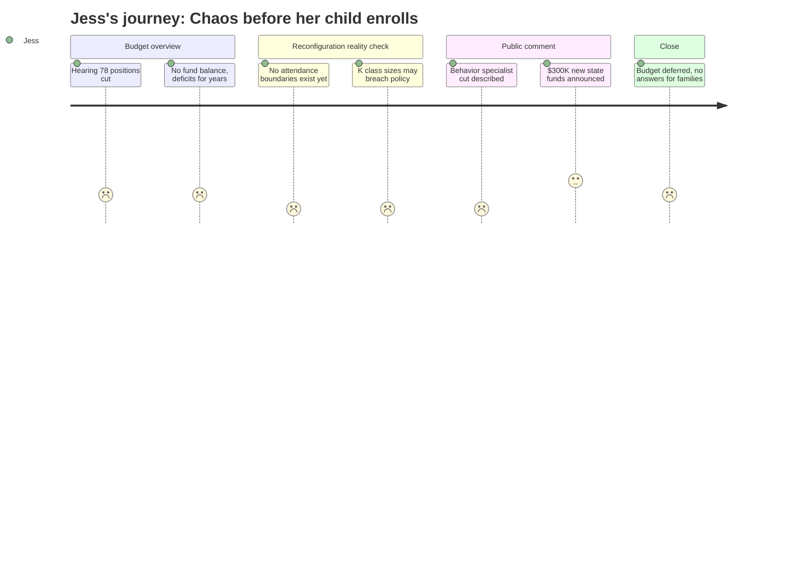

# Interpretation: Jess (PERSONA-003)
## Meeting: School Board Regular Meeting -- April 2, 2026 -- 2026-04-02

### Structured Points

#### 1. Nobody knows where the kids will go
- **Fact:** When pressed on attendance boundaries after the reconfiguration vote, Dr. Prince said the district is still gathering community input and has not yet determined how students will be assigned to the four remaining elementary schools. A parent stated directly: "The assumption is that small school parents will go to Brown. But it's possible those kids will be going across town to Skillin."
- **Source:** Transcript [53:46--54:33] and public comment by Vladimir Corian [134:31--136:07]
- **Emotional valence:** negative
- **Threat level:** 5
- **Open question:** true

#### 2. The one person handling behavior problems in elementary schools is being cut
- **Fact:** The district's general education behavioral specialist, who this year alone wrote formal behavior plans for over 40 individual elementary students and designed social-emotional supports for roughly 50 more, is being eliminated. Her written statement warned that without her role, struggling students will either receive no behavioral support in general education or be referred directly to special education -- "there is no in between."
- **Source:** Public comment, Nicholas Boggs reading statement from Jenna Goldstein Walsh [101:14--106:45]
- **Emotional valence:** negative
- **Threat level:** 4
- **Open question:** true

#### 3. Kindergarten class sizes may exceed the district's own policy by fall
- **Fact:** A board member raised the scenario where a new kindergartner enrolls and pushes a class over the district's class-size policy cap. Dr. Prince acknowledged this has already happened to some classes this year and said the district has "structures to address" overflow, including redirecting students to a different school -- but stated no written policy exists governing how IEP concentration limits would be managed in larger classes.
- **Source:** Transcript [57:42--63:51]
- **Emotional valence:** negative
- **Threat level:** 4
- **Open question:** true

#### 4. Pre-K at Kaler -- the entry point for some incoming families -- is being zeroed out
- **Fact:** The FY27 budget book shows Kaler Elementary School's entire budget at zero across all line items, including teacher salaries, ed tech salaries, and supplies. A parent, Brian Green, specifically noted that his daughters ages four and six had attended pre-K at Kaler and described it as his family's "first exposure to real school."
- **Source:** Budget Book, Kaler Elementary rows 116--161; public comment Brian Green [156:38--157:49]
- **Emotional valence:** negative
- **Threat level:** 3
- **Open question:** true

#### 5. The district has been running deficits for years with no savings left
- **Fact:** Finance Director Abigail Ketchen confirmed the district has run deficits in FY24, FY25, and is projecting one in FY26 as well. She stated plainly: "We are in the context of no savings buffer." The recommended minimum fund balance is 9% of operating costs; the district currently has none.
- **Source:** Transcript [16:28--20:24] and [70:08--70:54]
- **Emotional valence:** negative
- **Threat level:** 3
- **Open question:** false

#### 6. New state funding could bring some positions back -- but it's one year only
- **Fact:** During the meeting, union president Connie DeSanto announced that advocacy in Augusta had likely secured an additional $300,000 in state funding for economically disadvantaged and homeless students. A board member then received a text indicating a potential additional $750,000 from EPS formula changes. However, a board member immediately flagged that this was reportedly a one-year increase.
- **Source:** Public comment Connie DeSanto [122:05--123:39]; board discussion [264:15--274:25]
- **Emotional valence:** positive
- **Threat level:** 2
- **Open question:** true

#### 7. The board voted to reconfigure all elementary schools before building any plan
- **Fact:** Multiple speakers noted the reconfiguration vote passed Monday, April 1 -- just one day before this meeting -- with no finalized transportation plan, no attendance boundaries, no published timeline, and no superintendent in place to lead the transition. A speaker cited Lewiston's comparable process taking three years; South Portland is attempting it in roughly four months before the next school year.
- **Source:** Public comment Alex Strube [168:38--171:41]; board discussion Dr. Prince [49:08--52:58]
- **Emotional valence:** negative
- **Threat level:** 5
- **Open question:** true

#### 8. The district is actively hiring a new superintendent mid-transition
- **Fact:** The board chair confirmed the district is currently conducting preliminary interviews for a new superintendent, with finalists expected roughly four weeks out and a selection to follow. Dr. Prince noted the incoming superintendent "is going to be inheriting a lot of change" and "not really leading anything" at the outset.
- **Source:** Transcript [239:15--253:17]
- **Emotional valence:** negative
- **Threat level:** 3
- **Open question:** true

---

### Journey Map

---

### Reactions

Oh my god, okay, so I finally watched the whole thing during nap time and I have so many thoughts. So basically they voted Monday to completely restructure all the elementary schools -- like split kindergarten and first grade to one set of buildings and second through fourth somewhere else -- and then showed up to THIS meeting with zero plan for where any kid is actually going. Zero. A parent literally stood up and said the neighborhood assumption is that Small kids go to Brown, but they could end up at Skillin across town, and nobody from the district corrected him. Nobody. Because they don't know yet. They voted first and are figuring it out now. My kid enters kindergarten in two years and I genuinely do not know which school she'll be assigned to, whether it'll be walkable, or whether the school that exists right now will even be the same school by then.

And here's the thing that really got me. Someone read a statement from the elementary behavior specialist -- the one person whose whole job is catching kids who are struggling behaviorally *before* they need special ed services. She works across four schools, she wrote formal behavior plans for over 40 kids just this year, and they're cutting her. Gone. The person who read her statement explained it clearly: right now there's a middle layer of support. Without her, kids either get nothing or get referred straight to special ed. And in the same meeting they're acknowledging class sizes are going up. So more kids, bigger classes, and the one person bridging behavioral needs to classroom teachers is just... eliminated. I keep thinking about what my kid's kindergarten will actually look like in two years if this is the trajectory.

The only thing that felt like a breath was near the end -- one of the union leaders announced they'd lobbied the state and gotten what sounds like an extra $300,000 or maybe more coming to the district. The board got excited for like two minutes. But then somebody immediately said it might be a one-year bump, and then everything stalled out and they couldn't even vote on the budget because nobody agreed on what to do with the money. They ended the meeting with no budget passed, no attendance plan, no superintendent hired yet, and a four-month clock ticking to restructure every elementary school. I genuinely don't know whether to start looking at schools in Scarborough or just... wait and see what's left standing.