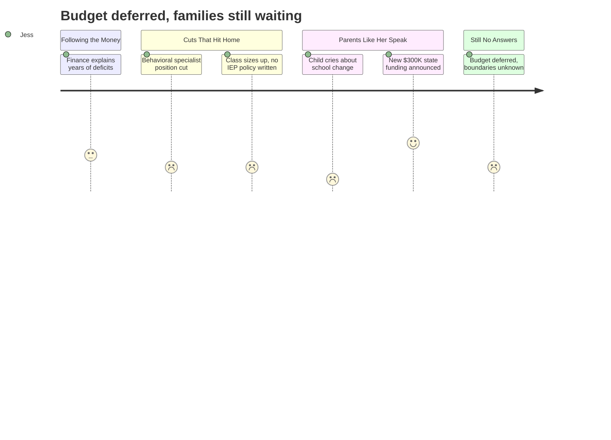

# Interpretation: Jess (PERSONA-003)
## Meeting: School Board Regular Meeting -- April 2, 2026 -- 2026-04-02

### Structured Points

#### 1. Reconfiguration already voted; no one knows where children will go
- **Fact:** The board voted the prior Monday to reconfigure all four remaining elementary schools into grade bands (K-1 and 2-4). As of this meeting, no attendance boundaries have been set. The superintendent said families should expect updates "in the next few weeks" after listening sessions, but acknowledged, "I don't want to get ahead of hearing those voices." A board member separately described "an absolute information vacuum" around boundaries.
- **Source:** [53:00--55:19]; [149:00--151:00]
- **Emotional valence:** negative
- **Threat level:** 4
- **Open question:** true

#### 2. Pre-K program exists but loses a teacher position
- **Fact:** The FY27 budget funds Pre-K instruction at $900,553, including 3.0 teacher FTEs and 4.0 ed tech FTEs. In FY26, Pre-K had 4.0 teacher FTEs — a reduction of one full teacher position heading into the year Jess is watching most closely.
- **Source:** Budget Book (FY27 Budget Meeting 4.2.26), rows 377--388
- **Emotional valence:** negative
- **Threat level:** 3
- **Open question:** true

#### 3. Elementary behavioral support specialist eliminated
- **Fact:** The district's sole elementary general-education behavioral strategist position is proposed for elimination. A statement read into the record described this person as working directly with nearly 60 students across four schools, designing and overseeing formal behavior plans for more than 40 of them. The statement warned that without this role, students who need early intervention will either receive no meaningful support in general education or be referred into special education — "there is no in between."
- **Source:** [101:14--106:10] (public comment, statement read by Nicholas Boggs on behalf of Jenna Goldstein Walsh)
- **Emotional valence:** negative
- **Threat level:** 4
- **Open question:** true

#### 4. Class sizes rising; no written policy on IEP concentration in classrooms
- **Fact:** Thirteen elementary teacher positions are eliminated in this budget. Board member Feller noted that class sizes will rise and pushed for clarity on what happens when a kindergarten class hits 21 or 22 students. The superintendent acknowledged that some current grade levels already have 50% of enrolled students with IEPs, and confirmed there is no written district policy limiting IEP concentration per classroom.
- **Source:** [57:42--63:05]
- **Emotional valence:** negative
- **Threat level:** 3
- **Open question:** true

#### 5. Pre-K and kindergarten facility needs raised but not answered
- **Fact:** A public commenter asked directly whether the buildings being reconfigured have the appropriate infrastructure for Pre-K and kindergarten students — specifically noting that these age groups require classrooms with child-sized sinks and bathrooms. The question was asked during public comment and was not addressed in the board's responses at the end of the meeting.
- **Source:** [150:30--151:00] (public comment by Aiden Rehan)
- **Emotional valence:** neutral
- **Threat level:** 3
- **Open question:** true

#### 6. Potential $300,000 in new state funding, likely directed to staff positions
- **Fact:** A union leader announced mid-meeting that direct advocacy with state legislators may yield approximately $300,000 in additional state funding for the district — $150,000 linked to the homeless student population and $150,000 for economically disadvantaged students. Multiple board members expressed intent to use this money to restore student-facing staff positions rather than seed the fund balance. A separate text message to a board member cited a potentially higher figure of $750,000 in EPS formula changes for FY28, though this was flagged as a one-year item and unconfirmed.
- **Source:** [122:00--123:40]; [264:00--265:08]
- **Emotional valence:** positive
- **Threat level:** 1
- **Open question:** true

#### 7. Budget not passed; new superintendent will inherit reconfiguration already in motion
- **Fact:** The board did not vote to adopt the FY27 budget at this meeting. The board voted unanimously to convene a meeting with city council to seek additional budget guidance. A new superintendent search is ongoing, with finalist interviews expected in approximately four weeks. A board member noted plainly that the incoming superintendent "is not really leading anything — they're going to show up with a new plan."
- **Source:** [239:00--240:50]; [253:17]; [271:59--280:00]
- **Emotional valence:** negative
- **Threat level:** 3
- **Open question:** true

---

### Journey Map

---

### Reactions

Okay so I finally watched last night's meeting and I genuinely could not sleep after. So they already voted — Monday night — to close a school and restructure everything else into these K-1 and 2-4 grade bands, and I didn't even fully understand that had happened until I was like an hour into this meeting. And here's the thing: no one knows where any kid is going. The superintendent literally said she doesn't want to get ahead of the community listening sessions. My kid doesn't enter for two more years and I already feel like I'm watching someone build a plane while it's in the air. One mom got up and said her first-grader asked "will my friends be there?" and she had to tell her she didn't know. That hit me hard. That's going to be my kid.

What I can't stop thinking about is the behavioral support piece. They're cutting the one person in the entire district whose job was to catch kids before they fall into special ed — she worked with almost 60 kids across four schools this year. The statement they read from her said without that role there's literally "no in between" for struggling kids — either they get nothing or they get pushed into special education, which costs way more and is harder to get back out of. And this is happening at the same time they're cutting thirteen elementary teachers and class sizes are going up. A board member asked point-blank whether there's a written policy on how many kids with IEPs can be in one class — and the answer was no, there isn't. So when my daughter's in kindergarten, her class could be 22 kids with no behavioral support specialist and no written limit on how many kids with intensive needs are in the room with her. I don't know how teachers are supposed to do that.

The only thing that gave me any hope at all was a union rep who stood up and said staff actually went to the state house and got $300,000 in new funding, and the board seemed to want to use it to bring back positions. That's something. But the budget didn't even pass last night — they're still negotiating with the city council — and they're in the middle of hiring a new superintendent who someone on the board admitted is going to walk in and inherit everything already in motion. So I don't know. I genuinely don't know if south Portland will have the Pre-K program my kid needs, which school would even be her neighborhood school, or whether the classroom she walks into will have the support around it that I'd want. I can't find those answers anywhere. Nobody seems to have them yet.