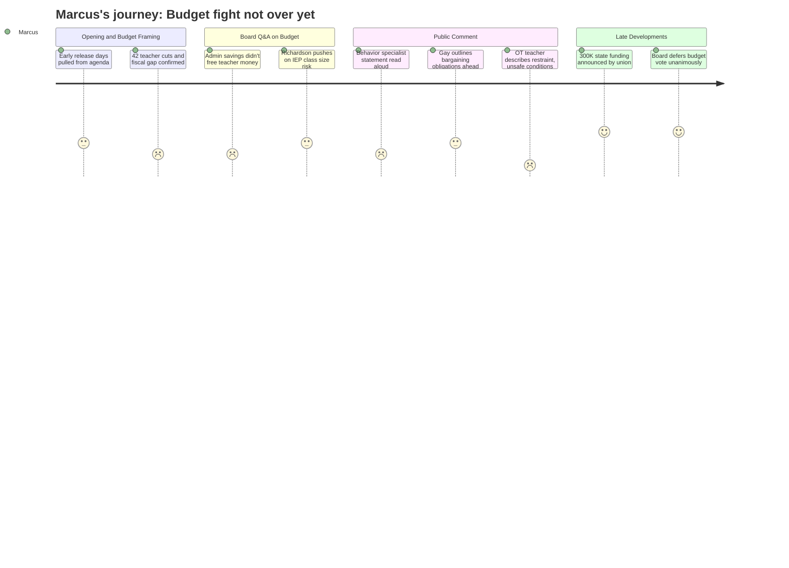

# Interpretation: Marcus (PERSONA-004)
## Meeting: School Board Regular Meeting -- April 2, 2026 -- 2026-04-02

---

### Structured Points

#### 1. Admin "Right-Sizing" Did Not Free Money for Classroom Positions
- **Fact:** Board members Richardson and Holman both stated they had expected that cuts at the director level would "liberate" money to restore classroom-facing positions. Finance director Ketchen confirmed the shift from DI director to DI strategist saves roughly $20–30K. Richardson said directly: "we've lost some incredibly effective student-facing roles with this reduction in force... and we can't bring back our entire computer science department... I'm having a really hard time seeing any concessions that were made to eliminate redundancies at the director level."
- **Source:** [39:50–41:22], [45:54–46:00], [84:45–85:48]
- **Emotional valence:** negative
- **Threat level:** 4
- **Open question:** true — Were there any administrative positions where costs were materially reduced? The board received no clear reconciliation of what the restructuring actually saved versus what was spent.

#### 2. Reconfiguration Creates Dozens of Unresolved Bargaining Obligations
- **Fact:** SPTA president Sarah Gay stated that union leadership has "already identified several dozen items that need to at least be discussed in a meet and consult more robustly, and many that we know will have to be bargained because they are fundamental changes to people's working conditions." She explicitly warned that compensation for reconfiguration work must be built into the budget now, or the union will not accept blame if further staff cuts result from unbudgeted labor costs.
- **Source:** [115:56–116:44]
- **Emotional valence:** negative
- **Threat level:** 4
- **Open question:** true — The board has not publicly acknowledged the scope of bargaining obligations created by reconfiguration, and no cost estimate for those obligations appears in the budget.

#### 3. Behavior Specialist Elimination Removes the Tier-Two Safety Net
- **Fact:** A statement from Jenna Goldstein Walsh, the district's elementary general education behavioral strategist — a position recommended for elimination — was read into the record. It stated she directly supported nearly 60 students this year, developed over 40 formal behavior plans, and provided individualized social-emotional supports for approximately 50 students across four schools. The statement argued that eliminating this role "removes the middle layer" of MTSS support, predicting that students will either get nothing or be referred to special education — which currently serves 23% of students, already above comparable districts.
- **Source:** [101:14–103:35]
- **Emotional valence:** negative
- **Threat level:** 5
- **Open question:** true — When board members asked who would absorb this work, the administration cited BCBAs and instructional strategists, but did not account for the fact that those roles are not equivalent in function or daily presence across all four elementary buildings.

#### 4. State May Deliver $300K+; Board Members Signal It Should Restore Staff Positions
- **Fact:** SSPA president Connie DeSanto announced during public comment — based on a text received during the meeting — that South Portland is likely to receive approximately $300,000 in additional state funding tied to homeless and economically disadvantaged student populations, attributable partly to union and staff advocacy trips to Augusta. Board member Richardson responded that she wanted that money directed to teachers and staff, not director positions. Board member Feller concurred. A separate board member later received a text suggesting an additional $750K may be available through EPS formula changes for FY28.
- **Source:** [122:05–123:39], [263:55–264:20], [271:17–272:04]
- **Emotional valence:** positive
- **Threat level:** 2
- **Open question:** true — The $300K figure is unconfirmed and came via text message during the meeting. The $750K is described as a one-year change. Neither amount has been formally incorporated into any budget proposal.

#### 5. The Board Did Not Vote to Adopt the Budget
- **Fact:** Agenda item 4.3 — adoption of the FY27 superintendent's budget as the board's proposal — was not acted on. Multiple board members said they were not ready to vote, citing the unconfirmed state funding figures and the desire to understand what to do with those dollars before locking in a position. The board unanimously voted to convene a meeting with city council to seek budget guidance. A potential Monday meeting was discussed but not confirmed.
- **Source:** [272:38–279:06], [260:18–261:10]
- **Emotional valence:** positive
- **Threat level:** 2
- **Open question:** true — No date was confirmed for the next board action on the budget; the timeline to the May 5 city council vote and June 9 referendum creates real pressure.

#### 6. Reconfiguration Planning Is Underway — But Contractual Timelines Are Unresolved
- **Fact:** Superintendent Entwistle described 13+ listening sessions, a staff preference survey going out the next day, and a reconfiguration roadmap page being built on the district website. However, when asked about professional development time for elementary teachers, the administration acknowledged that the waiver for a reduced school day is capped at one day, and that existing contracted early release time and pre-school-year days would have to absorb the rest. SPTA president Gay said plainly: "staff cannot be required to work during the summer or outside of school hours... and in either case they would need to be paid for that time."
- **Source:** [50:28–52:58], [113:40–116:08]
- **Emotional valence:** negative
- **Threat level:** 3
- **Open question:** true — No cost estimate was provided for compensating staff for reconfiguration planning work that falls outside contracted hours. The board has not yet determined how it will fund this.

#### 7. Class Size Policy Has No Enforcement Mechanism When Enrollment Spikes
- **Fact:** Board member Richardson pressed the administration on what happens when a transient student pushes a kindergarten class over the district's policy limit. The administration acknowledged that classes are currently at or one student above policy in some instances, and that South Portland regularly receives students mid-year. The proposed response — using regular education ed techs and reconfiguration's larger grade-level groupings to absorb variation — was described as a plan, but no written policy governing this scenario exists.
- **Source:** [57:42–63:51]
- **Emotional valence:** negative
- **Threat level:** 4
- **Open question:** true — There is no written policy capping the percentage of IEP students per classroom, and no policy specifying the district's response when class enrollment exceeds the board's stated limit.

#### 8. SPTA Warned Against Position-by-Position Board Advocacy as a Budget Process
- **Fact:** SPTA vice president Abby Anderson made a formal statement warning that last year's precedent — where board members put specific positions back into the budget based on personal engagement — was a failure of process that puts the union in an "extremely difficult position." She argued that if the board restores positions based on volume of public testimony or personal email contact rather than a defined process, it undermines the criteria that governed the 42 SPTA bargaining unit positions that were cut in the first place. She called for a clear, equitable process before any positions are restored.
- **Source:** [183:14–185:34]
- **Emotional valence:** neutral
- **Threat level:** 3
- **Open question:** true — No formal process for evaluating which positions to restore was established at this meeting, leaving the decision vulnerable to the exact dynamic Anderson described.

---

### Journey Map

---

### Reactions

So they didn't vote on the budget. That's the headline. And I know some people in that room were frustrated — like, just get it done — but honestly, I'm not mad about it. The reason they didn't vote is because Connie got up and said, hey, we just got news that there's $300K coming from Augusta because our people went and lobbied for it. And Richardson immediately said that money should go to teachers and staff, not directors. That's a board member saying that out loud, on the record. That matters. We will be citing that at every meeting from here until June.

But here's what I can't stop thinking about. Richardson and Holman both said the same thing: they expected that "right-sizing" the director roles would free up money to bring back teacher positions. And Ketchen basically said — yeah, the shift from DI director to DI strategist saved you $20,000 to $30,000, maybe. That's it. So we cut 42 teachers and the administration restructured some central office roles and we got... nothing back for the classroom. Nothing. Member Holman said it was "disappointing." I'd call it something stronger. Sarah's speech — and I've heard her talk before budget meetings, at the union briefing, everywhere — but tonight she laid it all out publicly. Several dozen items need meet and consult. Many will require actual bargaining. The reconfiguration working conditions are not just a logistics question. They are a contract question. And if this administration thinks it can move teachers to new buildings, assign them to new grade levels, give them new team compositions, and ask them to do it all over the summer without pay — they are going to find out exactly how that plays out. We've already identified the items. We're not bluffing.

What's keeping me up is the behavior specialist thing. They had someone read Jenna's statement — she supports 60 kids across four schools, 40-plus formal behavior plans — and when the board asked who absorbs that work, the answer was BCBAs and instructional strategists. That's not an answer. That's a category. Meanwhile, Stacy Lauren got up and told the board she ended her day in a physical restraint. She said her OT is her backup. She's already short-staffed. And we're proposing to increase class sizes at the same time. That combination — bigger classes, less behavioral support, special ed ed techs we can't fill — that's not a budget efficiency. That's a classroom that's going to be harder and less safe for every person in it, teacher included. I need people to understand: losing one behavior specialist is not an abstract equity concern. That is 60 kids whose plans get handed to people who are already stretched, and that comes back to every classroom in the building.