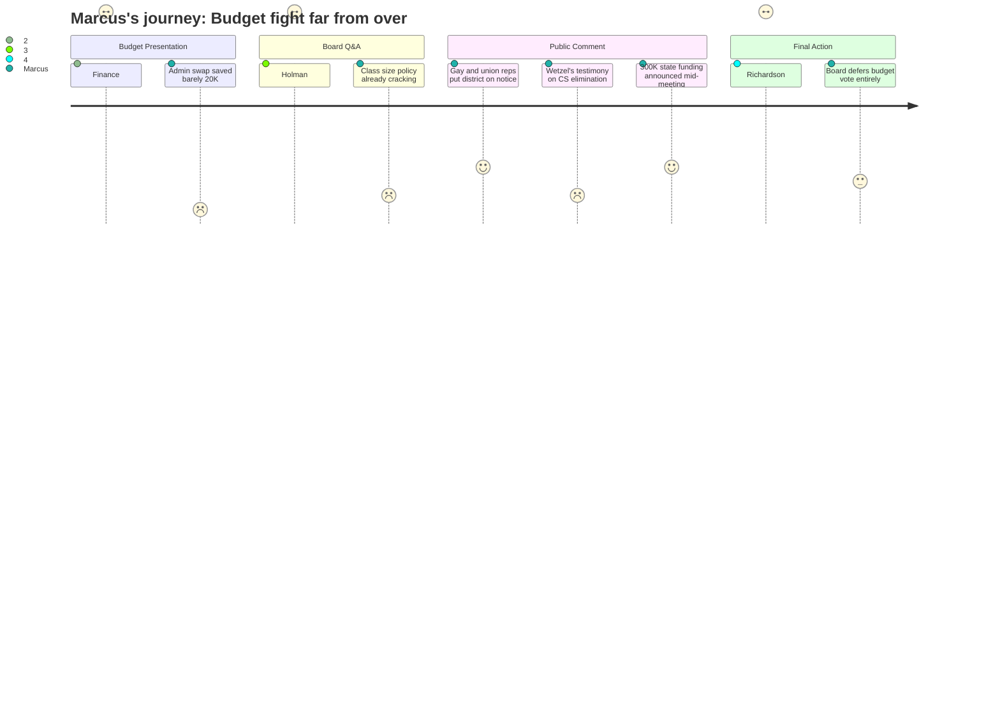

# Interpretation: Marcus (PERSONA-004)
## Meeting: School Board Regular Meeting -- April 2, 2026 -- 2026-04-02

---

### Structured Points

#### 1. Administrative restructuring saved almost nothing for the classroom
- **Fact:** When the district converted a DEI director role to a DEI strategist and replaced the assistant director of special education with an instructional strategist, the net savings were approximately $20,000–$30,000 per role swap -- not enough to restore a single teaching position. Board member Holman said outright: "I expected to see money that where there were cuts made in one place, money would be liberated in another. And that's been disappointing."
- **Source:** [23:34] (Abigail Ketchen on savings estimate); [45:59–46:00] (Member Holman, "liberated"); [85:00–85:47] (Member Feller, "we can't bring back our entire computer science department... there's no money")
- **Emotional valence:** negative
- **Threat level:** 4
- **Open question:** true

#### 2. 42 teacher positions eliminated -- with FTE counts buried across the budget book
- **Fact:** The proposed budget eliminates 42 teacher positions district-wide, representing the largest single category of the 78 total cuts. The FTE reductions are visible in the budget document line by line: the middle school drops from 64.0 to 55.0 teacher FTEs; the high school from 58.8 to 52.8; elementary schools absorb the steepest proportional cuts, with Kaler zeroed out entirely.
- **Source:** Fiscal Context summary (78 positions, 42 teachers); Budget Book rows 280, 454, 118, 171, 227, 62, 5
- **Emotional valence:** negative
- **Threat level:** 5
- **Open question:** false

#### 3. Labor costs structurally outpace the 6% tax ceiling every year
- **Fact:** Finance Director Abigail Ketchen confirmed that when all lane, step, and contractual adjustments are included, labor costs increase by more than 6% per year -- meaning even if this budget passes cleanly, the district starts FY28 already behind the ceiling the city council has set. She said: "our labor costs do increase by a higher than 6% rate. So we have to be very precise and careful about how we manage things during FY27."
- **Source:** [20:24–21:12] (Ketchen testimony); Budget Presentation Slide 7
- **Emotional valence:** negative
- **Threat level:** 4
- **Open question:** true

#### 4. SPTA president formally put the district on notice about transition costs and bargaining obligations
- **Fact:** SPTA president Sarah Gay used her public comment to formally request that next year's budget process begin no later than October, to flag that the union has already identified "several dozen items" requiring meet-and-consult and many that will require formal bargaining due to changes in working conditions, and to warn the board that any staff time outside school hours for reconfiguration preparation must be compensated. She said: "if that responsibility isn't built in now, please do not blame our contract or our advocacy for members if your choice is to make additional staff cuts as a result."
- **Source:** [112:26–117:00]
- **Emotional valence:** positive
- **Threat level:** 3
- **Open question:** true

#### 5. A potential $300,000 in state funding appeared mid-meeting -- and the board signaled it should go to staff positions
- **Fact:** SSPA president Connie DeSanto announced during public comment that union and staff lobbying in Augusta had secured approximately $300,000 in anticipated additional state funding ($150K for homeless students, $150K for economically disadvantaged students). Later in board discussion, Member Richardson stated explicitly: "I want our teachers to get that money. No director positions please with that money." A separate text to a board member suggested an additional $750,000 in EPS formula changes may be coming for FY28.
- **Source:** [122:05–123:39] (DeSanto); [264:00–265:08] (Richardson and board discussion); [271:18–272:04] (Richardson, "no director positions")
- **Emotional valence:** positive
- **Threat level:** 2
- **Open question:** true

#### 6. The behavioral specialist elimination got a non-answer
- **Fact:** A statement read on behalf of eliminated elementary behavioral specialist Jenna Goldstein Walsh warned that her role -- supporting nearly 60 students across four elementary schools with formal behavior plans -- provides the "middle layer" between general education and special education referrals. Eliminating it removes tier 2 MTSS behavioral support. When the board asked who would cover these functions, Dr. Prince pointed to BCBAs and instructional strategists, but acknowledged their time would not be 100% student-facing.
- **Source:** [101:14–106:00] (Boggs/Goldstein Walsh statement); [241:35–243:08] (Dr. Prince response)
- **Emotional valence:** negative
- **Threat level:** 4
- **Open question:** true

#### 7. Class size policy compliance is already fraying -- and no written policy governs IEP concentration
- **Fact:** Board member Richardson pressed on what happens when a 20-student kindergarten class gains one new enrollment and triggers a policy violation. The superintendent acknowledged it has already happened this year. Richardson also raised that there is no written district policy capping the percentage of students with IEPs per classroom, noting that some grade levels at some schools are already at 50% IEP concentration -- and that larger class sizes make this harder to manage.
- **Source:** [57:42–64:00]
- **Emotional valence:** negative
- **Threat level:** 4
- **Open question:** true

#### 8. The board did not pass the budget tonight -- leaving the door open
- **Fact:** After hours of discussion, the board declined to vote on agenda item 4.3 -- adopting the superintendent's budget as the board's proposal to city council. Multiple members said they were not ready given the new state funding figures and uncertainty about how that money should be used. The board voted unanimously to convene a meeting with city council to seek guidance and agreed to tentatively hold Monday for a possible additional meeting if accurate figures could be confirmed.
- **Source:** [266:40–279:34]; [260:24–261:10] (unanimous vote on 4.2); [272:50–273:38] (4.3 deferred without action)
- **Emotional valence:** positive
- **Threat level:** 2
- **Open question:** true

---

### Journey Map

---

### Reactions

So I was there until almost midnight and I'm still processing it. The thing that's going to stay with me is what Holman said -- she literally said she expected money to be "liberated" when they cut the director positions and turned them into instructional strategists. And then Abigail confirmed the savings on each of those swaps was maybe twenty to thirty thousand dollars. Twenty to thirty thousand. That's not even one teaching position. We lost 42 teachers in this budget and the big administrative restructuring that was supposed to offset some of that saved less than what it costs to run one classroom for a year. Member Feller said it out loud: "we can't bring back our entire computer science department, there's no money." That's because there isn't any. The money didn't move. It just got relabeled.

The other thing that kept me on edge all night was what Abigail said about labor costs. She confirmed it -- our contracts, by lane and step and all the rest, go up by more than 6% a year. The city council set 6% as the ceiling. So even if this budget passes and everyone claps and moves on, we start next year already in structural deficit. She said it herself, right there in the presentation. That means this is not a one-time crisis. It's annual. And we've got no fund balance to absorb anything, which she also said means that any time they under-budget something -- electricity, subs, you name it -- the shortfall comes out of personnel the following year. That's the mechanism. That's how 42 teachers disappear.

But here's the thing: they didn't pass the budget. That surprised me. And Connie DeSanto walked up there and announced three hundred thousand dollars in new state money that she and our colleagues literally went to Augusta and fought for. And Claire Richardson said on the record, in public, "no director positions please with that money -- I want our teachers to get it." I wrote that down. That goes on the record. Now the question is whether it holds. They're meeting with city council, there may be more state money coming for FY28, and the board still has a vote to take. It is not over. If you're going to that Monday meeting or the April 14th workshop -- show up.