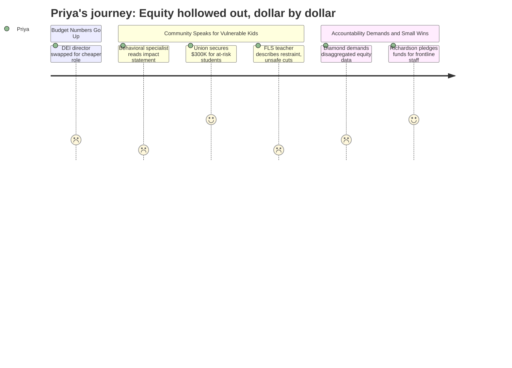

# Interpretation: Priya (PERSONA-005)
## Meeting: School Board Regular Meeting -- April 2, 2026 -- 2026-04-02

### Structured Points

#### 1. DEI Director Eliminated, Replaced with Lower-Authority Strategist
- **Fact:** The finance director confirmed the DEI Director position is being eliminated and replaced with a "DEI Strategist" drawn from the SPTA recall list — a teacher-contract role. Cost savings were estimated at roughly $20,000–$30,000. Board member Angela Kabisa, in her written statement read aloud at the meeting, specifically named the DEI role as what makes students "feel seen and understood in school."
- **Source:** [14:55] Abigail Ketchen budget presentation; [24:19] board Q&A on cost savings; [228:25] Board member Kabisa's statement read by Board member Dowling
- **Emotional valence:** negative
- **Threat level:** 4
- **Open question:** true

#### 2. McKinney-Vento, Community Partner, and DEI Support Staff Zeroed Out of Local Budget
- **Fact:** The FY27 budget eliminates all local funding for the "Other Student Support Services" cost center covering Community Partner, McKinney-Vento homeless student liaisons, and DEI staff — a reduction from $388,833 and 3.50 FTEs to $0 locally funded, with a notation that the district will rely entirely on a Maine DOE Community Schools grant. No board member or administrator addressed this shift during the meeting.
- **Source:** Budget Book 4.2.26, rows 2322–2323 — "Other Student Support Services (Community Partner, McKinney Vento and DEI)"
- **Emotional valence:** negative
- **Threat level:** 4
- **Open question:** true

#### 3. Elementary Behavioral Specialist Cut — 60+ Students Lose Behavior Plans, 23% IEP Rate Flagged
- **Fact:** A statement from Jenna Goldstein Walsh, the district's general education behavioral specialist facing elimination, was read aloud. She reported working with nearly 60 individual students this year, developing over 40 formal behavior plans. She warned that eliminating the role removes the "middle layer" of preventative support between general education and special education referrals — and that the district's IEP identification rate, already at approximately 23% (higher than most surrounding districts), will likely increase without early intervention.
- **Source:** [101:14]–[106:45] Nicholas Boggs reading Jenna Goldstein Walsh's statement; specifically [102:48]–[103:35] for the 23% figure and special education referral warning
- **Emotional valence:** negative
- **Threat level:** 5
- **Open question:** true

#### 4. FLS Classroom Safety Breaks Down as OT Positions Are Cut
- **Fact:** A functional life skills teacher at Skillin disclosed that both embedded OT positions covering her classroom are being cut. She described ending her school day that night in a physical restraint of a student, with chronically unfilled EdTech vacancies filled by a substitute. Another speaker, a frequent FLS classroom substitute, testified that cutting OTs will increase "unprovoked violence and eloping in the hallways." The administration confirmed 6 special education ed tech vacancies remain, but stated the positions were eliminated from the budget because staffing models have been redesigned.
- **Source:** [163:13] Rachel GIBS, SLP at Dyer; [166:17]–[168:38] Stacy Lauren, FLS teacher at Skillin; [77:07]–[78:39] board Q&A with Dr. Prince on OT/EdTech relationship
- **Emotional valence:** negative
- **Threat level:** 5
- **Open question:** true

#### 5. ESOL Teacher Staffing Cut from 19 to 17 FTEs
- **Fact:** The FY27 budget reduces ESOL teacher positions from 19.00 FTEs in FY26 to 17.00 FTEs — a reduction of two teachers serving English learners across the district. No board member raised this cut during discussion, and no speaker in public comment directly addressed it. The ESOL director is now listed at 0.50 FTE with a note indicating the other 0.50 FTE is funded through Title II federal funds.
- **Source:** Budget Book 4.2.26, rows 537 and 549 — ESOL Services cost center
- **Emotional valence:** negative
- **Threat level:** 3
- **Open question:** true

#### 6. Union Advocacy Produces $300,000 Specifically for Economically Disadvantaged and Homeless Students
- **Fact:** SSPA president Connie DeSanto announced mid-meeting that state-level advocacy by union leadership had secured approximately $150,000 in anticipated additional funding for economically disadvantaged students and $150,000 for students experiencing homelessness, totaling $300,000. Board member Richardson later stated publicly: "I want our teachers to get that money — no director positions, please."
- **Source:** [121:05]–[123:39] Connie DeSanto public comment; [271:18]–[271:52] board member Richardson statement during board deliberations
- **Emotional valence:** positive
- **Threat level:** 1
- **Open question:** true

#### 7. No Disaggregated Equity Data Presented in Five Hours of Budget Discussion
- **Fact:** Community member Meredith Diamond formally requested eight specific categories of student outcome data disaggregated by race, income, disability status, and ELL status — including suspension rates, chronic absenteeism, gifted program enrollment, and counselor access rates by subgroup. No administrator or board member responded to this request. No disaggregated data appeared in the budget presentation or any district-produced slide in this meeting.
- **Source:** [220:30]–[224:31] Meredith Diamond public comment; [215:11] Lauren Shapiro Deek questions on ELL students in achievement data
- **Emotional valence:** negative
- **Threat level:** 3
- **Open question:** true

---

### Journey Map

---

### Reactions

I've been to a lot of these meetings over the years, and I know how to read a budget document. So let me tell you what actually happened last night. They cut the person who was running behavior plans for sixty kids. Sixty. And the woman who held that role sent a statement through a colleague because she couldn't be there, and it was devastating and precise. She said their IEP identification rate is already 23% — nearly one in four students — which is higher than comparable districts. And she explained exactly what happens when you remove the only person doing early intervention: kids either get nothing, or they get fast-tracked into special ed. Which is more expensive. Which means more cuts next year. This is the "preventative model vs reactive model" problem I've been writing about for years, and here it is playing out live at a school board meeting, and the board barely engaged with it.

But that's not even the thing that kept me up. The DEI director is gone. They replaced it with a "DEI strategist" — a teacher-contract position, no administrative authority, drawn from the recall list. The cost savings were twenty, maybe thirty thousand dollars. Meanwhile, the McKinney-Vento liaisons, the community partner support staff — that whole cost center, 3.5 positions and nearly $400,000 — zeroed out of local funding entirely, now dependent on a state grant that could disappear. And the ESOL team is down two teachers, which nobody mentioned out loud once in five hours. This is the pattern: every line item serving students who don't have institutional advocates gets quietly reassigned or eliminated, while the equity language stays in the mission statement. I have been waiting for someone to ask where the ESOL per-pupil spending data is, or what the suspension rates look like by subgroup. Meredith Diamond stood up and listed eight specific things they should be tracking, disaggregated by race and income and disability. The board said nothing.

Here's what I'm holding onto: $300,000 is coming from the state, specifically for economically disadvantaged students and kids experiencing homelessness. That is real money for real kids, and it happened because union members drove to Augusta and made it happen. And board member Richardson said publicly — on the record — "no director positions with that money, I want it to go to teachers and staff." I want to trust that. But here's my question: who is tracking whether this money actually reaches the students it was secured for? The district just eliminated the people who were supposed to be accountable for equity outcomes. I'm submitting a records request next week. I want the ESOL student outcome data, the IEP referral rates by school, the Title I allocation by cost center. If the $300,000 ends up funding a budget line that doesn't disaggregate, we'll have no way to know if it ever touched a single homeless kid.