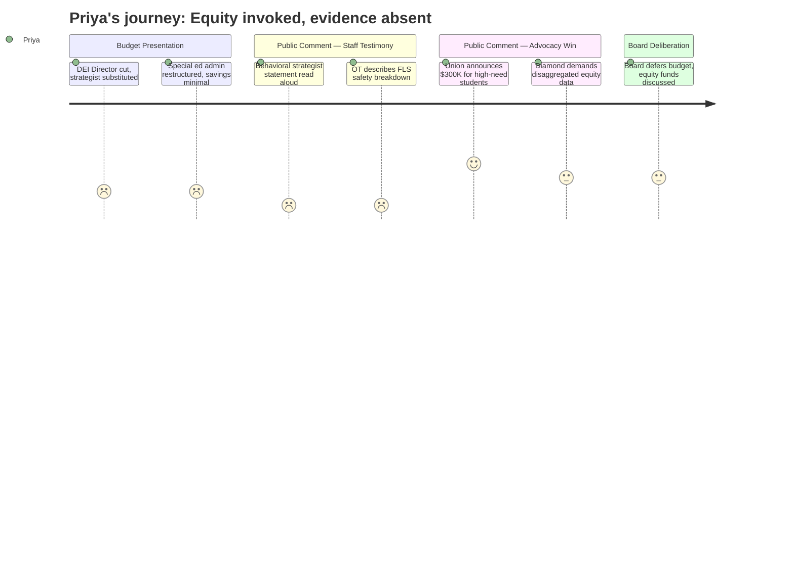

# Interpretation: Priya (PERSONA-005)
## Meeting: School Board Regular Meeting -- April 2, 2026 -- 2026-04-02

### Structured Points

#### 1. DEI Director position downgraded to DEI Strategist
- **Fact:** The FY27 budget removes the Director of Diversity, Equity, and Inclusion and replaces it with a DEI Strategist drawn from the SPTA recall list — a shift from an administrative leadership role to a teacher-contract role. The budget book shows the Community Partner/McKinney-Vento/DEI cost center at $0 in local funding for FY27, with the note that it had previously been funded through a Maine DOE Community Schools grant.
- **Source:** Transcript [14:55–15:41]; Budget Book rows 2322–2323
- **Emotional valence:** negative
- **Threat level:** 4
- **Open question:** true — Does the DEI Strategist role carry comparable institutional authority to shape district-wide policy, or does the downgrade to a teacher contract effectively remove equity work from administrative decision-making? What happens to the function when the DOE grant expires?

#### 2. General education behavioral strategist eliminated — the "middle layer" disappears
- **Fact:** A statement read on behalf of Jenna Goldstein Walsh, the district's general education behavioral strategist (a position proposed for elimination), described serving nearly 60 individual students across four elementary schools this year, with over 40 requiring formal behavior plans. The statement warned that eliminating the role removes the tier-two/three MTSS intervention layer: students will either receive no meaningful behavioral support or be referred directly to special education, with no in-between. The statement also noted that approximately 23% of district students — nearly one in four — are already identified for special education services, a rate described as higher than most surrounding districts.
- **Source:** Transcript [101:14–106:07]
- **Emotional valence:** negative
- **Threat level:** 5
- **Open question:** true — Who will design and oversee tier-two and tier-three behavioral interventions across elementary schools? The district's answer — BCBAs and instructional strategists filling part of the gap — was not specifically quantified in terms of capacity or caseload.

#### 3. Union advocacy secures $300,000 in state funding for economically disadvantaged and homeless students
- **Fact:** SSPA president Connie DeSanto announced during public comment that union and staff advocacy — including trips to Augusta by union leadership from both SSPA and SPTA — had resulted in South Portland likely receiving approximately $150,000 in additional state funding tied to economically disadvantaged students and $150,000 tied to the district's homeless student population, for a total of approximately $300,000. Board Member Richardson later reported a text from Representative Kessler indicating that EPS formula changes could provide an additional $750,000 for the following year's budget.
- **Source:** Transcript [122:05–123:39]; [264:00–264:20]
- **Emotional valence:** positive
- **Threat level:** 1
- **Open question:** true — Member Richardson explicitly said the funds should go to teachers and staff, not director positions. But no formal board action determined how these dollars would be allocated. Whether they reach student-facing roles serving the highest-need populations — or are absorbed into structural budget gaps — remains unresolved.

#### 4. Reconfiguration equity framing challenged as analytically thin
- **Fact:** Community speaker Wheeler Boyd stated that the analysis supporting the reconfiguration decision was "alarmingly thin" and that "the scoring matrix used to evaluate the various closure and reconfiguration scenarios is minimally aligned with the district's own mission." A separate speaker, Meredith Diamond, went further, stating that framing reconfiguration as an equity initiative "is a manipulation and a lie," arguing that the plan risks increasing class sizes "most dramatically at our highest-needs schools" and eliminating access to enrichment programming — outcomes she characterized as the opposite of equity.
- **Source:** Transcript [146:09–148:28]; [221:26–224:31]
- **Emotional valence:** negative
- **Threat level:** 3
- **Open question:** true — The district did not present outcome evidence from comparable districts demonstrating that this reconfiguration model improves results for the student populations most affected. No speaker from the administration disputed the "minimally aligned" characterization of the scoring matrix.

#### 5. Disaggregated equity data does not appear to exist in a usable form
- **Fact:** Meredith Diamond called on the board to demand data disaggregated by race, income, disability status, and English learner status across eight dimensions: chronic absenteeism, grade retention, enrollment in gifted and advanced programs, access to arts and enrichment by subgroup, discipline rates, student and family perceptions of safety and belonging, bullying incidents, and counselor-to-student ratios. No such data was presented at this or any prior meeting documented in the record. The board did not commit to producing it.
- **Source:** Transcript [220:40–224:31]
- **Emotional valence:** negative
- **Threat level:** 3
- **Open question:** true — Without disaggregated outcome data, there is no basis for evaluating whether any budget decision — the behavioral strategist cut, the reconfiguration, the OT reductions — is equity-neutral, equity-positive, or equity-harmful. The district has not indicated when or whether this data will be produced.

#### 6. OT positions cut from Functional Life Skills classrooms amid an existing vacancy crisis
- **Fact:** A speech-language pathologist at Dyer and a special education teacher at Skillin both described, in detail, the role that embedded occupational therapists play in functional life skills classrooms — covering for absent ed techs, helping manage physical safety during behavioral incidents, providing sensory and self-care support. The Skillin teacher stated that the OT cut would require the equivalent of four additional ed tech positions to compensate, and described ending her day in a physical restraint with the OT unavailable. The district currently has six open special education ed tech vacancies, positions that were eliminated from the budget; the administration stated current service minutes could be met under the new configuration but acknowledged that hiring special ed ed techs has been a persistent challenge.
- **Source:** Transcript [163:13–168:38]; [166:17–168:00]
- **Emotional valence:** negative
- **Threat level:** 4
- **Open question:** true — The district's projection that OT service minutes can be met rests on an assumption that existing staff will adequately cover gaps currently filled by OTs. The vacancy history — six open positions described as chronically hard to fill — raises questions about whether that projection is realistic for the district's highest-need self-contained classrooms.

#### 7. ESOL teacher staffing reduced while reconfiguration will redraw boundaries affecting multilingual families
- **Fact:** The FY27 budget book shows 17.0 ESOL teacher FTE, down from 19.0 in FY25. The ESOL Director is budgeted at 0.5 FTE. Superintendent Entwistle noted plans to work with the "director of multilingual programs" on specific outreach to multilingual families during the reconfiguration listening sessions, and to design a focus group for parents of students with IEPs. No translated materials, multilingual session formats, or community liaisons were mentioned in the reconfiguration engagement plan described at this meeting.
- **Source:** Budget Book rows 537, 549; Transcript [54:33–54:33]
- **Emotional valence:** negative
- **Threat level:** 3
- **Open question:** true — The 2024 Boundaries and Configurations Steering Committee process included translated notes for community forums. No equivalent commitment was described for the reconfiguration engagement process now underway. With attendance boundaries undrawn and multilingual families facing potential school reassignments, the absence of a documented multilingual outreach strategy is a gap in the current record.

---

### Journey Map

---

### Reactions

The thing I keep coming back to is Jenna Goldstein Walsh. She couldn't be there, so someone read her statement for her. She's the behavioral strategist — one person covering four elementary schools, working with nearly 60 students this year, building behavior plans, doing the tier-two and tier-three MTSS work that keeps kids from sliding into full special ed referrals. That position is gone. And the district's response when board members pushed on it was essentially: the BCBAs and instructional strategists will pick it up. No caseload numbers, no capacity analysis, no acknowledgment that these are entirely different roles with different scopes. Meanwhile 23% of district students already have IEPs — that's their own number, and it's higher than neighboring districts. You cut the early intervention that's specifically designed to hold that line, and you're going to see it move. The district knows this. It was said clearly, in writing, at the microphone. I want to know what they're going to say when the referral numbers go up in FY28.

The reconfiguration-as-equity framing is the other thing I won't let go. Wheeler Boyd stood up and said it directly: the scoring matrix used to justify the closure was minimally aligned with the district's own mission statement. Meredith Diamond said it even more plainly — she called it a lie. I don't use that word as freely, but what I will say is this: you cannot call something an equity initiative when you have not produced a single line of disaggregated outcome data to demonstrate the impact on the students you claim to be helping. Attendance by subgroup? Not there. Discipline data by race and disability status? Not there. Counselor-to-student ratios by school? Not there. Diamond read off eight dimensions of equity data the district should have. None of it was in the room. If you're closing a school and redrawing every attendance boundary in the district, and you're doing it in the name of equity, you owe the community that data. Its absence isn't suspicious by itself — districts often under-invest in this kind of reporting — but it does mean the equity claim is currently unverifiable, and that matters.

The one thing that genuinely moved me was Connie DeSanto walking in with $300,000. Her people went to Augusta on their own time and came back with money specifically designated for economically disadvantaged students and students experiencing homelessness. That is real. And when Member Richardson said out loud that those funds should go to teachers and staff, not director positions, that was the clearest equity-aligned statement I heard all night. There's also potentially $750,000 more coming from the EPS formula change next year. I want to believe those dollars will reach the behavioral strategist role, the OT support in the FLS classrooms, multilingual family engagement — the things that actually serve the kids the district keeps saying this is all about. But there's no formal commitment yet, no process, no criteria for how it gets allocated. I'll be at every meeting between now and June watching to see whether that money gets used to restore what was cut from the highest-need programs, or whether it quietly disappears into the structural gap. The difference between those two outcomes is the whole question.