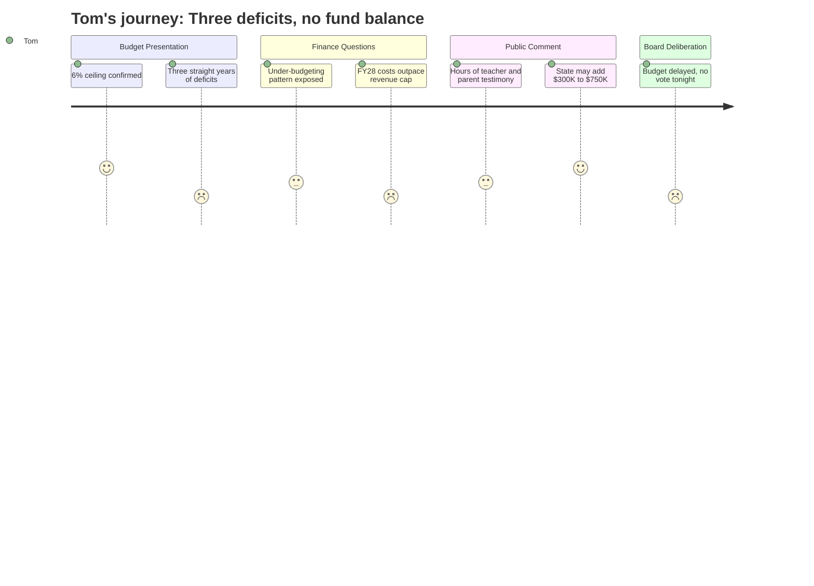

# Interpretation: Tom (PERSONA-006)
## Meeting: School Board Regular Meeting -- April 2, 2026 -- 2026-04-02

---

### Structured Points

#### 1. The 6% Tax Increase Ceiling Holds -- For Now
- **Fact:** Board member Feller confirmed directly with the finance director that the proposed budget still represents a 6.0% local tax increase, within the ceiling set by the city council.
- **Source:** [22:46--23:05]
- **Emotional valence:** positive
- **Threat level:** 2
- **Open question:** false

#### 2. The District Has Run Deficits for Three Consecutive Years
- **Fact:** Finance Director Ketchen stated explicitly that the district ran a deficit in FY24, a deficit in FY25, and is projecting a deficit in the current fiscal year (FY26). She framed FY27 as a "reset" of the financial path.
- **Source:** [16:00--16:28]
- **Emotional valence:** negative
- **Threat level:** 4
- **Open question:** true

#### 3. Electricity Has Been Budgeted Wrong for Years -- and Nobody Fixed It
- **Fact:** The finance director presented a slide showing the district overspent its electricity budget by $138K in FY23, $211K in FY24, $165K in FY25, and is projecting an overage of roughly $368K in the current year -- yet the FY26 budget had been set *lower* than actual FY25 spending.
- **Source:** [18:20--19:15], Budget presentation slide 6
- **Emotional valence:** negative
- **Threat level:** 3
- **Open question:** true

#### 4. The Fund Balance Is Gone -- Zero Cushion Remaining
- **Fact:** Finance Director Ketchen stated that the district has no fund balance remaining. Board member Richardson confirmed this. The finance director described her budgeting philosophy as refusing to use "optimistic" or "wishful thinking" numbers precisely because there is nothing to draw from if the budget falls short.
- **Source:** [19:39--20:24], [30:00--30:35]
- **Emotional valence:** negative
- **Threat level:** 4
- **Open question:** true

#### 5. Surprise: State May Provide $300K--$750K in New Funding
- **Fact:** SSPA President Connie DeSanto announced during public comment that union outreach to the state legislature had secured a likely $300K in additional funding (split between economically disadvantaged and homeless student populations). Board member Richardson then read a separate text indicating potential additional state EPS formula changes worth another $750K.
- **Source:** [122:42--123:39], [264:05--264:25]
- **Emotional valence:** positive
- **Threat level:** 1
- **Open question:** true

#### 6. Next Year Is Already Going to Be Harder: Labor Costs Outpace the 6% Cap
- **Fact:** The finance director warned the board that labor costs, when all lane/step adjustments are included, increase by more than 6% per year under existing contracts. This means the structural gap problem does not go away -- it rebuilds automatically every year.
- **Source:** [20:55--21:15], Budget presentation slide 7
- **Emotional valence:** negative
- **Threat level:** 5
- **Open question:** true

#### 7. The Board Did Not Vote to Pass the Budget Tonight
- **Fact:** Despite the superintendent's recommendation to pass the budget as presented, the board declined to take a vote on agenda item 4.3. Multiple board members said they wanted to wait for firmer figures on the new state money before committing. The budget will be presented to the city council on April 7th as the superintendent's proposed budget, not a board-adopted budget.
- **Source:** [272:50--279:06]
- **Emotional valence:** negative
- **Threat level:** 3
- **Open question:** true

#### 8. Deferred Maintenance Is Coming Due: Boiler and Chimney Stacks
- **Fact:** The finance director mentioned a $700K estimate for chimney stack repairs at the high school that have been deferred for many years, with some of the insurance savings redirected toward that project. The Skillin boiler was also flagged as a potential future debt item with no clear funding source.
- **Source:** [32:47--35:07], [37:10--37:28], Budget presentation slide 7
- **Emotional valence:** negative
- **Threat level:** 4
- **Open question:** true

---

### Journey Map

---

### Reactions

Well, the good news is they're staying at 6%. I was half expecting them to come in asking for more. So fine -- 6% is what the council told them, and that's what they've got. On a $300,000 assessment that's roughly another $125 or so on my tax bill this year. I can live with that. What I can't live with is what they showed us about how they got here. That finance director got up there and just said it flat out: they ran a deficit in '24, a deficit in '25, and they're going to run a deficit again this year. Three years in a row. And nobody sounded the alarm? The electricity bill alone -- they budgeted *less* than they actually spent, every single year going back to 2023, and now they're $368,000 over budget just on power. That's not bad luck. That's not managing your books.

The thing that really got me was the fund balance. It's gone. There's nothing left. The finance director said it herself -- they have no cushion, so if anything goes sideways, the next year there are layoffs. That's how we got here. And now we've got a $700,000 chimney repair coming at the high school, a boiler problem at Skillin, and debt service on that artificial turf field ticking up by $300,000 next year. She even said it directly: labor costs under the current contracts grow faster than 6% every single year. So even if we "fix" this budget, the structural problem builds right back up. The meeting dragged on for almost five hours, most of it parents and teachers upset about the reconfiguration -- and look, I get it, that's real -- but nobody up there was really talking about what happens in 2028. That's the number I'm watching.

One thing I did not expect: the union president stood up and said she'd been talking to state legislators and got us $300,000 in new money, and then by the end of the night a board member was reading a text about maybe $750,000 more from a formula change. Good. That's real money, and I hope they use it to close the structural gap rather than just adding back positions to feel better. What I can't figure out is why nobody in the district has been doing that kind of outreach consistently. The board didn't even vote to pass the budget tonight -- they're waiting to see if those numbers firm up before they commit. That's the right instinct, but they're running out of time. The council meeting is Tuesday. They need to stop stalling and get something done.