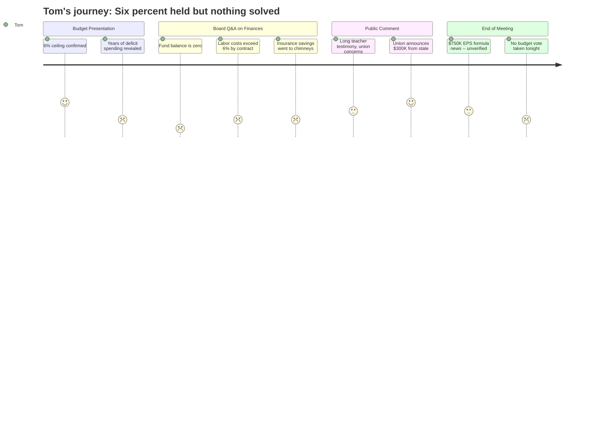

# Interpretation: Tom (PERSONA-006)
## Meeting: School Board Regular Meeting -- April 2, 2026 -- 2026-04-02

### Structured Points

#### 1. The 6% ceiling held -- for now
- **Fact:** The finance director confirmed the proposed budget stays at a 6% local tax increase, the ceiling set by the city council. The total proposed budget is $75.85M, up from $73.4M last year.
- **Source:** Budget presentation slides, "FY27 Proposed Budget Revenue Overview"; confirmed verbally at [22:46]
- **Emotional valence:** positive
- **Threat level:** 2
- **Open question:** false

#### 2. Years of deliberate under-budgeting created this crisis
- **Fact:** The finance director presented a slide showing the district ran deficits in FY24, FY25, and projects a deficit in FY26. She gave two specific examples: electricity has been under-budgeted by $138K--$368K every year since FY23, and tuition reimbursement has been over-spent by $30K--$153K every year since FY23. She stated explicitly: "our budget is not sufficient to meet our needs."
- **Source:** [16:28--19:39]; Budget presentation slide "FY27 adjusts from prior under-budgeting"
- **Emotional valence:** negative
- **Threat level:** 4
- **Open question:** true

#### 3. The fund balance is at zero -- and the insurance savings didn't go there
- **Fact:** The finance director confirmed the district has no fund balance at all. A board member asked why the $52K in savings from the health insurance cap reduction (12% to 11.5%) wasn't directed to the fund balance as had been discussed; the finance director said it was redistributed into the budget and toward capital costs, specifically the high school chimney stacks project estimated at $700K. A board member stated bluntly: "We've been extremely negligent... having spent all that." The district's own standard calls for a 9-12% fund balance; the district has none.
- **Source:** [19:39--20:24]; [36:42--37:28]; [69:21--71:41]; [233:50--236:55]
- **Emotional valence:** negative
- **Threat level:** 5
- **Open question:** true

#### 4. Labor costs grow faster than 6% by contract -- the structural problem remains
- **Fact:** The finance director stated that labor costs, when all lane/step/contractual adjustments are included, increase by more than 6% per year automatically. This means the 6% tax ceiling the district just barely met will be structurally breached again in FY28 unless enrollment grows, state funding increases, or further cuts are made. She said: "we have to be very precise and careful about how we manage things during FY27."
- **Source:** [20:24--21:12]; Budget presentation slide "Preparing for FY28 and Beyond"
- **Emotional valence:** negative
- **Threat level:** 5
- **Open question:** true

#### 5. Known capital costs are stacking up with no savings to absorb them
- **Fact:** The finance director identified multiple capital cost pressures ahead: debt service will increase by $300K+ in FY28 due to the athletic turf bond; the Skillin boiler may require new debt; the high school chimney stacks need ~$700K in work that has been deferred for years. The district has no fund balance to cushion any of these.
- **Source:** [20:24--21:12]; [32:47--35:07]; [37:28--37:28]
- **Emotional valence:** negative
- **Threat level:** 4
- **Open question:** true

#### 6. School resource officer cost jumped $60K -- billed by the city
- **Fact:** A board member noted that the SRO line item rises from $158K (corrected from a prior $191K figure) to $220K in FY27 -- a ~$60K increase for two officers working at 85% effort. The finance director confirmed this number is set by the city and passed through directly. A board member asked why the city doesn't absorb this cost; the response was that these are city police department employees, and the district pays for the service.
- **Source:** [24:19--26:38]
- **Emotional valence:** negative
- **Threat level:** 2
- **Open question:** true

#### 7. Late-breaking state money -- but the board couldn't decide what to do with it
- **Fact:** Near the end of the meeting, a union representative announced that state lobbying by staff had secured a projected $300K in additional state funding (based on homeless and economically disadvantaged student populations). A board member then reported a separate text message suggesting the EPS formula change could yield an additional $750K. However, the board could not verify the amounts or act on them that night. Board members were split between using the money to restore cut positions versus rebuilding the fund balance. No budget vote was taken; the board provisionally scheduled a Monday meeting pending confirmation of the figures.
- **Source:** [122:51--123:39]; [264:09--265:08]; [266:40--279:06]
- **Emotional valence:** neutral
- **Threat level:** 2
- **Open question:** true

#### 8. The budget was not voted on -- and the structural path forward is unclear
- **Fact:** Despite the superintendent's explicit recommendation that the board pass the budget as presented, no vote was taken on agenda item 4.3 (adoption of the FY27 superintendent's budget). The board unanimously voted to convene a meeting with city council to seek budget guidance, but deferred the budget vote to a possible Monday meeting. The superintendent noted that if no board vote occurs, what goes to city council is the superintendent's proposed budget, not a board-adopted budget.
- **Source:** [95:48--97:24]; [260:42--279:06]
- **Emotional valence:** neutral
- **Threat level:** 3
- **Open question:** true

---

### Journey Map

---

### Reactions

Six percent. They held the line at six percent. That's the number I walked in wanting to hear, and I got it -- barely. But the more I sat there, the more I realized that six percent only happened because they cut 78 jobs and stripped the district down to the bone. And the finance director stood up there and basically admitted they've been fudging the numbers for years. Electricity? Under-budgeted by over two hundred thousand dollars a year, three years running. Tuition reimbursements? Same deal. She called it "optimistic budgeting." I'd call it something else. They ran deficits in FY24, FY25, and they're projecting one this year too. That's not bad luck, that's a pattern.

Here's what really got me: they have zero in savings. Zero. The standard is nine to twelve percent of operating costs in reserve -- one of the board members said it out loud and then said, "we've been extremely negligent." I appreciate the honesty, I do, but that money didn't disappear by accident. And when they had a chance to start rebuilding it -- fifty-two thousand in insurance savings -- where did it go? Chimney stacks at the high school. Which I understand, deferred maintenance is real, but the decision was made without even a conversation. Meanwhile, the labor contracts they signed guarantee salaries go up by more than six percent a year automatically. So unless enrollment picks up or the state finally starts paying what it owes -- twenty percent of actual costs when it's supposed to be fifty-five, by the way -- we're going to be right back here having this same conversation next spring.

And then near the end, a union rep announced they'd lobbied Augusta and were getting an extra three hundred thousand in state money. That's good news. A board member got a text saying maybe another seven-fifty was coming from a formula change. Also good news. But the board couldn't confirm the numbers, couldn't agree on what to do with the money, and didn't even vote on the budget. Four and a half hours and they left without a vote. The superintendent wanted them to pass it and go present to the city council -- a completely reasonable process -- and the board punted to a possible Monday meeting. I came in hoping for a straight answer on what this is going to cost me. I'm leaving with a maybe.