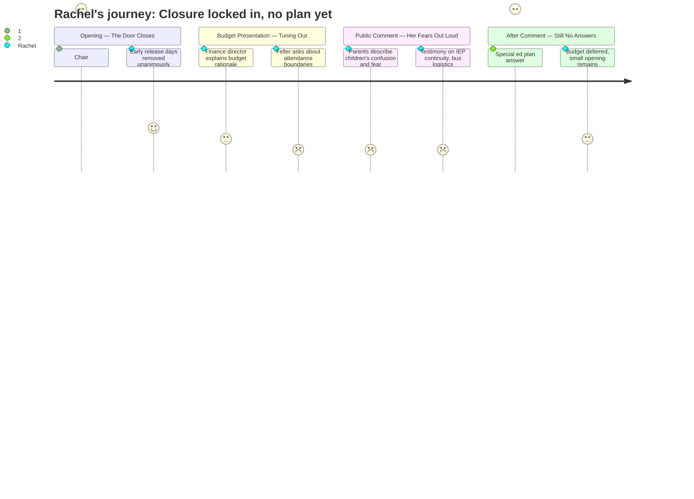

# Interpretation: Rachel (PERSONA-008)
## Meeting: School Board Regular Meeting -- April 2, 2026 -- 2026-04-02

---

### Structured Points

#### 1. The Reconfiguration Decision Is Locked In
- **Fact:** Board Chair DeAngelis opened by stating explicitly that "voting down the budget does not change the action the board took to move to reconfigure elementary school" and that "the city council cannot override the decisions of the school board." The reconfiguration vote from Monday is a separate, final action.
- **Source:** Transcript [09:24–10:11]
- **Emotional valence:** negative
- **Threat level:** 5
- **Open question:** false — the answer is clear and devastating: the budget vote is not a lever for reversing reconfiguration.

#### 2. Board Pulled Proposed Early Release Days After Parent Pushback
- **Fact:** The board unanimously removed from tonight's agenda a proposal to add four early release days in May and June for reconfiguration preparation. The chair acknowledged directly that the proposal "is not easy on families."
- **Source:** Transcript [00:51–08:39]
- **Emotional valence:** positive
- **Threat level:** 1
- **Open question:** true — the district still needs planning time; the waiver for one student day was discussed as a partial replacement, and whether adequate preparation time exists remains unresolved.

#### 3. No Attendance Boundary Plan Exists Yet
- **Fact:** Board Member Feller described the situation as "an absolute information vacuum" and asked directly whether families should worry about kids being bused across the city. Dr. Prince responded that she did not want to "get ahead of hearing those voices" at upcoming listening sessions and that boundaries would be informed by community input — meaning no assignment decisions have been made.
- **Source:** Transcript [53:46–54:33]
- **Emotional valence:** negative
- **Threat level:** 4
- **Open question:** true — which school will each child attend, and how will that be determined? No answer was given at this meeting.

#### 4. Listening Sessions and a Community Survey Are Underway
- **Fact:** Dr. Prince announced 13 scheduled listening sessions across all schools for both families and staff, an open digital survey that had already received approximately 200 responses, and specific outreach planned for multilingual families and families of children with IEPs. A formal reconfiguration timeline is expected to be published by end of next week.
- **Source:** Transcript [50:40–52:58]
- **Emotional valence:** positive
- **Threat level:** 2
- **Open question:** true — the listening sessions are scheduled after the reconfiguration vote, meaning community input shapes implementation, not the decision itself.

#### 5. Existing Friend Groups Will Not Move Forward Together as Classes
- **Fact:** When asked whether classrooms would be kept together during reconfiguration, Dr. Prince confirmed that even in normal years, classes are redistributed annually — students are mixed up each year, not rolled forward intact. She stated the district would "prioritize existing social relationships and bonding" but would not move "an entire third grade of students into a single new fourth grade classroom."
- **Source:** Transcript [72:26–73:14]
- **Emotional valence:** neutral
- **Threat level:** 2
- **Open question:** true — "prioritizing" social relationships is a stated goal but not a concrete mechanism; what it means in practice for any given child is unknown.

#### 6. Special Education Transition Plan Has No Specifics Yet
- **Fact:** When a public commenter and board members asked directly what the plan is for maintaining consistency for children with IEPs during reconfiguration, the response from administration was: "The plan is to speak to educators and to speak to parents. There isn't any more details that are available at this point." Board Member Richardson called this response "insufficient for the public."
- **Source:** Transcript [255:00–256:00]
- **Emotional valence:** negative
- **Threat level:** 3
- **Open question:** true — for families of children in self-contained or specialized programs, the absence of a concrete plan is a direct unresolved concern.

#### 7. Multiple Voices Warned the Four-Month Timeline Is Unprecedented and Dangerous
- **Fact:** A parent cited that Lewiston took three years to reconfigure and Portland took one year; South Portland is attempting it in approximately 3.5 months — roughly one-tenth the time. The SPTA president described her own experience moving between school types and warned that teachers "cannot be required to work during the summer" without pay, adding unbudgeted costs. A SPTA vice president warned the district has already identified "several dozen items" needing meet-and-consult or bargaining before fall.
- **Source:** Transcript [169:23–170:08]; [115:11–116:44]
- **Emotional valence:** negative
- **Threat level:** 4
- **Open question:** true — the board was asked directly about a "go/no-go" date if implementation falls behind, and the administration's answer was that the board's vote means "our job is to be ready." No off-ramp criteria were described.

#### 8. Budget Was Not Passed — A Monday Meeting Is Possible
- **Fact:** The board did not vote to adopt the FY27 budget tonight. During the meeting, news emerged of potentially $300,000 in new state funds (from union advocacy in Augusta) and a separate text received by a board member suggesting an additional $750,000 from EPS formula changes — though neither figure was confirmed. Board members cited these developments as reason to pause and possibly meet Monday before presenting to city council on April 7th.
- **Source:** Transcript [264:20–279:06]; [122:51–123:39]
- **Emotional valence:** neutral
- **Threat level:** 2
- **Open question:** true — whether any restored funding would go toward student-facing positions versus the fund balance or facilities remained actively debated and unresolved at adjournment.

---

### Journey Map

---

### Reactions

So the first thing the chair said — before anything else — was that voting no on the budget in June does not undo the reconfiguration vote. Like he opened with that. He was basically telling us: this is done, stop hoping the budget vote is your lever. I sat there thinking, okay, so what are we even doing here for the next five hours. The decision that changes my kid's entire school year is already made and there is nothing any of us can vote on to reverse it.

The one moment I actually exhaled was when they pulled the early release proposal off the agenda. Parents pushed back hard after Monday and the board listened, at least on that one thing. That felt real. But then someone on the board asked about the attendance boundaries — literally asked, "are you going to take my child and bus them across the city?" — and the answer was basically: we don't know yet, come to a listening session. A listening session. That we're holding after the decision was made. My kid came home this week and asked me what school she's going to next year and I had to say I don't know. A board member's kid asked the same thing after Monday's meeting and the board member said the same thing back. That moment hit me hard because that's not a parent at the school — that's someone who voted for this and still can't answer the question. Nobody can answer it yet. That's what we're living with.

The IEP piece worries me even more than it worries most people here because of our situation. There was a speech language pathologist from Dyer who got up and said the plan for keeping special ed teams together is "we're going to talk to educators and parents" — and a board member called that insufficient right there in the meeting. It is insufficient. The teacher from the FLS classroom talked about ending her day in a restraint, her OT being cut, running out of staff, and now on top of that we're going to physically move these kids to different buildings in four months. The district kept saying they have structures to address it, but the actual answer to "what is the specific plan" was we'll figure it out. I need more than that. Every parent of a kid who relies on consistency needs more than that. The budget not passing tonight at least means this isn't fully locked into motion yet — there might be a Monday meeting, there might be some state money coming — but I'm not holding my breath that any of it changes where my daughter is going to school in September.