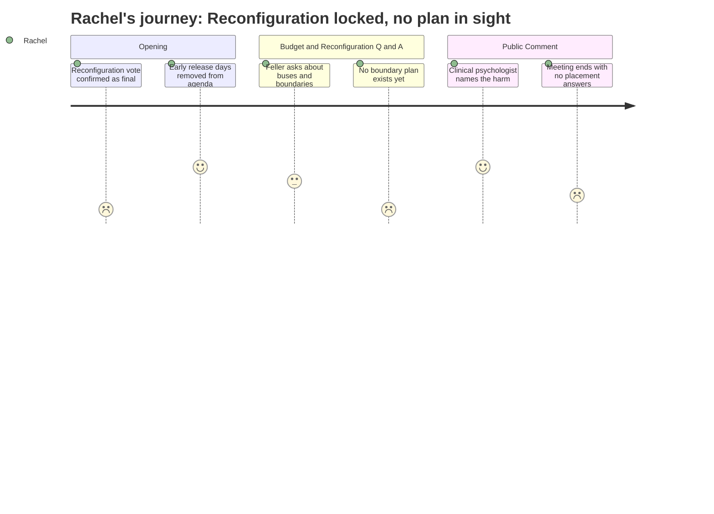

# Interpretation: Rachel (PERSONA-008)
## Meeting: School Board Regular Meeting -- April 2, 2026 -- 2026-04-02

### Structured Points

#### 1. The Budget Vote Cannot Undo Reconfiguration
- **Fact:** The board chair stated explicitly at the opening that voting down the budget in June does not reverse the reconfiguration decision taken Monday. The two votes are legally separate. Even if the budget fails, the district reverts to the prior year's budget and reconfiguration still proceeds.
- **Source:** Transcript [09:24--10:11]
- **Emotional valence:** negative
- **Threat level:** 5
- **Open question:** false

#### 2. No Attendance Boundaries Announced -- Children's Placement Still Unknown
- **Fact:** Board member Feller asked directly how boundaries will be drawn and whether kids will be bused across the city. Dr. Prince said the district has been meeting with the transportation consultant and working on student demographics, but declined to share any assignments -- saying she did not want to "get ahead" of family listening sessions.
- **Source:** Transcript [53:24--54:33]
- **Emotional valence:** negative
- **Threat level:** 5
- **Open question:** true

#### 3. Early Release Days Removed From the Agenda
- **Fact:** The board chair acknowledged parent pushback on a proposal for four additional PreK-4 early release days in May and June (intended to support reconfiguration planning), and moved to remove the item. The board voted unanimously to remove it.
- **Source:** Transcript [03:12--08:39]
- **Emotional valence:** positive
- **Threat level:** 1
- **Open question:** false

#### 4. Listening Sessions Announced -- But After the Vote Already Happened
- **Fact:** Dr. Prince announced 13 upcoming school-based listening sessions for families and staff, an open digital survey (already 200 responses), and a staff preference survey going out the next day. All of this engagement is being launched after the reconfiguration vote was taken on Monday.
- **Source:** Transcript [50:40--52:58]
- **Emotional valence:** neutral
- **Threat level:** 2
- **Open question:** true

#### 5. Special Education Continuity: "We're Going to Talk to Parents" -- No Plan Yet
- **Fact:** When asked directly what the plan is for keeping special education teams together through reconfiguration, the superintendent said the plan is to consult with families and educators. No placements, no grouping logic, and no timeline for those answers were provided.
- **Source:** Transcript [255:38--256:25]
- **Emotional valence:** negative
- **Threat level:** 4
- **Open question:** true

#### 6. A Clinical Psychologist Named the Developmental Risk From the Podium
- **Fact:** A community member identifying herself as a clinical psychologist testified that young children's emotional wellbeing depends on stability, predictability, and a sense of belonging -- and that this proposal "risks undermining all three of those things at the same time." She asked the board to pause until a full plan and evidence from comparable districts was provided.
- **Source:** Transcript [136:07--138:24] (Victoria Libby, public comment)
- **Emotional valence:** positive
- **Threat level:** 3
- **Open question:** false

#### 7. A First Grader Already Asked Where She's Going -- and Got No Answer
- **Fact:** A parent testified that the morning after Monday's vote, her first grader asked, "What school will I go to? Will my friends be there? Will the teachers I know be there?" The parent said she could only respond: "I don't know. I'm sorry. I don't know."
- **Source:** Transcript [175:09--176:15] (Kate La Turo, public comment)
- **Emotional valence:** negative
- **Threat level:** 4
- **Open question:** true

#### 8. No Go/No-Go Criteria Defined -- No Off-Ramp If Implementation Fails
- **Fact:** A community member asked what the reconfiguration off-ramp looks like and how the district would know if it needed to stop. The superintendent's response was that the board has voted and "that is our job" to be ready -- no criteria, checkpoints, or trigger conditions were named.
- **Source:** Transcript [251:44--252:31]; also raised in public comment at [147:28--148:28] (Wheeler Boyd)
- **Emotional valence:** negative
- **Threat level:** 4
- **Open question:** true

---

### Journey Map

---

### Reactions

Okay so I was there for almost five hours and here's what I know: they still cannot tell us where our kids are going. That's it. That's the whole meeting. The board chair said it right up front — even if people vote down the budget in June, the reconfiguration vote from Monday is done. It's a separate decision. So all these parents saying "just vote no in June, that'll stop it" — it doesn't work that way. That vote can't touch reconfiguration. I've been holding onto the idea that there was still a way to pump the brakes, and Monday was the vote I didn't know I needed to be at. Last night just confirmed it's over.

The one real thing that happened was they pulled those four early release days off the agenda — the ones they wanted to add in May and June for reconfiguration planning. Gone, because parents pushed back. Fine. At least they're listening to something. But when a board member actually asked the real question — where are kids going, how are you drawing the boundaries, is my child going to be on a bus for 45 minutes? — the superintendent said she doesn't want to "get ahead" of the family listening sessions. In April. School starts in September. A mom got up and told the board her first grader woke up the day after the vote and asked her "Will my friends be there? What school will I go to?" And the mom had to say "I don't know, I'm sorry, I don't know." I almost cried. That's going to be me having that conversation. That's my kid.

There was a clinical psychologist who stood up and said exactly what I've been struggling to put into words — that young kids depend on stability, predictability, and belonging, and this plan disrupts all three at once. Nobody has shown evidence that this actually helps kids. She asked them to pause and get real data first. I wanted to hug her. And the board is launching listening sessions now — after the vote already happened. I don't understand how that's real input. You don't consult people after you've made the decision. That's not a process. That's just paperwork.